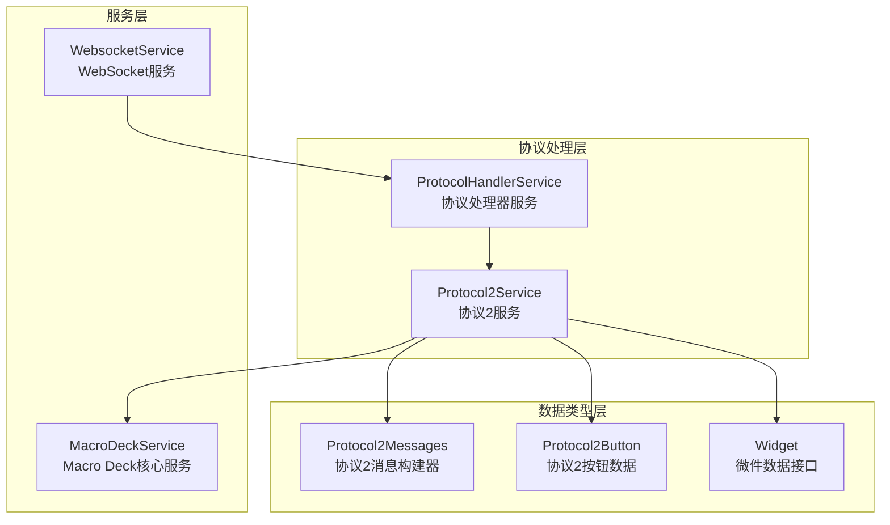
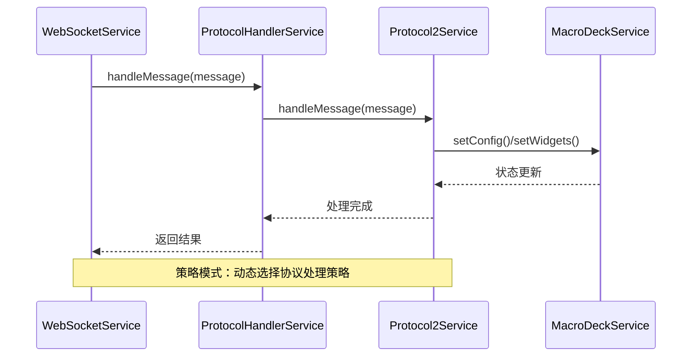
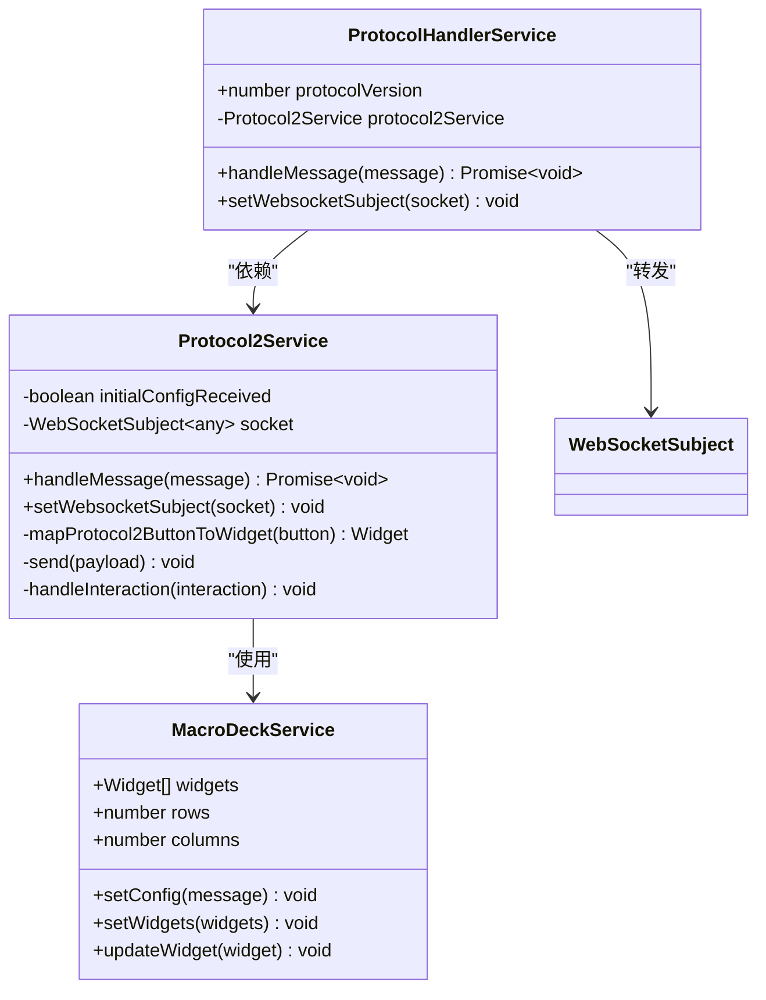
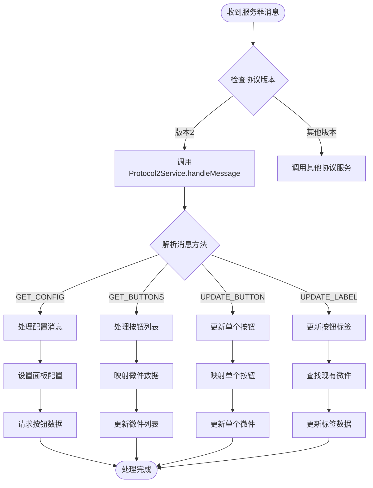
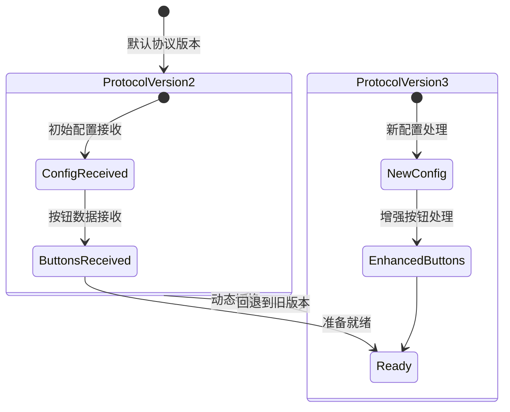
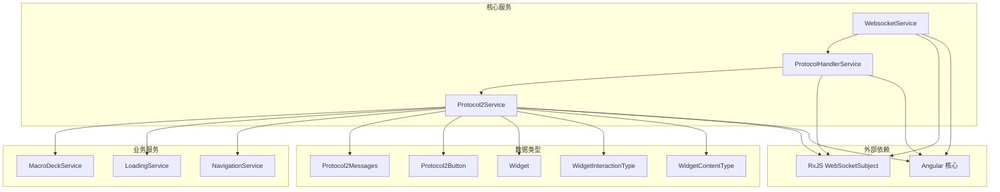

# 策略模式

<cite>
**本文引用的文件**
- [protocol-handler.service.ts](file://src/app/services/protocol/protocol-handler.service.ts)
- [protocol2.service.ts](file://src/app/services/protocol/protocol2.service.ts)
- [protocol2-messages.ts](file://src/app/datatypes/protocol2/protocol2-messages.ts)
- [protocol2-button.ts](file://src/app/datatypes/protocol2/protocol2-button.ts)
- [websocket.service.ts](file://src/app/services/websocket/websocket.service.ts)
- [macro-deck.service.ts](file://src/app/services/macro-deck/macro-deck.service.ts)
- [widget.ts](file://src/app/datatypes/widgets/widget.ts)
- [widget-interaction-type.ts](file://src/app/enums/widget-interaction-type.ts)
- [widget-content-type.ts](file://src/app/enums/widget-content-type.ts)
</cite>

## 目录
1. [简介](#简介)
2. [项目结构](#项目结构)
3. [核心组件](#核心组件)
4. [架构概览](#架构概览)
5. [详细组件分析](#详细组件分析)
6. [依赖关系分析](#依赖关系分析)
7. [性能考虑](#性能考虑)
8. [故障排除指南](#故障排除指南)
9. [结论](#结论)

## 简介

本文档深入分析Macro-Deck-Client-App中策略模式的应用，重点说明ProtocolHandlerService如何使用策略模式管理不同版本的协议处理，以及Protocol2Service作为具体策略的实现。该应用采用策略模式来实现协议版本切换和动态策略选择机制，在协议兼容性和版本演进中发挥重要作用。

策略模式是一种行为设计模式，它允许在运行时选择算法的行为。在Macro-Deck-Client-App中，策略模式被应用于协议处理系统，使得不同的协议版本可以作为独立的策略实现，并且可以在运行时进行切换。

## 项目结构

该项目采用Angular框架构建，遵循模块化架构设计。协议处理相关的文件主要位于以下目录结构中：

**图表来源**
- [protocol-handler.service.ts:1-65](file://src/app/services/protocol/protocol-handler.service.ts#L1-L65)
- [protocol2.service.ts:1-296](file://src/app/services/protocol/protocol2.service.ts#L1-L296)
- [websocket.service.ts:1-402](file://src/app/services/websocket/websocket.service.ts#L1-L402)

**章节来源**
- [protocol-handler.service.ts:1-65](file://src/app/services/protocol/protocol-handler.service.ts#L1-L65)
- [protocol2.service.ts:1-296](file://src/app/services/protocol/protocol2.service.ts#L1-L296)
- [websocket.service.ts:1-402](file://src/app/services/websocket/websocket.service.ts#L1-L402)

## 核心组件

### 协议处理器服务（ProtocolHandlerService）

ProtocolHandlerService是策略模式的核心协调者，负责根据协议版本分发消息到相应的协议处理服务。该服务具有以下关键特性：

- **协议版本管理**：维护当前使用的协议版本，默认为2
- **消息分发**：根据协议版本将消息分发给对应的协议服务
- **策略注入**：通过依赖注入机制接收具体的协议策略实现

### 协议2服务（Protocol2Service）

Protocol2Service是具体的策略实现，专门处理Macro Deck协议版本2的消息。该服务实现了完整的协议处理逻辑：

- **消息处理**：支持GET_CONFIG、GET_BUTTONS、UPDATE_BUTTON、UPDATE_LABEL四种消息类型
- **状态管理**：跟踪初始配置接收状态，确保消息处理的正确顺序
- **数据映射**：将协议数据映射为内部微件模型
- **交互处理**：处理用户交互事件并转换为协议消息

**章节来源**
- [protocol-handler.service.ts:9-37](file://src/app/services/protocol/protocol-handler.service.ts#L9-L37)
- [protocol2.service.ts:19-161](file://src/app/services/protocol/protocol2.service.ts#L19-L161)

## 架构概览

Macro-Deck-Client-App采用分层架构设计，策略模式在其中发挥关键作用：

**图表来源**
- [websocket.service.ts:115-119](file://src/app/services/websocket/websocket.service.ts#L115-L119)
- [protocol-handler.service.ts:22-28](file://src/app/services/protocol/protocol-handler.service.ts#L22-L28)
- [protocol2.service.ts:41-95](file://src/app/services/protocol/protocol2.service.ts#L41-L95)

该架构展示了策略模式的核心优势：
- **解耦性**：WebSocketService不需要了解具体的协议实现细节
- **可扩展性**：新的协议版本可以作为新策略轻松添加
- **动态性**：可以在运行时切换不同的协议策略

## 详细组件分析

### 协议处理器服务类图

**图表来源**
- [protocol-handler.service.ts:9-37](file://src/app/services/protocol/protocol-handler.service.ts#L9-L37)
- [protocol2.service.ts:19-161](file://src/app/services/protocol/protocol2.service.ts#L19-L161)
- [macro-deck.service.ts:10-66](file://src/app/services/macro-deck/macro-deck.service.ts#L10-L66)

### 协议消息处理流程

**图表来源**
- [protocol2.service.ts:41-95](file://src/app/services/protocol/protocol2.service.ts#L41-L95)
- [protocol2.service.ts:101-133](file://src/app/services/protocol/protocol2.service.ts#L101-L133)

### 协议版本切换机制

虽然当前版本只实现了协议2，但系统已经为未来的版本切换做好了准备：

**图表来源**
- [protocol-handler.service.ts:11-12](file://src/app/services/protocol/protocol-handler.service.ts#L11-L12)
- [protocol2.service.ts:21-22](file://src/app/services/protocol/protocol2.service.ts#L21-L22)

**章节来源**
- [protocol-handler.service.ts:22-28](file://src/app/services/protocol/protocol-handler.service.ts#L22-L28)
- [protocol2.service.ts:41-95](file://src/app/services/protocol/protocol2.service.ts#L41-L95)

## 依赖关系分析

### 组件依赖图

**图表来源**
- [websocket.service.ts:1-402](file://src/app/services/websocket/websocket.service.ts#L1-L402)
- [protocol-handler.service.ts:1-65](file://src/app/services/protocol/protocol-handler.service.ts#L1-L65)
- [protocol2.service.ts:1-296](file://src/app/services/protocol/protocol2.service.ts#L1-L296)

### 依赖注入关系

系统采用Angular的依赖注入机制，确保组件间的松耦合：

- **WebsocketService** 依赖 **ProtocolHandlerService**
- **ProtocolHandlerService** 依赖 **Protocol2Service**  
- **Protocol2Service** 依赖 **MacroDeckService**、**LoadingService**、**NavigationService**

这种设计使得每个组件都可以独立测试和维护，同时保持清晰的职责分离。

**章节来源**
- [websocket.service.ts:51-57](file://src/app/services/websocket/websocket.service.ts#L51-L57)
- [protocol-handler.service.ts:14](file://src/app/services/protocol/protocol-handler.service.ts#L14)
- [protocol2.service.ts:27-34](file://src/app/services/protocol/protocol2.service.ts#L27-L34)

## 性能考虑

### 策略模式的性能优势

1. **延迟初始化**：策略对象只有在需要时才被创建和使用
2. **内存效率**：避免了为所有可能的策略实现分配内存
3. **执行效率**：直接调用策略方法，避免额外的抽象层开销

### 优化建议

1. **消息处理优化**：对于频繁更新的消息，可以考虑批量处理机制
2. **缓存策略**：对重复的数据映射操作可以使用缓存机制
3. **异步处理**：确保所有网络I/O操作都是异步的，避免阻塞UI线程

## 故障排除指南

### 常见问题及解决方案

1. **协议版本不匹配**
   - 检查 `protocolVersion` 属性是否正确设置
   - 确保对应的协议服务已正确注入

2. **消息处理异常**
   - 验证消息格式是否符合协议规范
   - 检查 `initialConfigReceived` 状态是否正确

3. **WebSocket连接问题**
   - 确认 `setWebsocketSubject` 方法已被正确调用
   - 检查网络连接状态和防火墙设置

**章节来源**
- [protocol2.service.ts:99-104](file://src/app/services/protocol/protocol2.service.ts#L99-L104)
- [protocol-handler.service.ts:34-36](file://src/app/services/protocol/protocol-handler.service.ts#L34-L36)

## 结论

Macro-Deck-Client-App中的策略模式实现展现了现代软件架构的最佳实践。通过ProtocolHandlerService和Protocol2Service的协作，系统实现了：

1. **高度的可扩展性**：新的协议版本可以轻松添加为新的策略实现
2. **良好的可维护性**：每个策略都封装在独立的服务中，职责明确
3. **强大的兼容性**：支持协议版本的动态切换和回退机制
4. **优秀的性能表现**：通过延迟初始化和直接调用实现高效的策略执行

该策略模式的应用不仅解决了当前的协议处理需求，更为未来的功能扩展和技术演进奠定了坚实的基础。通过这种设计，Macro-Deck-Client-App能够在保持稳定性的前提下，灵活应对不断变化的技术要求和用户需求。