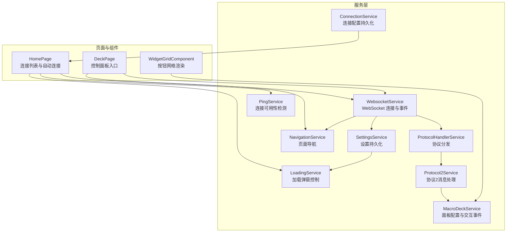
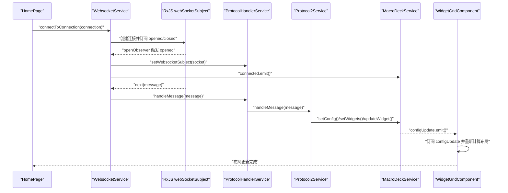
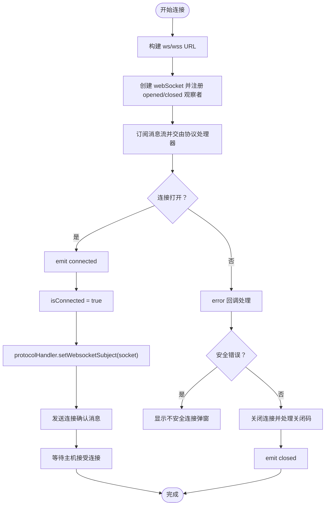
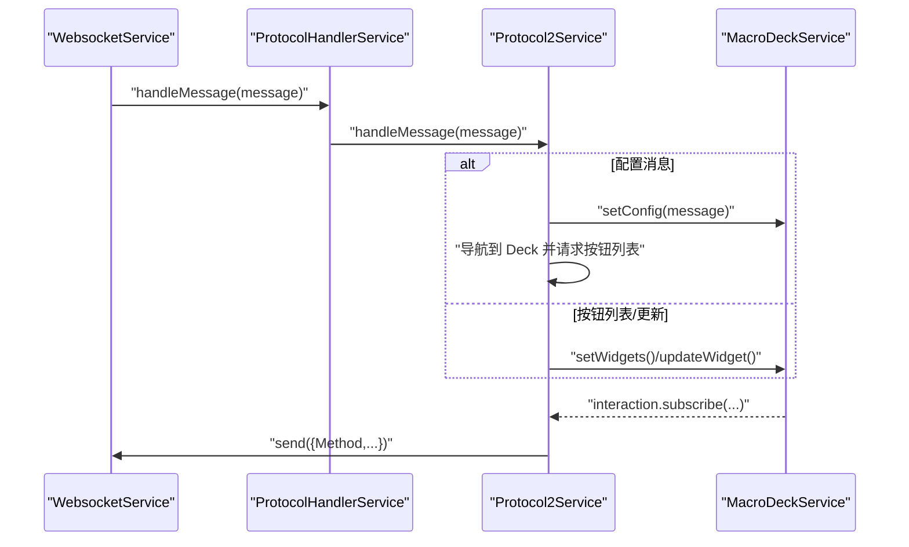
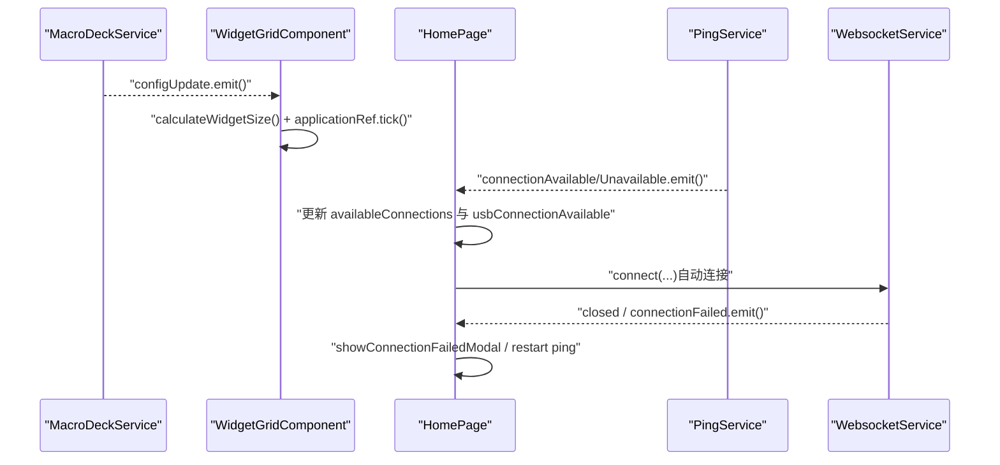
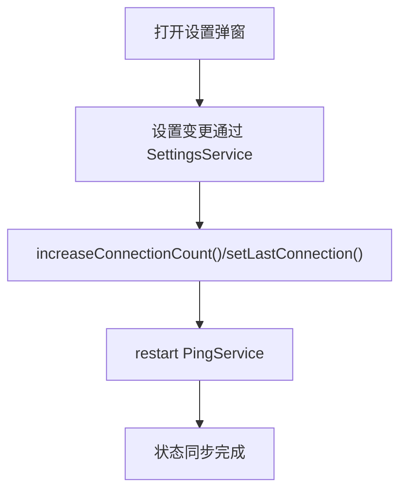
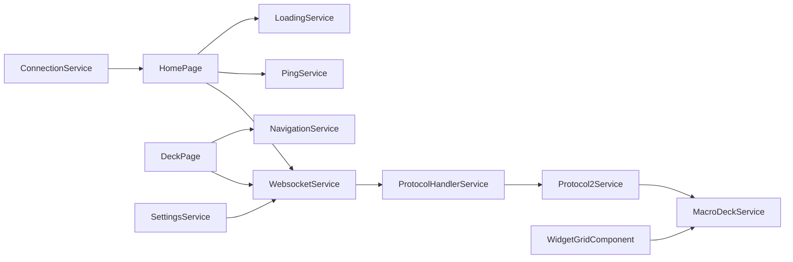

# 观察者模式

<cite>
**本文档引用的文件**
- [websocket.service.ts](file://src/app/services/websocket/websocket.service.ts)
- [settings.service.ts](file://src/app/services/settings/settings.service.ts)
- [connection.service.ts](file://src/app/services/connection/connection.service.ts)
- [macro-deck.service.ts](file://src/app/services/macro-deck/macro-deck.service.ts)
- [navigation.service.ts](file://src/app/services/navigation/navigation.service.ts)
- [protocol-handler.service.ts](file://src/app/services/protocol/protocol-handler.service.ts)
- [protocol2.service.ts](file://src/app/services/protocol/protocol2.service.ts)
- [ping.service.ts](file://src/app/services/ping/ping.service.ts)
- [loading.service.ts](file://src/app/services/loading/loading.service.ts)
- [home.page.ts](file://src/app/pages/home/home.page.ts)
- [deck.page.ts](file://src/app/pages/deck/deck.page.ts)
- [widget-grid.component.ts](file://src/app/pages/deck/widget-grid/widget-grid.component.ts)
</cite>

## 目录
1. [简介](#简介)
2. [项目结构](#项目结构)
3. [核心组件](#核心组件)
4. [架构总览](#架构总览)
5. [详细组件分析](#详细组件分析)
6. [依赖关系分析](#依赖关系分析)
7. [性能考量](#性能考量)
8. [故障排查指南](#故障排查指南)
9. [结论](#结论)

## 简介
本文件系统性梳理 Macro-Deck-Client-App 中观察者模式的应用，重点覆盖以下方面：
- RxJS Observable 与 Subject 在 WebSocket 连接状态、消息订阅与事件分发中的使用
- 组件间通信的观察者模式实现（事件订阅与发布）
- WebSocket 连接状态变化的观察者模式处理（打开/关闭/错误）
- 设置变更通知的观察者模式应用（通过服务间事件驱动 UI 更新）
- 观察者模式在用户界面更新、状态同步与异步数据处理中的具体实现示例

## 项目结构
项目采用 Angular + Ionic 架构，服务层集中于 src/app/services，页面与组件位于 src/app/pages。观察者模式贯穿服务层与页面层，形成松耦合的事件驱动体系。

图表来源
- [websocket.service.ts:17-57](file://src/app/services/websocket/websocket.service.ts#L17-L57)
- [protocol-handler.service.ts:9-36](file://src/app/services/protocol/protocol-handler.service.ts#L9-L36)
- [protocol2.service.ts:19-34](file://src/app/services/protocol/protocol2.service.ts#L19-L34)
- [macro-deck.service.ts:10-30](file://src/app/services/macro-deck/macro-deck.service.ts#L10-L30)
- [ping.service.ts:13-30](file://src/app/services/ping/ping.service.ts#L13-L30)
- [loading.service.ts:9-15](file://src/app/services/loading/loading.service.ts#L9-L15)
- [navigation.service.ts:13-21](file://src/app/services/navigation/navigation.service.ts#L13-L21)
- [settings.service.ts:26-30](file://src/app/services/settings/settings.service.ts#L26-L30)
- [connection.service.ts:10-16](file://src/app/services/connection/connection.service.ts#L10-L16)
- [home.page.ts:39-64](file://src/app/pages/home/home.page.ts#L39-L64)
- [deck.page.ts:24-38](file://src/app/pages/deck/deck.page.ts#L24-L38)
- [widget-grid.component.ts:29-35](file://src/app/pages/deck/widget-grid/widget-grid.component.ts#L29-L35)

章节来源
- [websocket.service.ts:17-57](file://src/app/services/websocket/websocket.service.ts#L17-L57)
- [home.page.ts:39-64](file://src/app/pages/home/home.page.ts#L39-L64)
- [deck.page.ts:24-38](file://src/app/pages/deck/deck.page.ts#L24-L38)
- [widget-grid.component.ts:29-35](file://src/app/pages/deck/widget-grid/widget-grid.component.ts#L29-L35)

## 核心组件
- WebsocketService：封装 RxJS webSocket，提供连接生命周期事件（opened/closed）、错误处理与消息订阅；通过 Subject 暴露连接状态事件，供其他服务订阅。
- ProtocolHandlerService：根据协议版本分发消息至对应协议服务，并注入 WebSocket 主题以便发送消息。
- Protocol2Service：处理协议2消息（配置、按钮列表、按钮更新、标签更新），订阅 MacroDeckService 的交互事件并转发为协议方法。
- MacroDeckService：维护面板配置与微件数据，通过 EventEmitter 发布配置更新与用户交互事件。
- PingService：周期性探测连接可用性，通过 EventEmitter 发布连接可用/不可用事件。
- LoadingService：统一管理加载弹窗，暴露 canceled 事件供外部取消连接流程。
- NavigationService：跨页面导航，配合环境变量区分 Web 与原生页面。
- SettingsService：设置项持久化与读取，为连接统计、客户端 ID 等提供数据源。
- ConnectionService：连接配置的增删改查与持久化。

章节来源
- [websocket.service.ts:20-57](file://src/app/services/websocket/websocket.service.ts#L20-L57)
- [protocol-handler.service.ts:9-36](file://src/app/services/protocol/protocol-handler.service.ts#L9-L36)
- [protocol2.service.ts:19-34](file://src/app/services/protocol/protocol2.service.ts#L19-L34)
- [macro-deck.service.ts:10-30](file://src/app/services/macro-deck/macro-deck.service.ts#L10-L30)
- [ping.service.ts:13-30](file://src/app/services/ping/ping.service.ts#L13-L30)
- [loading.service.ts:9-15](file://src/app/services/loading/loading.service.ts#L9-L15)
- [navigation.service.ts:13-21](file://src/app/services/navigation/navigation.service.ts#L13-L21)
- [settings.service.ts:26-30](file://src/app/services/settings/settings.service.ts#L26-L30)
- [connection.service.ts:10-16](file://src/app/services/connection/connection.service.ts#L10-L16)

## 架构总览
下图展示观察者模式在连接建立、消息处理与 UI 更新中的整体流转。

图表来源
- [home.page.ts:251-254](file://src/app/pages/home/home.page.ts#L251-L254)
- [websocket.service.ts:101-134](file://src/app/services/websocket/websocket.service.ts#L101-L134)
- [protocol-handler.service.ts:22-36](file://src/app/services/protocol/protocol-handler.service.ts#L22-L36)
- [protocol2.service.ts:41-95](file://src/app/services/protocol/protocol2.service.ts#L41-L95)
- [macro-deck.service.ts:36-43](file://src/app/services/macro-deck/macro-deck.service.ts#L36-L43)
- [widget-grid.component.ts:68-86](file://src/app/pages/deck/widget-grid/widget-grid.component.ts#L68-L86)

## 详细组件分析

### WebSocket 连接与状态观察者
- 使用 RxJS webSocket 创建连接，并通过 openObserver/closeObserver 注入 Subject，从而将底层连接事件转化为可订阅的事件流。
- WebsocketService 暴露多个 EventEmitter（connected/closed/connectionFailed/connectionLost），供页面与服务订阅。
- 连接成功后，设置 isConnected 标志并调用协议处理器注入 WebSocket 主题，随后请求初始配置。

图表来源
- [websocket.service.ts:101-172](file://src/app/services/websocket/websocket.service.ts#L101-L172)
- [websocket.service.ts:197-219](file://src/app/services/websocket/websocket.service.ts#L197-L219)
- [websocket.service.ts:300-360](file://src/app/services/websocket/websocket.service.ts#L300-L360)
- [websocket.service.ts:374-393](file://src/app/services/websocket/websocket.service.ts#L374-L393)

章节来源
- [websocket.service.ts:20-57](file://src/app/services/websocket/websocket.service.ts#L20-L57)
- [websocket.service.ts:101-172](file://src/app/services/websocket/websocket.service.ts#L101-L172)
- [websocket.service.ts:197-219](file://src/app/services/websocket/websocket.service.ts#L197-L219)
- [websocket.service.ts:300-360](file://src/app/services/websocket/websocket.service.ts#L300-L360)
- [websocket.service.ts:374-393](file://src/app/services/websocket/websocket.service.ts#L374-L393)

### 协议消息处理与事件分发
- ProtocolHandlerService 根据协议版本将消息分发至对应协议服务，并在连接建立后注入 WebSocket 主题。
- Protocol2Service 订阅 MacroDeckService 的交互事件，将用户操作转换为协议方法并发送；同时处理来自服务器的配置与按钮更新消息，驱动 UI 数据更新。

图表来源
- [protocol-handler.service.ts:22-36](file://src/app/services/protocol/protocol-handler.service.ts#L22-L36)
- [protocol2.service.ts:41-95](file://src/app/services/protocol/protocol2.service.ts#L41-L95)
- [protocol2.service.ts:139-160](file://src/app/services/protocol/protocol2.service.ts#L139-L160)

章节来源
- [protocol-handler.service.ts:9-36](file://src/app/services/protocol/protocol-handler.service.ts#L9-L36)
- [protocol2.service.ts:19-34](file://src/app/services/protocol/protocol2.service.ts#L19-L34)
- [protocol2.service.ts:41-95](file://src/app/services/protocol/protocol2.service.ts#L41-L95)
- [protocol2.service.ts:139-160](file://src/app/services/protocol/protocol2.service.ts#L139-L160)

### 组件间通信与 UI 更新
- MacroDeckService 通过 EventEmitter 发布 configUpdate 与 interaction 事件，WidgetGridComponent 订阅配置更新事件，重新计算按钮尺寸与布局，并触发变更检测。
- HomePage 订阅 PingService 的连接可用/不可用事件，实现自动连接与 UI 列表更新；同时订阅 WebsocketService 的 closed 与 connectionFailed 事件，执行相应导航与弹窗逻辑。

图表来源
- [macro-deck.service.ts:36-43](file://src/app/services/macro-deck/macro-deck.service.ts#L36-L43)
- [widget-grid.component.ts:68-86](file://src/app/pages/deck/widget-grid/widget-grid.component.ts#L68-L86)
- [home.page.ts:89-139](file://src/app/pages/home/home.page.ts#L89-L139)
- [ping.service.ts:102-111](file://src/app/services/ping/ping.service.ts#L102-L111)
- [websocket.service.ts:124-133](file://src/app/services/websocket/websocket.service.ts#L124-L133)

章节来源
- [macro-deck.service.ts:10-30](file://src/app/services/macro-deck/macro-deck.service.ts#L10-L30)
- [widget-grid.component.ts:68-86](file://src/app/pages/deck/widget-grid/widget-grid.component.ts#L68-L86)
- [home.page.ts:89-139](file://src/app/pages/home/home.page.ts#L89-L139)
- [ping.service.ts:142-151](file://src/app/services/ping/ping.service.ts#L142-L151)
- [websocket.service.ts:124-133](file://src/app/services/websocket/websocket.service.ts#L124-L133)

### 设置变更通知与状态同步
- SettingsService 提供设置项的读写接口，部分设置变更会触发服务内部的副作用（例如连接计数增加、最后连接记录更新）。
- WebsocketService 在连接成功后调用 SettingsService 的方法更新连接统计与最后连接记录，实现状态同步。
- HomePage 在设置弹窗关闭后重启 PingService，确保新设置生效。

图表来源
- [settings.service.ts:219-222](file://src/app/services/settings/settings.service.ts#L219-L222)
- [websocket.service.ts:163-166](file://src/app/services/websocket/websocket.service.ts#L163-L166)
- [home.page.ts:284-286](file://src/app/pages/home/home.page.ts#L284-L286)

章节来源
- [settings.service.ts:219-222](file://src/app/services/settings/settings.service.ts#L219-L222)
- [websocket.service.ts:163-166](file://src/app/services/websocket/websocket.service.ts#L163-L166)
- [home.page.ts:284-286](file://src/app/pages/home/home.page.ts#L284-L286)

### 异步数据处理与事件链路
- PingService 使用 RxJS Observable.interval + switchMap + timeout + catchError 实现定时探测与错误兜底，通过 EventEmitter 发布连接可用性变化。
- LoadingService 通过 EventEmitter.canceled 与 webSocket 连接流程解耦，允许用户取消连接时主动关闭连接。
- Protocol2Service 在收到初始配置后才处理后续消息，避免竞态条件，保证 UI 与协议状态一致。

章节来源
- [ping.service.ts:119-128](file://src/app/services/ping/ping.service.ts#L119-L128)
- [loading.service.ts:14-15](file://src/app/services/loading/loading.service.ts#L14-L15)
- [protocol2.service.ts:48-56](file://src/app/services/protocol/protocol2.service.ts#L48-L56)

## 依赖关系分析
- WebsocketService 依赖：LoadingService、ModalController、SettingsService、ProtocolHandlerService、NavigationService；通过 RxJS webSocket 与协议层解耦。
- ProtocolHandlerService 依赖：Protocol2Service；负责协议版本分发。
- Protocol2Service 依赖：MacroDeckService、LoadingService、NavigationService；订阅交互事件并发送协议消息。
- MacroDeckService 依赖：WebsocketService（通过协议注入）；向 UI 组件发布事件。
- HomePage 依赖：ConnectionService、PingService、WebsocketService、WakelockService、AlertController；协调连接与 UI。
- WidgetGridComponent 依赖：MacroDeckService、ApplicationRef；响应配置更新并重新布局。

图表来源
- [websocket.service.ts:51-55](file://src/app/services/websocket/websocket.service.ts#L51-L55)
- [protocol-handler.service.ts:14-15](file://src/app/services/protocol/protocol-handler.service.ts#L14-L15)
- [protocol2.service.ts:27-29](file://src/app/services/protocol/protocol2.service.ts#L27-L29)
- [macro-deck.service.ts:29-30](file://src/app/services/macro-deck/macro-deck.service.ts#L29-L30)
- [home.page.ts:56-63](file://src/app/pages/home/home.page.ts#L56-L63)
- [deck.page.ts:33-37](file://src/app/pages/deck/deck.page.ts#L33-L37)
- [widget-grid.component.ts:33-34](file://src/app/pages/deck/widget-grid/widget-grid.component.ts#L33-L34)
- [settings.service.ts](file://src/app/services/settings/settings.service.ts#L29)
- [connection.service.ts:15-16](file://src/app/services/connection/connection.service.ts#L15-L16)

章节来源
- [websocket.service.ts:51-55](file://src/app/services/websocket/websocket.service.ts#L51-L55)
- [protocol-handler.service.ts:14-15](file://src/app/services/protocol/protocol-handler.service.ts#L14-L15)
- [protocol2.service.ts:27-29](file://src/app/services/protocol/protocol2.service.ts#L27-L29)
- [macro-deck.service.ts:29-30](file://src/app/services/macro-deck/macro-deck.service.ts#L29-L30)
- [home.page.ts:56-63](file://src/app/pages/home/home.page.ts#L56-L63)
- [deck.page.ts:33-37](file://src/app/pages/deck/deck.page.ts#L33-L37)
- [widget-grid.component.ts:33-34](file://src/app/pages/deck/widget-grid/widget-grid.component.ts#L33-L34)
- [settings.service.ts](file://src/app/services/settings/settings.service.ts#L29)
- [connection.service.ts:15-16](file://src/app/services/connection/connection.service.ts#L15-L16)

## 性能考量
- 使用 RxJS Observable 的 switchMap/timeout/catchError 可有效降低无效请求与超时带来的资源消耗。
- 通过 Subscription 管理订阅生命周期，避免内存泄漏；在页面离开时统一取消订阅。
- 布局计算采用延迟与节流策略（setTimeout + resize 事件），减少频繁重排。
- 连接统计与最后连接记录仅在连接成功后更新，避免不必要的存储写入。

## 故障排查指南
- 连接失败弹窗：当 WebSocket 关闭码非正常关闭时，WebsocketService 会触发 connectionFailed 事件，HomePage 接收后弹出错误详情。
- 不安全连接：当出现安全错误（如证书问题）时，显示不安全连接弹窗，引导用户处理证书问题。
- 连接丢失：Web 版本直接触发 connectionLost；原生版本在连接丢失时导航到连接丢失页面。
- 自动连接：PingService 发布连接可用事件后，HomePage 根据设置自动发起连接；若失败则弹出错误弹窗。

章节来源
- [websocket.service.ts:197-219](file://src/app/services/websocket/websocket.service.ts#L197-L219)
- [websocket.service.ts:224-229](file://src/app/services/websocket/websocket.service.ts#L224-L229)
- [home.page.ts:128-131](file://src/app/pages/home/home.page.ts#L128-L131)
- [home.page.ts:390-404](file://src/app/pages/home/home.page.ts#L390-L404)

## 结论
本项目通过 RxJS Observable 与 Subject 将 WebSocket 连接、协议处理、UI 渲染与设置变更有机串联，形成清晰的观察者模式体系：
- 连接状态与消息通过事件流驱动，降低模块间耦合
- 通过订阅与发布机制实现 UI 与状态的自动同步
- 在异步数据处理中采用 RxJS 流式处理，提升健壮性与可维护性
- 设置变更与连接统计等状态同步通过服务间事件自然达成，无需显式轮询