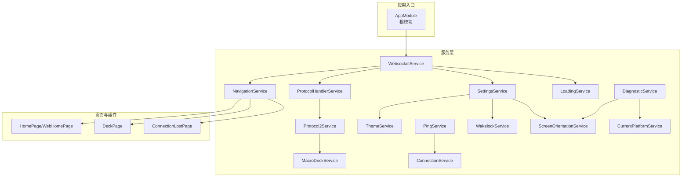
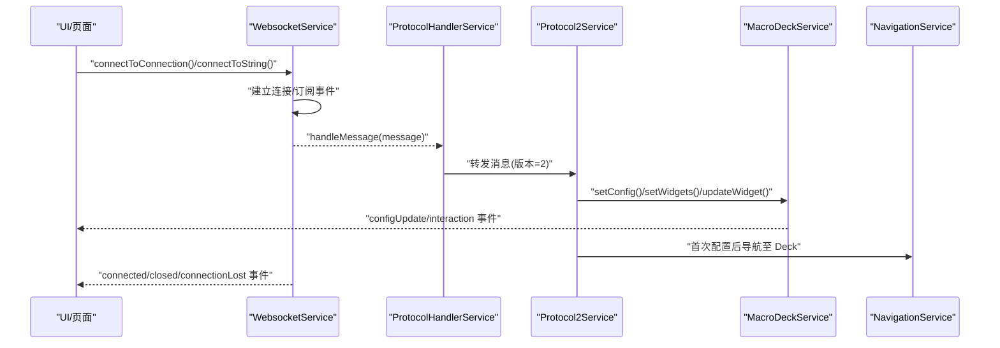
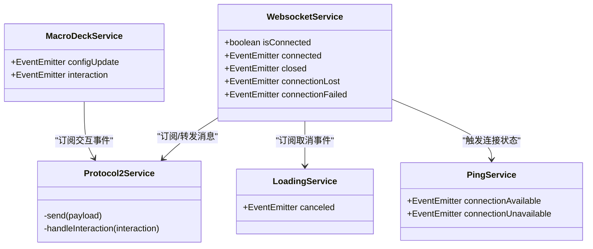
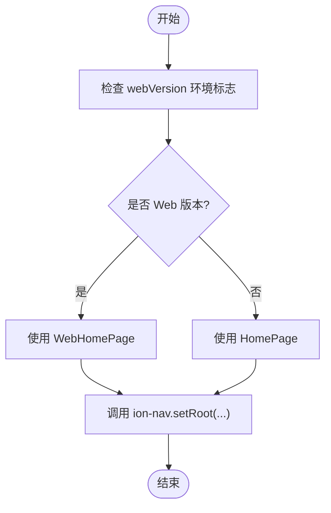
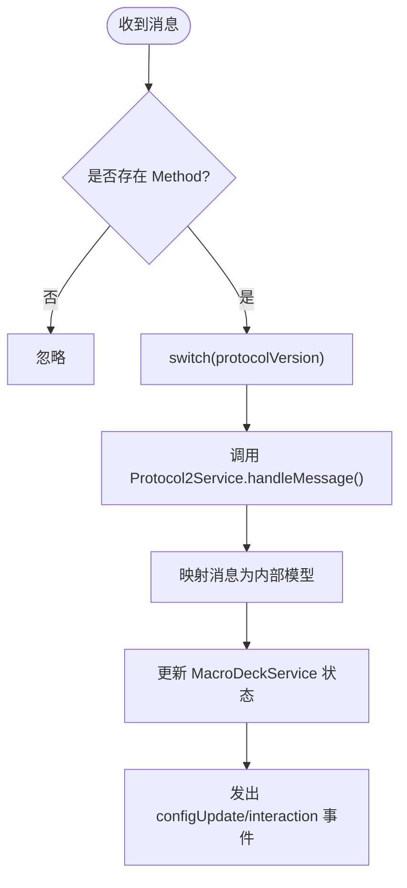
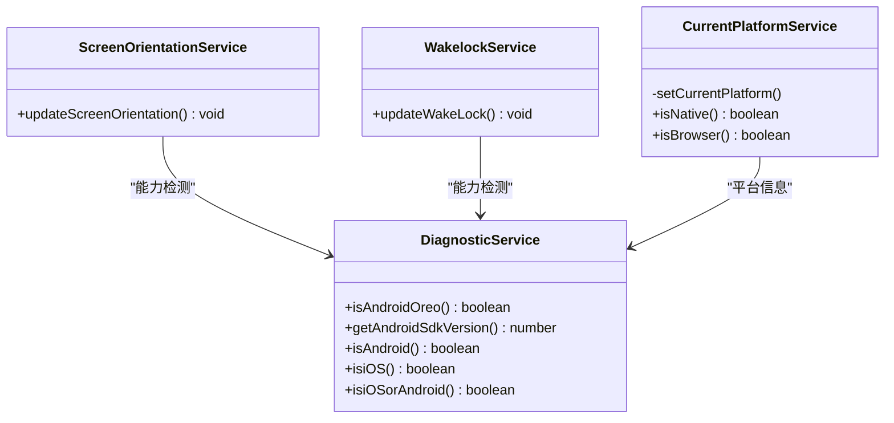
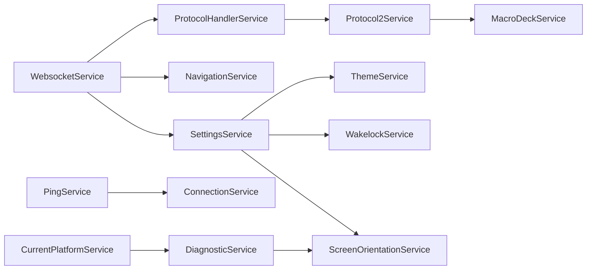

# 设计模式应用

<cite>
**本文档引用的文件**
- [src/app/app.module.ts](file://src/app/app.module.ts)
- [src/app/services/connection/connection.service.ts](file://src/app/services/connection/connection.service.ts)
- [src/app/services/macro-deck/macro-deck.service.ts](file://src/app/services/macro-deck/macro-deck.service.ts)
- [src/app/services/protocol/protocol-handler.service.ts](file://src/app/services/protocol/protocol-handler.service.ts)
- [src/app/services/protocol/protocol2.service.ts](file://src/app/services/protocol/protocol2.service.ts)
- [src/app/services/current-platform/current-platform.service.ts](file://src/app/services/current-platform/current-platform.service.ts)
- [src/app/services/navigation/navigation.service.ts](file://src/app/services/navigation/navigation.service.ts)
- [src/app/services/settings/settings.service.ts](file://src/app/services/settings/settings.service.ts)
- [src/app/services/websocket/websocket.service.ts](file://src/app/services/websocket/websocket.service.ts)
- [src/app/services/theme/theme.service.ts](file://src/app/services/theme/theme.service.ts)
- [src/app/services/loading/loading.service.ts](file://src/app/services/loading/loading.service.ts)
- [src/app/services/ping/ping.service.ts](file://src/app/services/ping/ping.service.ts)
- [src/app/services/wakelock/wakelock.service.ts](file://src/app/services/wakelock/wakelock.service.ts)
- [src/app/services/diagnostic/diagnostic.service.ts](file://src/app/services/diagnostic/diagnostic.service.ts)
- [src/app/services/screen-orientation/screen-orientation.service.ts](file://src/app/services/screen-orientation/screen-orientation.service.ts)
</cite>

## 目录
1. [简介](#简介)
2. [项目结构](#项目结构)
3. [核心组件](#核心组件)
4. [架构总览](#架构总览)
5. [详细组件分析](#详细组件分析)
6. [依赖关系分析](#依赖关系分析)
7. [性能考量](#性能考量)
8. [故障排查指南](#故障排查指南)
9. [结论](#结论)

## 简介
本文件聚焦于 Macro-Deck-Client-App 中的设计模式应用，系统梳理并解释以下模式在项目中的落地方式与场景价值：
- 依赖注入（Angular DI）
- 观察者模式（事件发射器与订阅）
- 单例模式（根作用域服务）
- 工厂模式（组件创建与页面选择）
- 策略模式（协议版本分发）
- 适配器模式（平台差异适配）

同时，结合实际代码路径对各模式的实现细节、数据流与控制流进行深入剖析，并提供可视化图示帮助读者快速把握整体架构。

## 项目结构
应用采用 Angular + Ionic 架构，服务层集中于 src/app/services 下，页面与组件位于 src/app/pages 与 src/app/widget-content-components，模块化组织便于依赖注入与跨模块复用。

图表来源
- [src/app/app.module.ts:19-42](file://src/app/app.module.ts#L19-L42)
- [src/app/services/websocket/websocket.service.ts:17-20](file://src/app/services/websocket/websocket.service.ts#L17-L20)
- [src/app/services/protocol/protocol-handler.service.ts:6-9](file://src/app/services/protocol/protocol-handler.service.ts#L6-L9)
- [src/app/services/protocol/protocol2.service.ts:16-19](file://src/app/services/protocol/protocol2.service.ts#L16-L19)
- [src/app/services/macro-deck/macro-deck.service.ts:7-10](file://src/app/services/macro-deck/macro-deck.service.ts#L7-L10)
- [src/app/services/navigation/navigation.service.ts:10-13](file://src/app/services/navigation/navigation.service.ts#L10-L13)
- [src/app/services/settings/settings.service.ts:23-26](file://src/app/services/settings/settings.service.ts#L23-L26)
- [src/app/services/connection/connection.service.ts:6-10](file://src/app/services/connection/connection.service.ts#L6-L10)
- [src/app/services/theme/theme.service.ts:6-9](file://src/app/services/theme/theme.service.ts#L6-L9)
- [src/app/services/loading/loading.service.ts:6-9](file://src/app/services/loading/loading.service.ts#L6-L9)
- [src/app/services/ping/ping.service.ts:10-13](file://src/app/services/ping/ping.service.ts#L10-L13)
- [src/app/services/wakelock/wakelock.service.ts:7-10](file://src/app/services/wakelock/wakelock.service.ts#L7-L10)
- [src/app/services/screen-orientation/screen-orientation.service.ts:9-12](file://src/app/services/screen-orientation/screen-orientation.service.ts#L9-L12)
- [src/app/services/diagnostic/diagnostic.service.ts:7-10](file://src/app/services/diagnostic/diagnostic.service.ts#L7-L10)
- [src/app/services/current-platform/current-platform.service.ts:5-8](file://src/app/services/current-platform/current-platform.service.ts#L5-L8)

章节来源
- [src/app/app.module.ts:19-42](file://src/app/app.module.ts#L19-L42)

## 核心组件
- 依赖注入与单例：大量服务通过 @Injectable({ providedIn: 'root' }) 声明为根级单例，贯穿应用生命周期，便于跨组件共享状态与能力。
- 观察者：广泛使用 EventEmitter 与 RxJS Subject/Subscription 实现松耦合事件通信，如连接状态、配置变更、交互事件等。
- 策略：协议处理器根据协议版本选择不同策略（协议2服务），实现多版本协议的扩展与隔离。
- 工厂：导航服务依据环境变量动态选择页面组件（Web/Home 或 Mobile/Home），形成“页面工厂”。
- 适配器：平台检测服务与诊断服务分别对平台差异与设备能力进行适配，保证在不同运行环境下的统一行为。

章节来源
- [src/app/services/websocket/websocket.service.ts:17-20](file://src/app/services/websocket/websocket.service.ts#L17-L20)
- [src/app/services/macro-deck/macro-deck.service.ts:7-10](file://src/app/services/macro-deck/macro-deck.service.ts#L7-L10)
- [src/app/services/protocol/protocol-handler.service.ts:6-9](file://src/app/services/protocol/protocol-handler.service.ts#L6-L9)
- [src/app/services/navigation/navigation.service.ts:10-13](file://src/app/services/navigation/navigation.service.ts#L10-L13)
- [src/app/services/current-platform/current-platform.service.ts:5-8](file://src/app/services/current-platform/current-platform.service.ts#L5-L8)
- [src/app/services/diagnostic/diagnostic.service.ts:7-10](file://src/app/services/diagnostic/diagnostic.service.ts#L7-L10)

## 架构总览
下图展示从连接建立到协议处理、再到界面渲染与状态管理的整体流程，体现观察者与策略模式的协同工作。

图表来源
- [src/app/services/websocket/websocket.service.ts:101-134](file://src/app/services/websocket/websocket.service.ts#L101-L134)
- [src/app/services/protocol/protocol-handler.service.ts:22-28](file://src/app/services/protocol/protocol-handler.service.ts#L22-L28)
- [src/app/services/protocol/protocol2.service.ts:41-95](file://src/app/services/protocol/protocol2.service.ts#L41-L95)
- [src/app/services/macro-deck/macro-deck.service.ts:36-65](file://src/app/services/macro-deck/macro-deck.service.ts#L36-L65)
- [src/app/services/navigation/navigation.service.ts:29-46](file://src/app/services/navigation/navigation.service.ts#L29-L46)

## 详细组件分析

### 依赖注入与单例模式
- 单例范围：多数服务通过 providedIn: 'root' 声明为全局单例，确保唯一实例与跨组件共享。
- 典型服务：
  - WebsocketService、ProtocolHandlerService、Protocol2Service、MacroDeckService、NavigationService、SettingsService、ConnectionService、ThemeService、LoadingService、PingService、WakelockService、ScreenOrientationService、DiagnosticService、CurrentPlatformService。
- 优势：
  - 减少重复初始化成本
  - 统一状态与资源管理
  - 便于测试与替换（可注入替身）

章节来源
- [src/app/services/websocket/websocket.service.ts:17-20](file://src/app/services/websocket/websocket.service.ts#L17-L20)
- [src/app/services/protocol/protocol-handler.service.ts:6-9](file://src/app/services/protocol/protocol-handler.service.ts#L6-L9)
- [src/app/services/protocol/protocol2.service.ts:16-19](file://src/app/services/protocol/protocol2.service.ts#L16-L19)
- [src/app/services/macro-deck/macro-deck.service.ts:7-10](file://src/app/services/macro-deck/macro-deck.service.ts#L7-L10)
- [src/app/services/navigation/navigation.service.ts:10-13](file://src/app/services/navigation/navigation.service.ts#L10-L13)
- [src/app/services/settings/settings.service.ts:23-26](file://src/app/services/settings/settings.service.ts#L23-L26)
- [src/app/services/connection/connection.service.ts:6-10](file://src/app/services/connection/connection.service.ts#L6-L10)
- [src/app/services/theme/theme.service.ts:6-9](file://src/app/services/theme/theme.service.ts#L6-L9)
- [src/app/services/loading/loading.service.ts:6-9](file://src/app/services/loading/loading.service.ts#L6-L9)
- [src/app/services/ping/ping.service.ts:10-13](file://src/app/services/ping/ping.service.ts#L10-L13)
- [src/app/services/wakelock/wakelock.service.ts:7-10](file://src/app/services/wakelock/wakelock.service.ts#L7-L10)
- [src/app/services/screen-orientation/screen-orientation.service.ts:9-12](file://src/app/services/screen-orientation/screen-orientation.service.ts#L9-L12)
- [src/app/services/diagnostic/diagnostic.service.ts:7-10](file://src/app/services/diagnostic/diagnostic.service.ts#L7-L10)
- [src/app/services/current-platform/current-platform.service.ts:5-8](file://src/app/services/current-platform/current-platform.service.ts#L5-L8)

### 观察者模式：组件通信与状态管理
- 事件源与订阅：
  - WebsocketService：connected、closed、connectionLost、connectionFailed 等事件发射器
  - MacroDeckService：configUpdate、interaction 事件发射器
  - PingService：connectionAvailable、connectionUnavailable 事件发射器
  - LoadingService：canceled 事件发射器
- 订阅与处理：
  - WebsocketService 订阅连接开关事件并在打开/关闭时执行导航与状态更新
  - Protocol2Service 订阅 MacroDeckService.interaction，将交互映射为协议方法并发送
  - ThemeService、WakelockService、ScreenOrientationService 分别订阅设置变化并更新运行时行为
- 优点：
  - 松耦合：组件间通过事件解绑
  - 可扩展：新增订阅者无需修改事件发布方

图表来源
- [src/app/services/websocket/websocket.service.ts:40-47](file://src/app/services/websocket/websocket.service.ts#L40-L47)
- [src/app/services/macro-deck/macro-deck.service.ts:12-14](file://src/app/services/macro-deck/macro-deck.service.ts#L12-L14)
- [src/app/services/ping/ping.service.ts:15-18](file://src/app/services/ping/ping.service.ts#L15-L18)
- [src/app/services/loading/loading.service.ts:15](file://src/app/services/loading/loading.service.ts#L15)
- [src/app/services/protocol/protocol2.service.ts:27-34](file://src/app/services/protocol/protocol2.service.ts#L27-L34)

章节来源
- [src/app/services/websocket/websocket.service.ts:141-172](file://src/app/services/websocket/websocket.service.ts#L141-L172)
- [src/app/services/protocol/protocol2.service.ts:139-160](file://src/app/services/protocol/protocol2.service.ts#L139-L160)
- [src/app/services/macro-deck/macro-deck.service.ts:36-65](file://src/app/services/macro-deck/macro-deck.service.ts#L36-L65)
- [src/app/services/ping/ping.service.ts:87-111](file://src/app/services/ping/ping.service.ts#L87-L111)
- [src/app/services/loading/loading.service.ts:15](file://src/app/services/loading/loading.service.ts#L15)

### 工厂模式：页面与组件创建
- 页面工厂（导航服务）：
  - 根据环境变量选择 Home 页面组件（WebHomePage 或 HomePage），形成“页面工厂”
  - 通过 setRoot 动态切换页面，避免硬编码页面类型
- 组件工厂（加载弹窗）：
  - LoadingService 在 showLoading 时动态创建 ConnectingComponent 弹窗，统一加载 UI 的创建与销毁

图表来源
- [src/app/services/navigation/navigation.service.ts:16](file://src/app/services/navigation/navigation.service.ts#L16)
- [src/app/services/navigation/navigation.service.ts:29-46](file://src/app/services/navigation/navigation.service.ts#L29-L46)
- [src/app/services/loading/loading.service.ts:37-48](file://src/app/services/loading/loading.service.ts#L37-L48)

章节来源
- [src/app/services/navigation/navigation.service.ts:16](file://src/app/services/navigation/navigation.service.ts#L16)
- [src/app/services/navigation/navigation.service.ts:29-46](file://src/app/services/navigation/navigation.service.ts#L29-L46)
- [src/app/services/loading/loading.service.ts:37-48](file://src/app/services/loading/loading.service.ts#L37-L48)

### 策略模式：协议处理
- 协议处理器根据协议版本选择对应策略（当前为协议2）
- 协议2服务负责：
  - 解析服务器消息（配置、按钮列表、按钮更新、标签更新）
  - 将协议消息映射为内部微件模型
  - 订阅交互事件并转换为协议方法发送
- 优点：
  - 易于扩展新协议版本（新增策略类并更新路由逻辑）

图表来源
- [src/app/services/protocol/protocol-handler.service.ts:22-28](file://src/app/services/protocol/protocol-handler.service.ts#L22-L28)
- [src/app/services/protocol/protocol2.service.ts:41-95](file://src/app/services/protocol/protocol2.service.ts#L41-L95)

章节来源
- [src/app/services/protocol/protocol-handler.service.ts:22-28](file://src/app/services/protocol/protocol-handler.service.ts#L22-L28)
- [src/app/services/protocol/protocol2.service.ts:41-95](file://src/app/services/protocol/protocol2.service.ts#L41-L95)

### 适配器模式：平台兼容性
- 平台检测适配：
  - CurrentPlatformService 将 Ionic Platform 结果抽象为 'mobile'/'browser' 两类，屏蔽底层平台差异
- 设备能力适配：
  - DiagnosticService 提供版本信息、Android Oreo 检测、平台类型判断等，为屏幕方向锁、唤醒锁等功能提供条件判断
- 屏幕方向适配：
  - ScreenOrientationService 在不支持的平台或版本上优雅降级（如 Android Oreo 不支持方向锁定）
- 唤醒锁适配：
  - WakelockService 优先使用原生 Capacitor KeepAwake，回退到 NoSleep.js

图表来源
- [src/app/services/current-platform/current-platform.service.ts:36-44](file://src/app/services/current-platform/current-platform.service.ts#L36-L44)
- [src/app/services/diagnostic/diagnostic.service.ts:33-40](file://src/app/services/diagnostic/diagnostic.service.ts#L33-L40)
- [src/app/services/screen-orientation/screen-orientation.service.ts:22-55](file://src/app/services/screen-orientation/screen-orientation.service.ts#L22-L55)
- [src/app/services/wakelock/wakelock.service.ts:38-58](file://src/app/services/wakelock/wakelock.service.ts#L38-L58)

章节来源
- [src/app/services/current-platform/current-platform.service.ts:36-44](file://src/app/services/current-platform/current-platform.service.ts#L36-L44)
- [src/app/services/diagnostic/diagnostic.service.ts:33-40](file://src/app/services/diagnostic/diagnostic.service.ts#L33-L40)
- [src/app/services/screen-orientation/screen-orientation.service.ts:22-55](file://src/app/services/screen-orientation/screen-orientation.service.ts#L22-L55)
- [src/app/services/wakelock/wakelock.service.ts:38-58](file://src/app/services/wakelock/wakelock.service.ts#L38-L58)

### 依赖注入模式在服务管理中的应用
- 服务间依赖：
  - WebsocketService 依赖 LoadingService、ModalController、SettingsService、ProtocolHandlerService、NavigationService
  - Protocol2Service 依赖 MacroDeckService、LoadingService、NavigationService
  - NavigationService 依赖环境配置与页面组件类型
  - SettingsService 作为配置中心，被多个服务读取与写入
- 注入方式：
  - 构造函数注入，确保服务生命周期与依赖关系清晰
  - 根作用域单例，避免重复实例带来的状态不一致

章节来源
- [src/app/services/websocket/websocket.service.ts:51-57](file://src/app/services/websocket/websocket.service.ts#L51-L57)
- [src/app/services/protocol/protocol2.service.ts:27-29](file://src/app/services/protocol/protocol2.service.ts#L27-L29)
- [src/app/services/navigation/navigation.service.ts:16](file://src/app/services/navigation/navigation.service.ts#L16)
- [src/app/services/settings/settings.service.ts:29](file://src/app/services/settings/settings.service.ts#L29)

## 依赖关系分析
- 低耦合高内聚：服务职责单一，通过事件与接口协作
- 关键依赖链：
  - WebsocketService → ProtocolHandlerService → Protocol2Service → MacroDeckService
  - WebsocketService → NavigationService → 页面组件
  - SettingsService → ThemeService/WakelockService/ScreenOrientationService
  - PingService → ConnectionService

图表来源
- [src/app/services/websocket/websocket.service.ts:51-57](file://src/app/services/websocket/websocket.service.ts#L51-L57)
- [src/app/services/protocol/protocol-handler.service.ts:14](file://src/app/services/protocol/protocol-handler.service.ts#L14)
- [src/app/services/protocol/protocol2.service.ts:27-29](file://src/app/services/protocol/protocol2.service.ts#L27-L29)
- [src/app/services/navigation/navigation.service.ts:16](file://src/app/services/navigation/navigation.service.ts#L16)
- [src/app/services/settings/settings.service.ts:29](file://src/app/services/settings/settings.service.ts#L29)
- [src/app/services/ping/ping.service.ts:29](file://src/app/services/ping/ping.service.ts#L29)
- [src/app/services/current-platform/current-platform.service.ts:12](file://src/app/services/current-platform/current-platform.service.ts#L12)
- [src/app/services/diagnostic/diagnostic.service.ts:12](file://src/app/services/diagnostic/diagnostic.service.ts#L12)

章节来源
- [src/app/services/websocket/websocket.service.ts:51-57](file://src/app/services/websocket/websocket.service.ts#L51-L57)
- [src/app/services/protocol/protocol-handler.service.ts:14](file://src/app/services/protocol/protocol-handler.service.ts#L14)
- [src/app/services/protocol/protocol2.service.ts:27-29](file://src/app/services/protocol/protocol2.service.ts#L27-L29)
- [src/app/services/navigation/navigation.service.ts:16](file://src/app/services/navigation/navigation.service.ts#L16)
- [src/app/services/settings/settings.service.ts:29](file://src/app/services/settings/settings.service.ts#L29)
- [src/app/services/ping/ping.service.ts:29](file://src/app/services/ping/ping.service.ts#L29)
- [src/app/services/current-platform/current-platform.service.ts:12](file://src/app/services/current-platform/current-platform.service.ts#L12)
- [src/app/services/diagnostic/diagnostic.service.ts:12](file://src/app/services/diagnostic/diagnostic.service.ts#L12)

## 性能考量
- 事件驱动与懒初始化：服务在需要时才建立连接与订阅，避免不必要的资源占用
- 单例复用：根作用域单例减少内存与实例化开销
- 观察者粒度：合理拆分事件，避免过度广播导致的频繁渲染
- 异步与超时：WebSocket 连接与 HTTP Ping 均设置超时与错误处理，提升稳定性

## 故障排查指南
- 连接失败/丢失：
  - 检查 WebsocketService 的 error 与 handleError 分支，区分安全错误与业务错误
  - 根据环境变量决定导航至连接丢失页面或直接触发 connectionLost 事件
- 协议处理异常：
  - 确认 ProtocolHandlerService 的协议版本与 Protocol2Service 的消息映射逻辑
  - 检查 MacroDeckService 的状态更新是否正确触发 UI 重绘
- 平台相关问题：
  - Android Oreo 不支持方向锁定；唤醒锁在浏览器需用户交互
  - 使用 DiagnosticService 与 CurrentPlatformService 进行能力检测与降级

章节来源
- [src/app/services/websocket/websocket.service.ts:197-219](file://src/app/services/websocket/websocket.service.ts#L197-L219)
- [src/app/services/protocol/protocol2.service.ts:41-95](file://src/app/services/protocol/protocol2.service.ts#L41-L95)
- [src/app/services/screen-orientation/screen-orientation.service.ts:28-31](file://src/app/services/screen-orientation/screen-orientation.service.ts#L28-L31)
- [src/app/services/wakelock/wakelock.service.ts:24-32](file://src/app/services/wakelock/wakelock.service.ts#L24-L32)
- [src/app/services/current-platform/current-platform.service.ts:36-44](file://src/app/services/current-platform/current-platform.service.ts#L36-L44)
- [src/app/services/diagnostic/diagnostic.service.ts:33-40](file://src/app/services/diagnostic/diagnostic.service.ts#L33-L40)

## 结论
本项目通过 Angular DI 构建了清晰的服务层，配合观察者、策略、工厂与适配器等多种设计模式，在保持低耦合的同时实现了良好的可扩展性与平台兼容性。根作用域单例确保了状态一致性与资源复用，事件驱动机制提升了组件间的协作效率。未来若引入协议3，只需新增策略类并更新路由即可平滑演进。