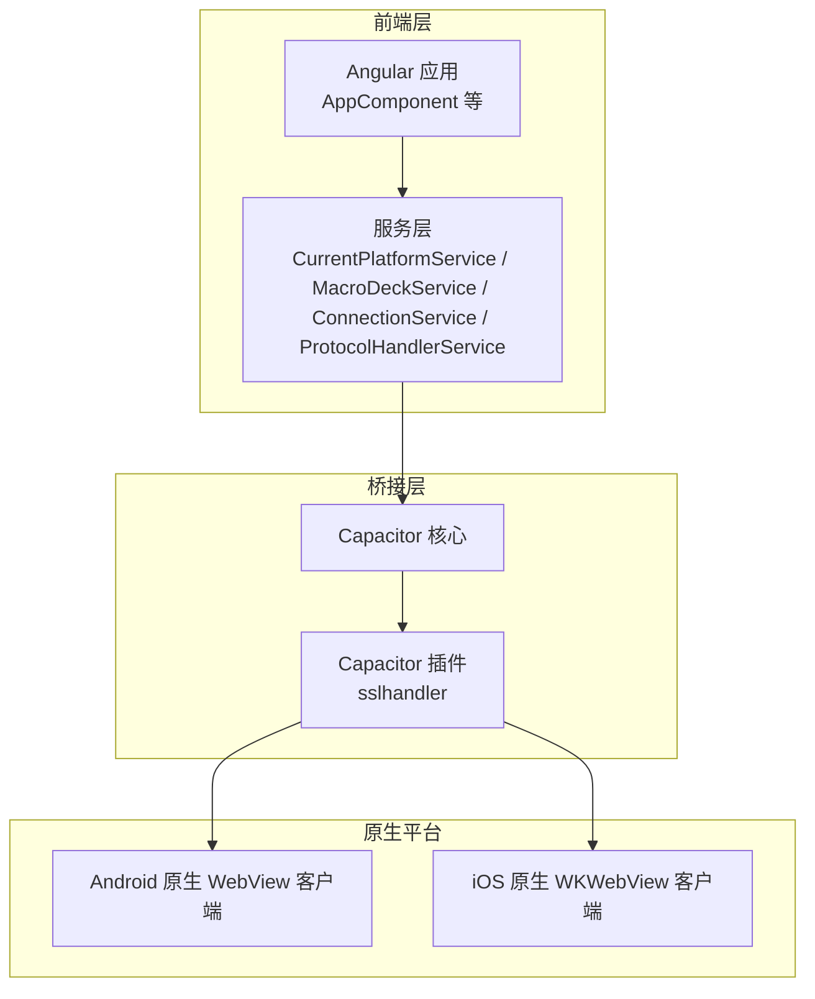
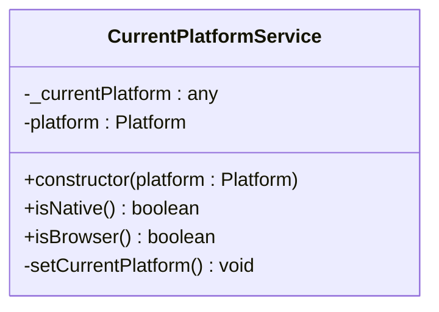
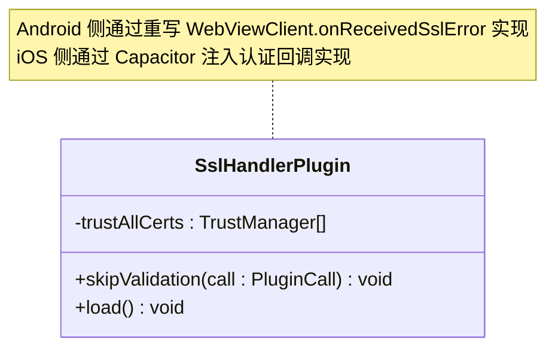
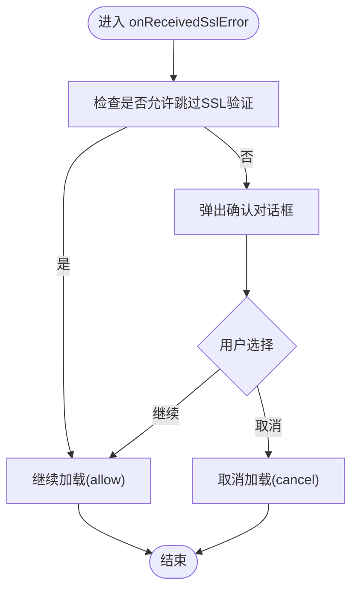
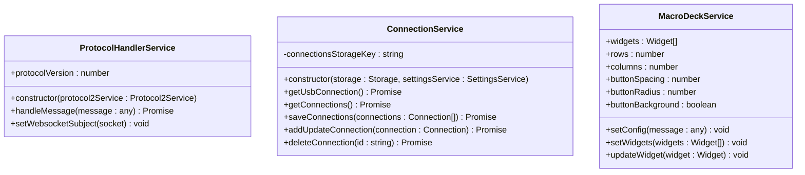
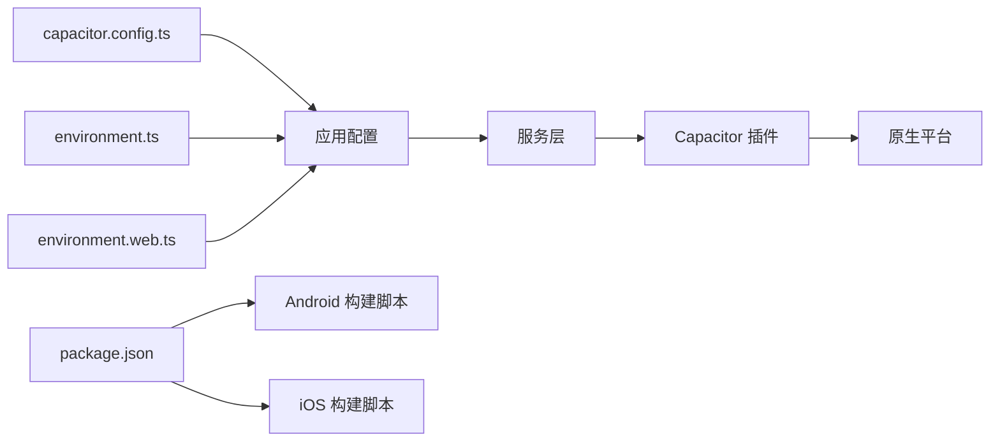

# 适配器模式

<cite>
**本文引用的文件**
- [src/app/services/current-platform/current-platform.service.ts](file://src/app/services/current-platform/current-platform.service.ts)
- [src/app/app.component.ts](file://src/app/app.component.ts)
- [capacitor_plugins/sslhandler/android/src/main/java/com/suchbyte/sslhandler/SslHandlerPlugin.java](file://capacitor_plugins/sslhandler/android/src/main/java/com/suchbyte/sslhandler/SslHandlerPlugin.java)
- [capacitor.config.ts](file://capacitor.config.ts)
- [package.json](file://package.json)
- [src/environments/environment.ts](file://src/environments/environment.ts)
- [src/environments/environment.web.ts](file://src/environments/environment.web.ts)
- [src/app/services/connection/connection.service.ts](file://src/app/services/connection/connection.service.ts)
- [src/app/services/macro-deck/macro-deck.service.ts](file://src/app/services/macro-deck/macro-deck.service.ts)
- [src/app/services/protocol/protocol-handler.service.ts](file://src/app/services/protocol/protocol-handler.service.ts)
</cite>

## 目录
1. [简介](#简介)
2. [项目结构](#项目结构)
3. [核心组件](#核心组件)
4. [架构总览](#架构总览)
5. [组件详解](#组件详解)
6. [依赖关系分析](#依赖关系分析)
7. [性能考量](#性能考量)
8. [故障排查指南](#故障排查指南)
9. [结论](#结论)
10. [附录](#附录)

## 简介
本文件聚焦于Macro-Deck-Client-App中适配器模式的应用与实践，重点说明以下三点：
- Capacitor插件适配器在平台兼容性方面的实现方式；
- SSLHandler插件适配器如何统一不同平台的SSL处理接口；
- CurrentPlatformService如何适配不同平台的功能差异。

同时，结合项目实际代码路径，给出架构图、序列图与流程图，帮助读者从整体到细节全面理解跨平台开发中“适配器模式”的作用与优势，并提供可操作的实践建议与排障指引。

## 项目结构
该项目采用Ionic/Capacitor多端同构架构，前端使用Angular，通过Capacitor桥接到原生平台能力。项目中存在自研Capacitor插件目录，用于扩展原生能力（如SSL处理），并通过统一的服务层对外暴露一致的API。



图表来源
- [src/app/app.component.ts](file://src/app/app.component.ts)
- [src/app/services/current-platform/current-platform.service.ts](file://src/app/services/current-platform/current-platform.service.ts)
- [capacitor_plugins/sslhandler/android/src/main/java/com/suchbyte/sslhandler/SslHandlerPlugin.java](file://capacitor_plugins/sslhandler/android/src/main/java/com/suchbyte/sslhandler/SslHandlerPlugin.java)
- [capacitor.config.ts](file://capacitor.config.ts)

章节来源
- [capacitor.config.ts](file://capacitor.config.ts)
- [package.json](file://package.json)

## 核心组件
- CurrentPlatformService：封装平台检测逻辑，屏蔽平台差异，向上提供统一的isNative/isBrowser接口，便于业务根据平台选择不同的行为。
- SSLHandler插件：作为Capacitor插件适配器，分别在Android/iOS侧实现统一的skipValidation方法，屏蔽底层WebView客户端差异。
- 服务层适配器：例如ProtocolHandlerService对协议版本进行分发，ConnectionService与MacroDeckService分别负责连接配置与面板状态管理，均体现“面向接口编程、隐藏实现细节”的适配器思想。

章节来源
- [src/app/services/current-platform/current-platform.service.ts](file://src/app/services/current-platform/current-platform.service.ts)
- [src/app/services/protocol/protocol-handler.service.ts](file://src/app/services/protocol/protocol-handler.service.ts)
- [src/app/services/connection/connection.service.ts](file://src/app/services/connection/connection.service.ts)
- [src/app/services/macro-deck/macro-deck.service.ts](file://src/app/services/macro-deck/macro-deck.service.ts)

## 架构总览
下图展示应用启动阶段与SSL处理的关键交互，体现“服务层调用插件适配器，插件适配器再调用原生平台能力”的适配器模式：

```mermaid
sequenceDiagram
participant UI as "应用界面"
participant AC as "AppComponent"
participant PS as "CurrentPlatformService"
participant SH as "SslHandler(插件)"
participant AND as "Android WebView 客户端"
participant IOS as "iOS WKWebView 客户端"
UI->>AC : 初始化应用
AC->>PS : 检测平台(isNative()/isBrowser())
AC->>SH : 调用 skipValidation({value})
alt "Android 平台"
SH->>AND : 设置 WebViewClient 并覆盖 onReceivedSslError
AND-->>SH : 触发证书错误回调
SH-->>AC : 根据配置决定 proceed()/cancel()
else "iOS 平台"
SH->>IOS : 通过 Capacitor 注入认证回调
IOS-->>SH : 触发认证挑战回调
SH-->>AC : 根据配置决定 proceed()/cancel()
end
```

图表来源
- [src/app/app.component.ts](file://src/app/app.component.ts)
- [src/app/services/current-platform/current-platform.service.ts](file://src/app/services/current-platform/current-platform.service.ts)
- [capacitor_plugins/sslhandler/android/src/main/java/com/suchbyte/sslhandler/SslHandlerPlugin.java](file://capacitor_plugins/sslhandler/android/src/main/java/com/suchbyte/sslhandler/SslHandlerPlugin.java)

## 组件详解

### CurrentPlatformService：平台适配器
该服务通过Ionic的Platform能力识别运行环境，并将复杂判断封装为简洁的布尔接口，向上屏蔽平台差异。



图表来源
- [src/app/services/current-platform/current-platform.service.ts](file://src/app/services/current-platform/current-platform.service.ts)

实现要点
- 将平台检测逻辑集中在一个类中，避免散落在各处重复判断；
- 提供isNative/isBrowser两个稳定接口，便于上层业务按需分支；
- 通过构造函数内调用setCurrentPlatform完成初始化，保证首次访问即可用。

章节来源
- [src/app/services/current-platform/current-platform.service.ts](file://src/app/services/current-platform/current-platform.service.ts)

### SSLHandler插件适配器：统一SSL处理
该插件在Android/iOS两端分别实现统一的skipValidation方法，向上提供一致的API，向下屏蔽WebView客户端差异。



图表来源
- [capacitor_plugins/sslhandler/android/src/main/java/com/suchbyte/sslhandler/SslHandlerPlugin.java](file://capacitor_plugins/sslhandler/android/src/main/java/com/suchbyte/sslhandler/SslHandlerPlugin.java)

调用流程（Android）


图表来源
- [capacitor_plugins/sslhandler/android/src/main/java/com/suchbyte/sslhandler/SslHandlerPlugin.java](file://capacitor_plugins/sslhandler/android/src/main/java/com/suchbyte/sslhandler/SslHandlerPlugin.java)

章节来源
- [src/app/app.component.ts](file://src/app/app.component.ts)
- [capacitor_plugins/sslhandler/android/src/main/java/com/suchbyte/sslhandler/SslHandlerPlugin.java](file://capacitor_plugins/sslhandler/android/src/main/java/com/suchbyte/sslhandler/SslHandlerPlugin.java)

### 服务层适配器：协议与连接
- 协议适配器：ProtocolHandlerService根据协议版本分发消息处理，隐藏协议版本切换细节。
- 连接适配器：ConnectionService负责连接配置的增删改查与持久化，屏蔽存储实现差异。



图表来源
- [src/app/services/protocol/protocol-handler.service.ts](file://src/app/services/protocol/protocol-handler.service.ts)
- [src/app/services/connection/connection.service.ts](file://src/app/services/connection/connection.service.ts)
- [src/app/services/macro-deck/macro-deck.service.ts](file://src/app/services/macro-deck/macro-deck.service.ts)

章节来源
- [src/app/services/protocol/protocol-handler.service.ts](file://src/app/services/protocol/protocol-handler.service.ts)
- [src/app/services/connection/connection.service.ts](file://src/app/services/connection/connection.service.ts)
- [src/app/services/macro-deck/macro-deck.service.ts](file://src/app/services/macro-deck/macro-deck.service.ts)

## 依赖关系分析
- Capacitor配置与插件集成：capacitor.config.ts定义了应用ID、应用名、Web目录与平台scheme；package.json声明了sslhandler插件路径，构建时将其纳入Android工程。
- 平台配置：environment与environment.web区分原生与Web环境，影响部分功能开关与UI行为。



图表来源
- [capacitor.config.ts](file://capacitor.config.ts)
- [package.json](file://package.json)
- [src/environments/environment.ts](file://src/environments/environment.ts)
- [src/environments/environment.web.ts](file://src/environments/environment.web.ts)

章节来源
- [capacitor.config.ts](file://capacitor.config.ts)
- [package.json](file://package.json)
- [src/environments/environment.ts](file://src/environments/environment.ts)
- [src/environments/environment.web.ts](file://src/environments/environment.web.ts)

## 性能考量
- 平台检测开销极低：CurrentPlatformService仅做一次初始化判断，后续调用为常量时间。
- 插件调用路径短：SslHandler通过Capacitor桥直接调用原生，避免不必要的中间层。
- 存储与渲染分离：ConnectionService与MacroDeckService职责清晰，降低耦合度，提升可维护性与测试性。

## 故障排查指南
- 平台误判
  - 症状：isNative/isBrowser返回值不符合预期
  - 排查：确认Ionic Platform检测条件与目标平台匹配，检查capacitor.config.ts中的平台配置
  - 参考
    - [src/app/services/current-platform/current-platform.service.ts](file://src/app/services/current-platform/current-platform.service.ts)
    - [capacitor.config.ts](file://capacitor.config.ts)

- SSL处理异常
  - 症状：证书错误弹窗频繁出现或无法继续
  - 排查：确认SslHandler.skipValidation调用是否成功，Android端onReceivedSslError分支是否命中；检查信任管理器初始化与WebViewClient替换逻辑
  - 参考
    - [src/app/app.component.ts](file://src/app/app.component.ts)
    - [capacitor_plugins/sslhandler/android/src/main/java/com/suchbyte/sslhandler/SslHandlerPlugin.java](file://capacitor_plugins/sslhandler/android/src/main/java/com/suchbyte/sslhandler/SslHandlerPlugin.java)

- 连接配置丢失
  - 症状：连接列表为空或顺序错乱
  - 排查：确认Storage键名一致、JSON解析与排序逻辑正确
  - 参考
    - [src/app/services/connection/connection.service.ts](file://src/app/services/connection/connection.service.ts)

- 协议版本不匹配
  - 症状：消息处理失败或功能异常
  - 排查：确认ProtocolHandlerService的协议版本字段与具体协议实现一致
  - 参考
    - [src/app/services/protocol/protocol-handler.service.ts](file://src/app/services/protocol/protocol-handler.service.ts)

## 结论
本项目通过“服务层适配器 + Capacitor插件适配器”的双层适配策略，在不牺牲可维护性的前提下，实现了跨平台能力的统一抽象：
- CurrentPlatformService将平台差异收敛为简单接口，便于业务按平台分支；
- SSLHandler插件在Android/iOS两端提供一致的skipValidation能力，屏蔽底层WebView差异；
- 服务层适配器（协议、连接、面板）进一步抽象了原生能力与数据流，使上层调用更稳定可靠。

这种设计在跨平台开发中具有显著优势：降低平台耦合、提升可测试性、增强可扩展性，并为未来引入更多平台或新能力提供良好基础。

## 附录
- 术语
  - 适配器模式：通过一个适配器类将一个接口转换为客户期望的另一个接口，从而让原本因接口不兼容而不能一起工作的类可以协同工作。
  - 平台抽象：将平台特定实现封装在适配器内部，向上暴露统一接口，使上层业务无感知。
  - 原生功能封装：通过Capacitor插件桥接到原生平台能力，保持前端API的一致性。