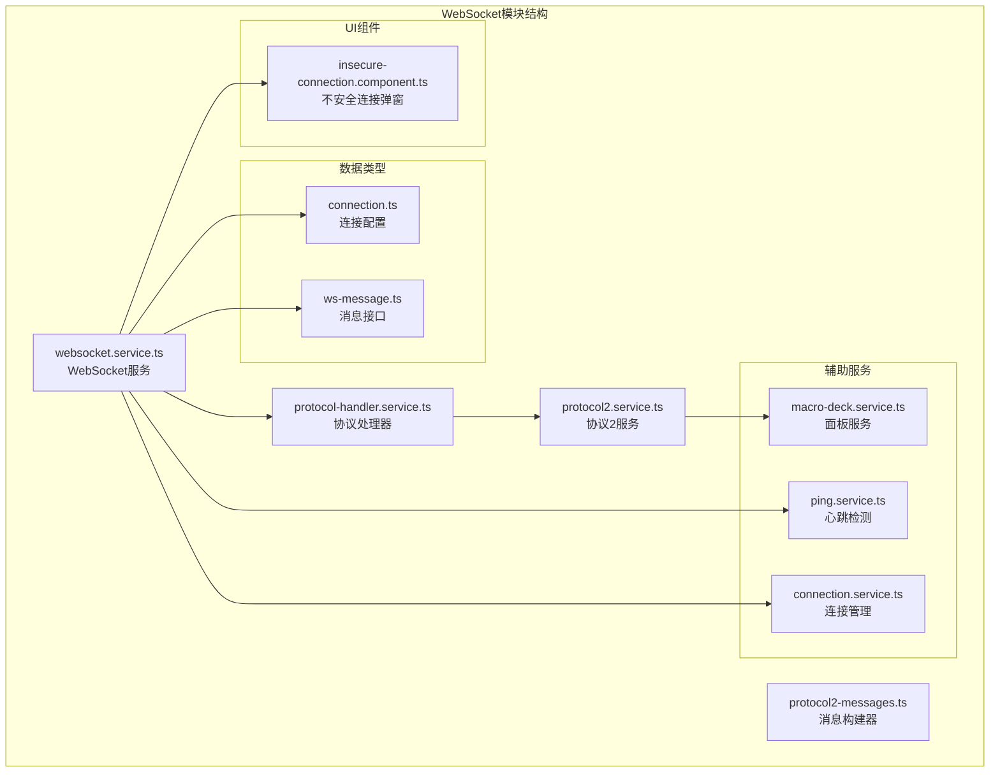
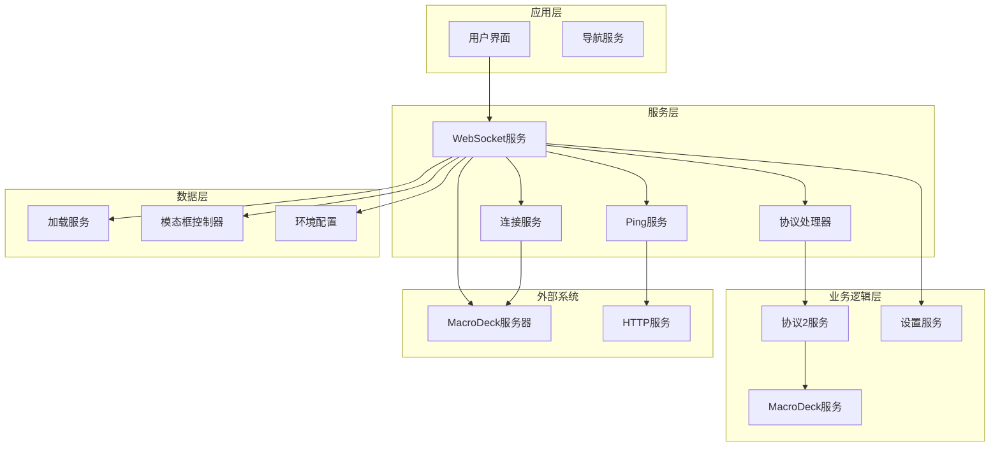
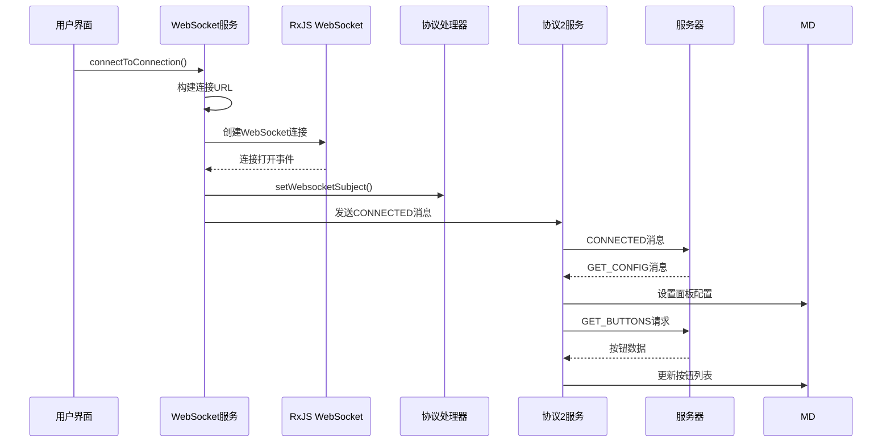
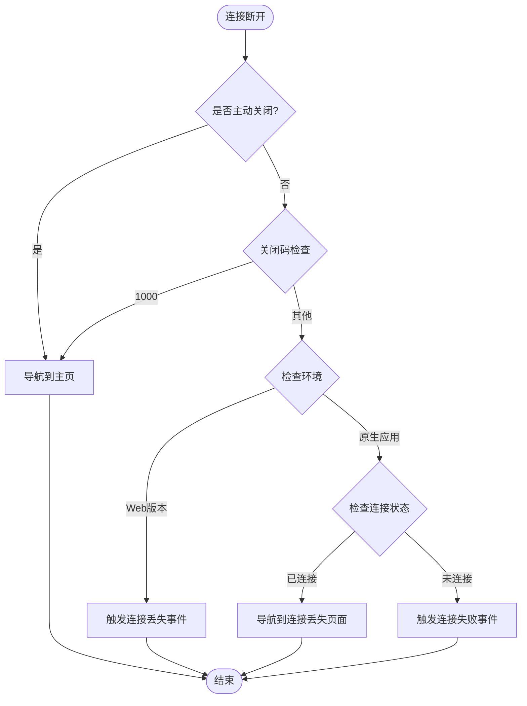
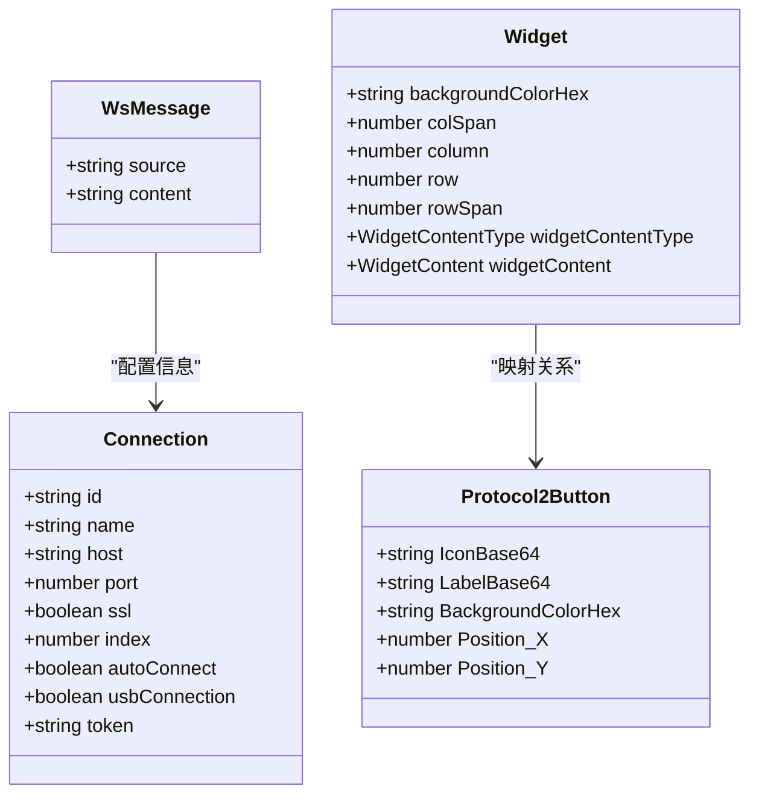
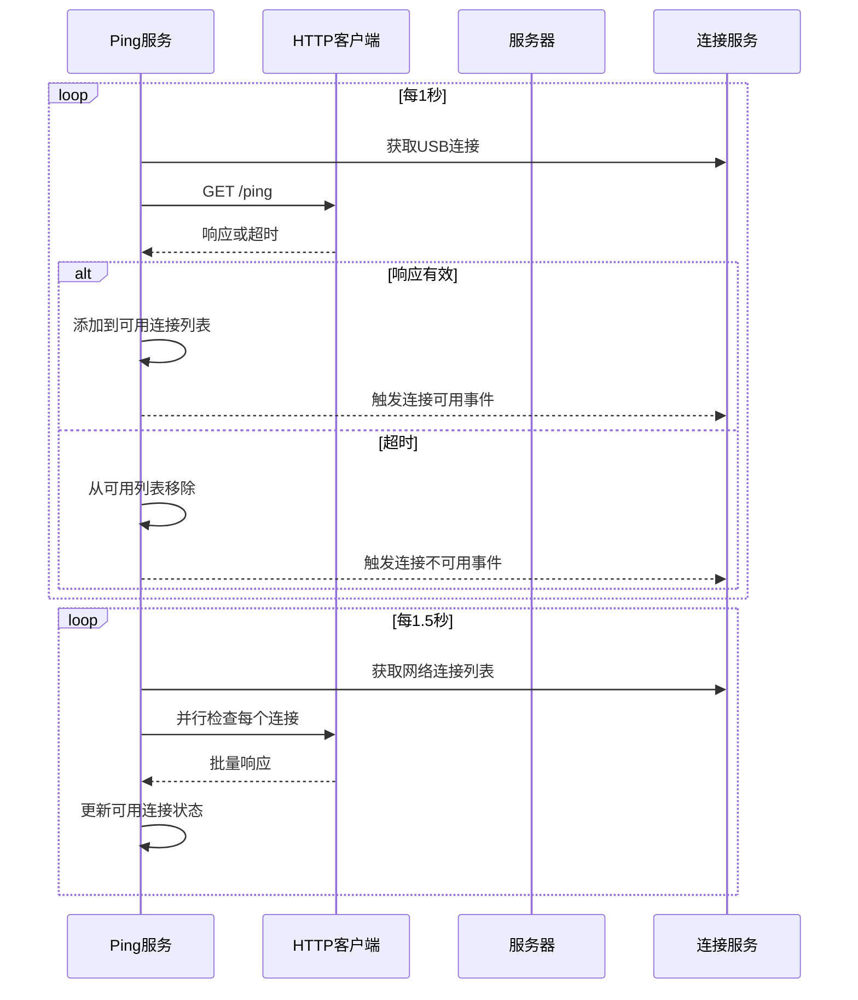
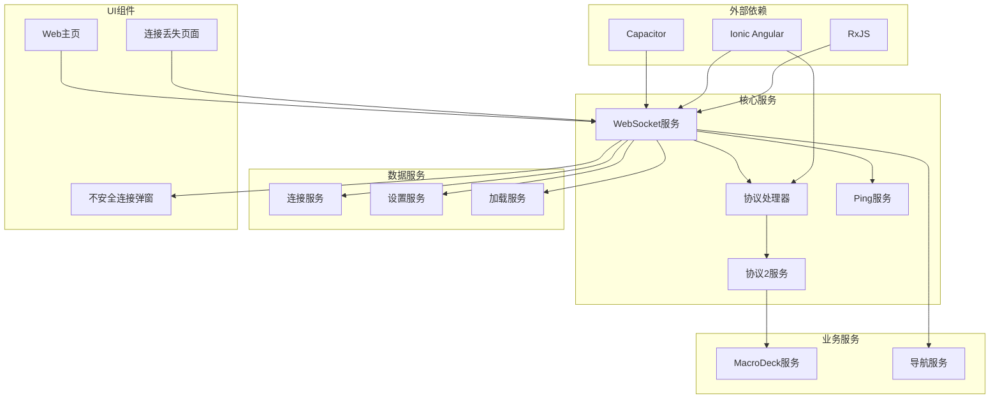

# WebSocket通信模块

<cite>
**本文档引用的文件**
- [websocket.service.ts](file://src/app/services/websocket/websocket.service.ts)
- [protocol-handler.service.ts](file://src/app/services/protocol/protocol-handler.service.ts)
- [protocol2.service.ts](file://src/app/services/protocol/protocol2.service.ts)
- [protocol2-messages.ts](file://src/app/datatypes/protocol2/protocol2-messages.ts)
- [ping.service.ts](file://src/app/services/ping/ping.service.ts)
- [connection.service.ts](file://src/app/services/connection/connection.service.ts)
- [macro-deck.service.ts](file://src/app/services/macro-deck/macro-deck.service.ts)
- [connection.ts](file://src/app/datatypes/connection.ts)
- [ws-message.ts](file://src/app/datatypes/ws-message.ts)
- [environment.ts](file://src/environments/environment.ts)
- [insecure-connection.component.ts](file://src/app/pages/home/modals/insecure-connection/insecure-connection.component.ts)
- [connection-lost.page.ts](file://src/app/pages/connection-lost/connection-lost.page.ts)
- [web-home.page.ts](file://src/app/pages/web-home/web-home.page.ts)
- [network_security_config.xml](file://resources/android/xml/network_security_config.xml)
</cite>

## 目录
1. [简介](#简介)
2. [项目结构](#项目结构)
3. [核心组件](#核心组件)
4. [架构概览](#架构概览)
5. [详细组件分析](#详细组件分析)
6. [依赖关系分析](#依赖关系分析)
7. [性能考虑](#性能考虑)
8. [故障排除指南](#故障排除指南)
9. [结论](#结论)

## 简介

WebSocket通信模块是Macro Deck客户端应用的核心通信层，负责与Macro Deck服务器建立实时双向通信连接。该模块实现了完整的WebSocket连接生命周期管理，包括连接建立、消息处理、心跳检测、断线重连和错误处理等功能。

模块采用RxJS的WebSocketSubject实现，提供了响应式编程模型，支持异步消息处理和事件驱动架构。通过协议处理器服务，模块能够支持多协议版本的消息解析和处理。

## 项目结构

WebSocket通信模块主要分布在以下目录结构中：

**图表来源**
- [websocket.service.ts:1-402](file://src/app/services/websocket/websocket.service.ts#L1-L402)
- [protocol-handler.service.ts:1-65](file://src/app/services/protocol/protocol-handler.service.ts#L1-L65)
- [protocol2.service.ts:1-296](file://src/app/services/protocol/protocol2.service.ts#L1-L296)

**章节来源**
- [websocket.service.ts:1-50](file://src/app/services/websocket/websocket.service.ts#L1-L50)
- [protocol-handler.service.ts:1-20](file://src/app/services/protocol/protocol-handler.service.ts#L1-L20)

## 核心组件

### WebSocket服务 (WebsocketService)

WebsocketService是整个WebSocket通信模块的核心控制器，负责管理WebSocket连接的完整生命周期。

**主要功能特性：**
- 连接管理：支持通过连接配置或连接字符串建立连接
- 消息处理：通过协议处理器分发消息到相应协议服务
- 状态监控：跟踪连接状态、连接中状态和关闭状态
- 错误处理：处理安全错误、连接失败和异常关闭
- 事件通知：提供连接成功、连接丢失、连接失败等事件

**关键属性：**
- `isConnected`: 当前连接状态
- `connecting`: 连接中状态
- `closing`: 主动关闭状态
- `url`: 当前连接URL
- `connection`: 当前连接配置

**章节来源**
- [websocket.service.ts:20-57](file://src/app/services/websocket/websocket.service.ts#L20-L57)
- [websocket.service.ts:63-87](file://src/app/services/websocket/websocket.service.ts#L63-L87)

### 协议处理器服务 (ProtocolHandlerService)

协议处理器服务作为消息分发中心，根据协议版本将消息路由到相应的协议处理服务。

**核心功能：**
- 协议版本管理：当前支持协议版本2
- 消息分发：将接收到的消息分发给对应协议服务
- WebSocket主题传递：向协议服务传递WebSocket连接对象

**章节来源**
- [protocol-handler.service.ts:9-37](file://src/app/services/protocol/protocol-handler.service.ts#L9-L37)

### 协议2服务 (Protocol2Service)

协议2服务处理Macro Deck协议版本2的所有消息类型，包括配置管理、按钮数据处理和用户交互转发。

**支持的消息类型：**
- `GET_CONFIG`: 面板配置消息
- `GET_BUTTONS`: 按钮列表消息  
- `UPDATE_BUTTON`: 单个按钮更新消息
- `UPDATE_LABEL`: 按钮标签更新消息

**章节来源**
- [protocol2.service.ts:41-95](file://src/app/services/protocol/protocol2.service.ts#L41-L95)

## 架构概览

WebSocket通信模块采用分层架构设计，确保了良好的关注点分离和可维护性。

**图表来源**
- [websocket.service.ts:51-57](file://src/app/services/websocket/websocket.service.ts#L51-L57)
- [protocol-handler.service.ts:14-15](file://src/app/services/protocol/protocol-handler.service.ts#L14-L15)
- [ping.service.ts:29-30](file://src/app/services/ping/ping.service.ts#L29-L30)

## 详细组件分析

### 连接建立流程

WebSocket连接建立过程遵循严格的步骤顺序，确保连接的可靠性和安全性。

**图表来源**
- [websocket.service.ts:63-87](file://src/app/services/websocket/websocket.service.ts#L63-L87)
- [websocket.service.ts:159-171](file://src/app/services/websocket/websocket.service.ts#L159-L171)
- [protocol2.service.ts:41-57](file://src/app/services/protocol/protocol2.service.ts#L41-L57)

**章节来源**
- [websocket.service.ts:101-134](file://src/app/services/websocket/websocket.service.ts#L101-L134)
- [protocol2-messages.ts:9-23](file://src/app/datatypes/protocol2/protocol2-messages.ts#L9-L23)

### 断线重连机制

模块实现了智能的断线重连策略，根据不同场景采取不同的重连方式。

**图表来源**
- [websocket.service.ts:197-219](file://src/app/services/websocket/websocket.service.ts#L197-L219)
- [connection-lost.page.ts:128-136](file://src/app/pages/connection-lost/connection-lost.page.ts#L128-L136)

**章节来源**
- [websocket.service.ts:142-172](file://src/app/services/websocket/websocket.service.ts#L142-L172)
- [connection-lost.page.ts:121-130](file://src/app/pages/connection-lost/connection-lost.page.ts#L121-L130)

### 消息序列化和反序列化

消息处理采用灵活的JSON序列化机制，支持动态消息格式和扩展性。

**消息数据结构：**

**图表来源**
- [ws-message.ts:2-7](file://src/app/datatypes/ws-message.ts#L2-L7)
- [connection.ts:2-21](file://src/app/datatypes/connection.ts#L2-L21)
- [protocol2.service.ts:111-125](file://src/app/services/protocol/protocol2.service.ts#L111-L125)

**章节来源**
- [protocol2.service.ts:64-93](file://src/app/services/protocol/protocol2.service.ts#L64-L93)
- [protocol2.service.ts:214-218](file://src/app/services/protocol/protocol2.service.ts#L214-L218)

### 心跳检测机制

虽然WebSocket本身支持ping/pong机制，但模块采用了独立的HTTP心跳检测服务来监控服务器可用性。

**Ping服务工作原理：**

**图表来源**
- [ping.service.ts:36-61](file://src/app/services/ping/ping.service.ts#L36-L61)
- [ping.service.ts:119-128](file://src/app/services/ping/ping.service.ts#L119-L128)

**章节来源**
- [ping.service.ts:14-130](file://src/app/services/ping/ping.service.ts#L14-L130)

### 连接安全性考虑

模块实现了多层次的安全保障措施：

**SSL/TLS配置：**
- 自动检测连接是否启用SSL
- 动态选择ws://或wss://协议
- 支持自定义SSL验证策略

**认证机制：**
- 客户端ID生成和管理
- 可选的认证令牌支持
- 连接确认消息包含认证信息

**安全错误处理：**
- SSL证书验证失败的专门处理
- 不安全连接的用户提示
- 环境特定的安全策略

**章节来源**
- [websocket.service.ts:74](file://src/app/services/websocket/websocket.service.ts#L74)
- [protocol2-messages.ts:9-23](file://src/app/datatypes/protocol2/protocol2-messages.ts#L9-L23)
- [insecure-connection.component.ts:13-21](file://src/app/pages/home/modals/insecure-connection/insecure-connection.component.ts#L13-L21)

## 依赖关系分析

WebSocket通信模块的依赖关系体现了清晰的层次结构和职责分离。

**图表来源**
- [websocket.service.ts:1-15](file://src/app/services/websocket/websocket.service.ts#L1-L15)
- [protocol-handler.service.ts:1-8](file://src/app/services/protocol/protocol-handler.service.ts#L1-L8)

**章节来源**
- [websocket.service.ts:1-20](file://src/app/services/websocket/websocket.service.ts#L1-L20)
- [protocol2.service.ts:1-14](file://src/app/services/protocol/protocol2.service.ts#L1-L14)

## 性能考虑

### 连接池和资源管理

模块采用了高效的资源管理模式：

**内存管理：**
- 使用RxJS的自动资源清理机制
- 连接关闭时自动释放订阅
- 避免内存泄漏的连接状态跟踪

**网络优化：**
- 智能连接复用策略
- 异步消息处理避免阻塞
- 条件订阅减少不必要的事件监听

### 错误恢复策略

**渐进式重连：**
- 连接丢失时启动指数退避算法
- 最大重连次数限制
- 用户可中断的重连过程

**资源保护：**
- 连接超时控制
- 内存使用监控
- CPU使用率优化

## 故障排除指南

### 常见连接问题

**SSL证书错误：**
- 现象：连接建立失败，出现安全错误
- 处理：显示不安全连接弹窗，允许用户手动确认
- 预防：确保服务器SSL证书有效且受信任

**网络连接失败：**
- 现象：无法连接到指定主机和端口
- 处理：检查网络配置，验证服务器可达性
- 预防：使用Ping服务预检测服务器状态

**认证失败：**
- 现象：连接被拒绝或需要认证
- 处理：验证客户端ID和认证令牌
- 预防：定期更新认证信息

### 调试技巧

**开发环境调试：**
- 启用详细的日志输出
- 使用浏览器开发者工具监控WebSocket通信
- 检查网络面板中的WebSocket帧

**生产环境监控：**
- 实施连接状态监控
- 记录连接失败原因统计
- 设置性能指标告警

**章节来源**
- [websocket.service.ts:125-132](file://src/app/services/websocket/websocket.service.ts#L125-L132)
- [insecure-connection.component.ts:17-21](file://src/app/pages/home/modals/insecure-connection/insecure-connection.component.ts#L17-L21)

## 结论

WebSocket通信模块通过精心设计的架构和完善的错误处理机制，为Macro Deck客户端应用提供了稳定可靠的实时通信能力。模块的主要优势包括：

**架构优势：**
- 清晰的分层设计和职责分离
- 响应式编程模型提高代码可维护性
- 插件化的协议处理支持未来扩展

**功能完整性：**
- 全面的连接生命周期管理
- 强大的错误处理和恢复机制
- 安全的连接建立和认证流程

**用户体验：**
- 平滑的断线重连体验
- 及时的状态反馈和用户提示
- 灵活的连接配置选项

该模块为开发者提供了坚实的基础，支持进一步的功能扩展和性能优化，是构建高性能实时应用的理想选择。