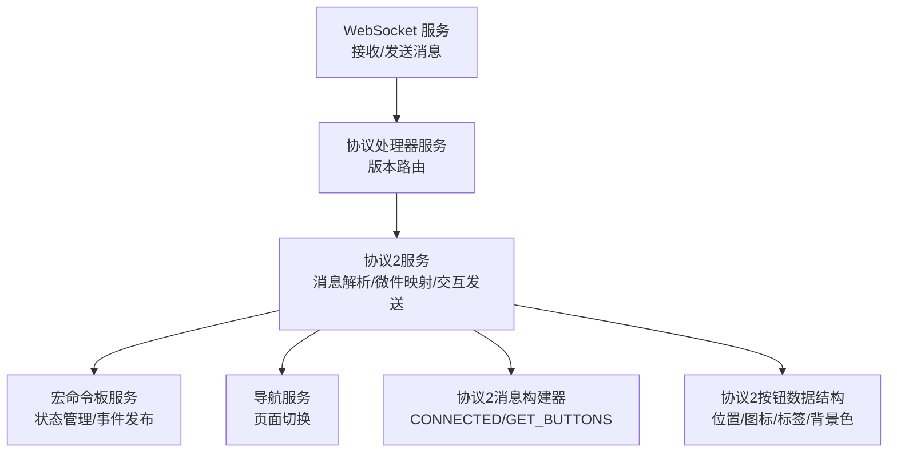
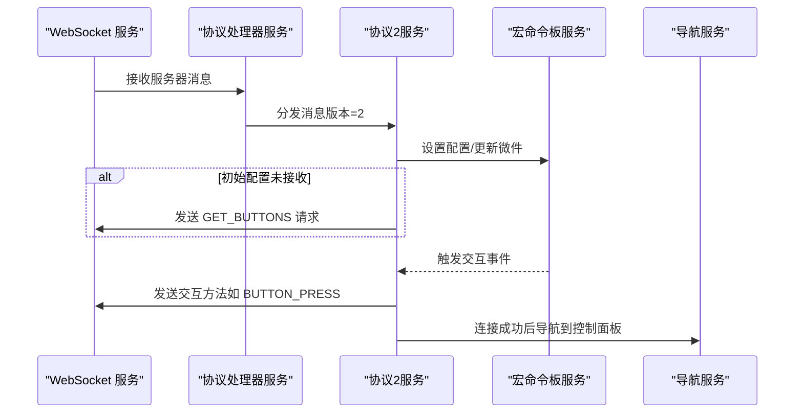
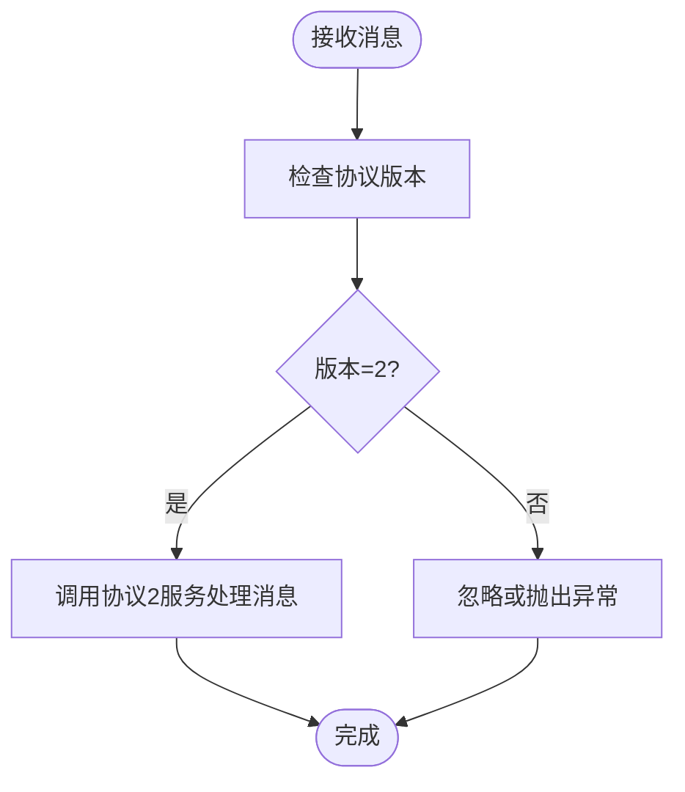
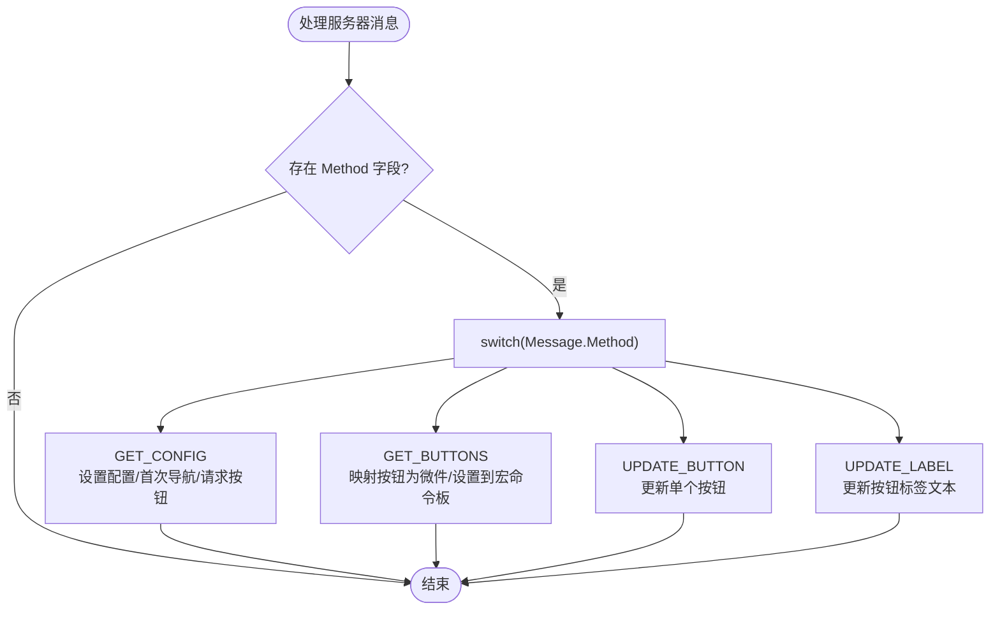
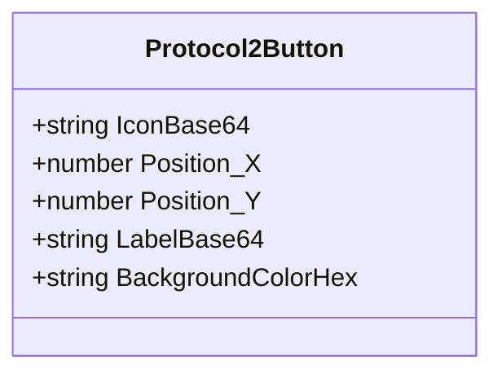
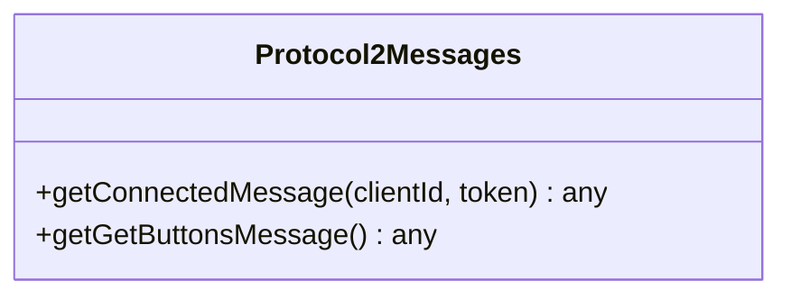
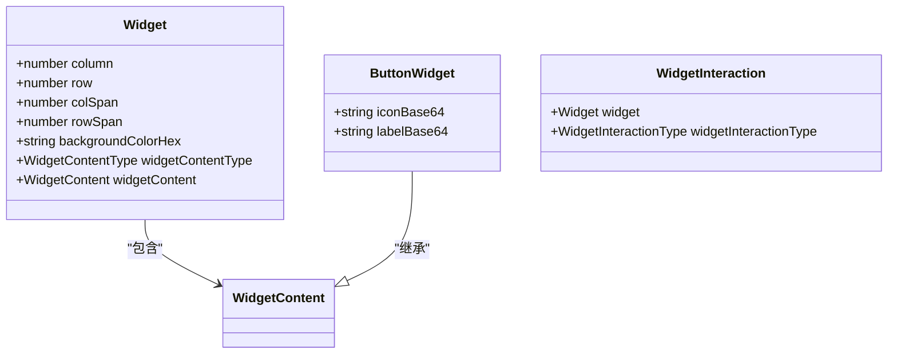
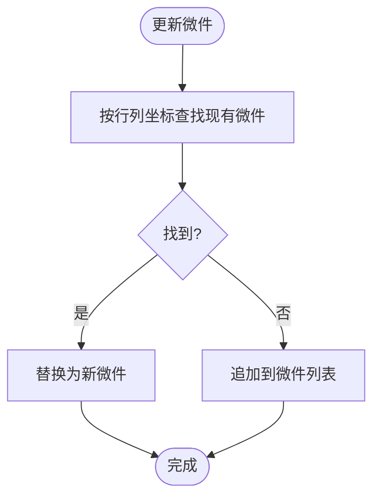
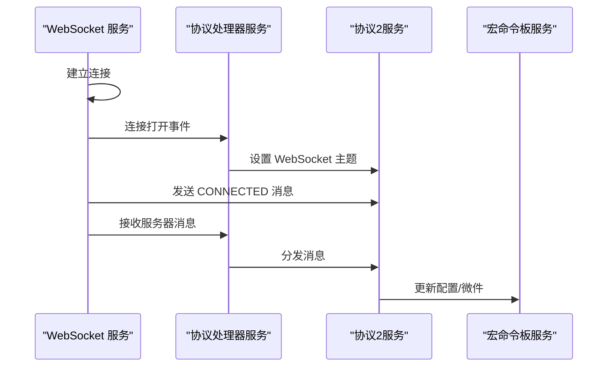
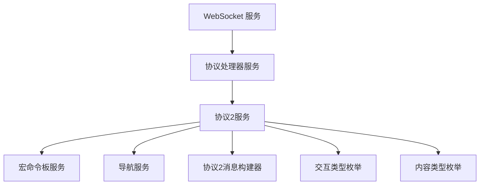

# 协议处理模块

<cite>
**本文档引用的文件**
- [protocol-handler.service.ts](file://src/app/services/protocol/protocol-handler.service.ts)
- [protocol2.service.ts](file://src/app/services/protocol/protocol2.service.ts)
- [protocol2-button.ts](file://src/app/datatypes/protocol2/protocol2-button.ts)
- [protocol2-messages.ts](file://src/app/datatypes/protocol2/protocol2-messages.ts)
- [widget-interaction-type.ts](file://src/app/enums/widget-interaction-type.ts)
- [widget-content-type.ts](file://src/app/enums/widget-content-type.ts)
- [widget.ts](file://src/app/datatypes/widgets/widget.ts)
- [button-widget.ts](file://src/app/datatypes/widgets/button-widget.ts)
- [widget-interaction.ts](file://src/app/datatypes/widgets/widget-interaction.ts)
- [widget-content.ts](file://src/app/datatypes/widgets/widget-content.ts)
- [macro-deck.service.ts](file://src/app/services/macro-deck/macro-deck.service.ts)
- [websocket.service.ts](file://src/app/services/websocket/websocket.service.ts)
- [navigation-destination.ts](file://src/app/enums/navigation-destination.ts)
</cite>

## 目录
1. [简介](#简介)
2. [项目结构](#项目结构)
3. [核心组件](#核心组件)
4. [架构总览](#架构总览)
5. [详细组件分析](#详细组件分析)
6. [依赖关系分析](#依赖关系分析)
7. [性能考虑](#性能考虑)
8. [故障排除指南](#故障排除指南)
9. [结论](#结论)
10. [附录](#附录)

## 简介
本文件面向协议处理模块，重点阐述以下内容：
- ProtocolHandlerService 的协议版本管理与消息路由机制
- Protocol2Service 的实现细节，包括消息解析、按钮数据处理、协议兼容性
- Protocol2Button 数据结构的设计理念与字段含义
- 不同协议版本之间的差异与迁移策略
- 消息序列化与反序列化的实现要点（基于 WebSocket JSON 对象）
- 协议扩展的开发指南（新增消息类型、修改现有功能）
- 协议调试工具使用方法、常见问题排查技巧与性能优化建议

## 项目结构
协议处理模块位于 Angular 应用的服务层与数据类型层，主要涉及：
- 协议处理服务：负责根据协议版本分发消息
- 协议2服务：处理协议版本2的消息解析、微件映射与交互发送
- 数据类型：协议2按钮、消息构建器、微件模型与交互类型
- 通信服务：WebSocket 通信与消息路由
- 核心服务：宏命令板状态管理与导航控制

图表来源
- [websocket.service.ts:101-134](file://src/app/services/websocket/websocket.service.ts#L101-L134)
- [protocol-handler.service.ts:22-28](file://src/app/services/protocol/protocol-handler.service.ts#L22-L28)
- [protocol2.service.ts:41-95](file://src/app/services/protocol/protocol2.service.ts#L41-L95)
- [macro-deck.service.ts:36-65](file://src/app/services/macro-deck/macro-deck.service.ts#L36-L65)

章节来源
- [protocol-handler.service.ts:1-65](file://src/app/services/protocol/protocol-handler.service.ts#L1-L65)
- [protocol2.service.ts:1-296](file://src/app/services/protocol/protocol2.service.ts#L1-L296)
- [websocket.service.ts:1-402](file://src/app/services/websocket/websocket.service.ts#L1-L402)

## 核心组件
- 协议处理器服务（ProtocolHandlerService）
  - 维护当前协议版本（默认为2），根据版本号将消息分发至对应协议服务
  - 提供设置 WebSocket 主题的方法，以便协议服务发送消息
- 协议2服务（Protocol2Service）
  - 解析服务器消息（GET_CONFIG、GET_BUTTONS、UPDATE_BUTTON、UPDATE_LABEL）
  - 将协议按钮数据映射为内部微件模型，并更新宏命令板状态
  - 订阅用户交互事件，转换为协议方法并发送给服务器
  - 通过 WebSocket 主题对象发送消息载荷
- 协议2消息构建器（Protocol2Messages）
  - 生成 CONNECTED 连接确认消息（包含客户端ID、API版本、设备类型、可选令牌）
  - 生成 GET_BUTTONS 请求按钮列表消息
- 协议2按钮数据结构（Protocol2Button）
  - 描述按钮在网格中的位置（Position_X, Position_Y）
  - 图标与标签的 Base64 编码数据
  - 背景色（十六进制）

章节来源
- [protocol-handler.service.ts:11-37](file://src/app/services/protocol/protocol-handler.service.ts#L11-L37)
- [protocol2.service.ts:21-34](file://src/app/services/protocol/protocol2.service.ts#L21-L34)
- [protocol2.service.ts:41-95](file://src/app/services/protocol/protocol2.service.ts#L41-L95)
- [protocol2.service.ts:111-125](file://src/app/services/protocol/protocol2.service.ts#L111-L125)
- [protocol2.service.ts:139-160](file://src/app/services/protocol/protocol2.service.ts#L139-L160)
- [protocol2-messages.ts:9-23](file://src/app/datatypes/protocol2/protocol2-messages.ts#L9-L23)
- [protocol2-messages.ts:29-33](file://src/app/datatypes/protocol2/protocol2-messages.ts#L29-L33)
- [protocol2-button.ts:2-13](file://src/app/datatypes/protocol2/protocol2-button.ts#L2-L13)

## 架构总览
协议处理模块采用“协议版本路由 + 具体协议实现”的分层设计：
- WebSocket 服务负责建立连接、订阅消息、错误处理与发送消息
- 协议处理器服务根据协议版本将消息分发到对应协议服务
- 协议2服务负责消息解析、微件映射、交互事件转换与发送
- 宏命令板服务维护面板配置与微件状态，提供事件发布/订阅
- 导航服务控制页面跳转（连接成功后进入控制面板）

图表来源
- [websocket.service.ts:115-119](file://src/app/services/websocket/websocket.service.ts#L115-L119)
- [protocol-handler.service.ts:22-28](file://src/app/services/protocol/protocol-handler.service.ts#L22-L28)
- [protocol2.service.ts:49-56](file://src/app/services/protocol/protocol2.service.ts#L49-L56)
- [protocol2.service.ts:139-160](file://src/app/services/protocol/protocol2.service.ts#L139-L160)

## 详细组件分析

### 协议处理器服务（ProtocolHandlerService）
职责与流程
- 维护协议版本号（默认2），在构造函数中注入协议2服务
- handleMessage(message)：根据协议版本分发消息；当前版本仅支持2
- setWebsocketSubject(socket)：将 WebSocket 主题传递给协议2服务，以便发送消息

图表来源
- [protocol-handler.service.ts:22-28](file://src/app/services/protocol/protocol-handler.service.ts#L22-L28)

章节来源
- [protocol-handler.service.ts:11-37](file://src/app/services/protocol/protocol-handler.service.ts#L11-L37)

### 协议2服务（Protocol2Service）
职责与流程
- 初始化时订阅宏命令板服务的交互事件，将用户交互转换为协议方法并发送
- handleMessage(message)：解析服务器消息，支持四种方法
  - GET_CONFIG：设置面板配置，首次收到时导航到控制面板并关闭加载
  - GET_BUTTONS：在收到初始配置后，将按钮数据映射为微件并设置到宏命令板
  - UPDATE_BUTTON：在收到初始配置后，更新单个按钮的完整数据
  - UPDATE_LABEL：在收到初始配置后，仅更新按钮标签文本
- mapProtocol2ButtonToWidget(button)：将协议2按钮映射为内部微件模型
- handleInteraction(interaction)：将交互类型映射为协议方法（如 BUTTON_PRESS、BUTTON_RELEASE、BUTTON_LONG_PRESS、BUTTON_LONG_PRESS_RELEASE），并发送消息

图表来源
- [protocol2.service.ts:41-95](file://src/app/services/protocol/protocol2.service.ts#L41-L95)
- [protocol2.service.ts:111-125](file://src/app/services/protocol/protocol2.service.ts#L111-L125)
- [protocol2.service.ts:139-160](file://src/app/services/protocol/protocol2.service.ts#L139-L160)

章节来源
- [protocol2.service.ts:21-34](file://src/app/services/protocol/protocol2.service.ts#L21-L34)
- [protocol2.service.ts:41-95](file://src/app/services/protocol/protocol2.service.ts#L41-L95)
- [protocol2.service.ts:111-125](file://src/app/services/protocol/protocol2.service.ts#L111-L125)
- [protocol2.service.ts:139-160](file://src/app/services/protocol/protocol2.service.ts#L139-L160)

### 协议2按钮数据结构（Protocol2Button）
设计理念与字段含义
- 位置信息：Position_X（列）、Position_Y（行），用于在网格中定位按钮
- 显示属性：IconBase64（图标 Base64 编码）、LabelBase64（标签 Base64 编码）、BackgroundColorHex（背景色十六进制）
- 设计原则：最小必要字段，便于传输与渲染；图标与标签采用 Base64 编码，避免额外的资源请求

图表来源
- [protocol2-button.ts:2-13](file://src/app/datatypes/protocol2/protocol2-button.ts#L2-L13)

章节来源
- [protocol2-button.ts:1-21](file://src/app/datatypes/protocol2/protocol2-button.ts#L1-L21)

### 协议2消息构建器（Protocol2Messages）
消息类型与用途
- CONNECTED：连接确认消息，包含 Method、Client-Id、API、Device-Type，以及可选 Token
- GET_BUTTONS：请求按钮列表消息，包含 Method

图表来源
- [protocol2-messages.ts:9-23](file://src/app/datatypes/protocol2/protocol2-messages.ts#L9-L23)
- [protocol2-messages.ts:29-33](file://src/app/datatypes/protocol2/protocol2-messages.ts#L29-L33)

章节来源
- [protocol2-messages.ts:1-57](file://src/app/datatypes/protocol2/protocol2-messages.ts#L1-L57)

### 微件模型与交互类型
- 微件（Widget）：描述网格中一个微件的位置、大小、背景色与内容类型
- 按钮微件（ButtonWidget）：继承自通用微件内容，包含图标与标签的 Base64 数据
- 交互类型（WidgetInteractionType）：定义按钮按下、短按释放、长按、长按释放
- 交互数据（WidgetInteraction）：描述一次用户交互，包含被交互的微件与交互类型

图表来源
- [widget.ts:5-20](file://src/app/datatypes/widgets/widget.ts#L5-L20)
- [button-widget.ts:4-9](file://src/app/datatypes/widgets/button-widget.ts#L4-L9)
- [widget-interaction.ts:5-10](file://src/app/datatypes/widgets/widget-interaction.ts#L5-L10)

章节来源
- [widget.ts:1-33](file://src/app/datatypes/widgets/widget.ts#L1-L33)
- [button-widget.ts:1-16](file://src/app/datatypes/widgets/button-widget.ts#L1-L16)
- [widget-interaction.ts:1-18](file://src/app/datatypes/widgets/widget-interaction.ts#L1-L18)
- [widget-content-type.ts:2-7](file://src/app/enums/widget-content-type.ts#L2-L7)
- [widget-interaction-type.ts:2-11](file://src/app/enums/widget-interaction-type.ts#L2-L11)

### 宏命令板服务（MacroDeckService）
职责与流程
- setConfig(message)：从服务器配置消息中提取面板参数（行数、列数、间距、圆角、背景显示），并发出配置更新事件
- setWidgets(widgets)：设置完整的微件列表
- updateWidget(widget)：根据行列坐标查找已有微件并替换，若不存在则追加

图表来源
- [macro-deck.service.ts:58-65](file://src/app/services/macro-deck/macro-deck.service.ts#L58-L65)

章节来源
- [macro-deck.service.ts:36-65](file://src/app/services/macro-deck/macro-deck.service.ts#L36-L65)

### WebSocket 服务（WebsocketService）
职责与流程
- 建立连接：根据连接配置构建 WebSocket URL，创建 WebSocket 主题并订阅消息与错误
- 打开连接：连接成功后，设置协议处理器的 WebSocket 主题，发送 CONNECTED 消息
- 接收消息：将消息交由协议处理器处理
- 错误处理：根据关闭码与环境决定导航到连接丢失页面或触发连接失败事件
- 关闭连接：主动关闭并清理订阅

图表来源
- [websocket.service.ts:141-172](file://src/app/services/websocket/websocket.service.ts#L141-L172)
- [websocket.service.ts:115-119](file://src/app/services/websocket/websocket.service.ts#L115-L119)
- [protocol-handler.service.ts:34-36](file://src/app/services/protocol/protocol-handler.service.ts#L34-L36)

章节来源
- [websocket.service.ts:101-134](file://src/app/services/websocket/websocket.service.ts#L101-L134)
- [websocket.service.ts:141-172](file://src/app/services/websocket/websocket.service.ts#L141-L172)
- [websocket.service.ts:197-219](file://src/app/services/websocket/websocket.service.ts#L197-L219)

## 依赖关系分析
组件耦合与协作
- WebSocket 服务依赖协议处理器服务进行消息分发
- 协议处理器服务依赖协议2服务处理协议版本2的消息
- 协议2服务依赖宏命令板服务更新面板配置与微件状态
- 协议2服务依赖导航服务在连接成功后跳转到控制面板
- 协议2服务依赖消息构建器生成 CONNECTED 与 GET_BUTTONS 消息
- 协议2服务依赖交互类型枚举将用户交互映射为协议方法

图表来源
- [websocket.service.ts:54-56](file://src/app/services/websocket/websocket.service.ts#L54-L56)
- [protocol-handler.service.ts:14](file://src/app/services/protocol/protocol-handler.service.ts#L14)
- [protocol2.service.ts:27-29](file://src/app/services/protocol/protocol2.service.ts#L27-L29)
- [protocol2.service.ts:139-160](file://src/app/services/protocol/protocol2.service.ts#L139-L160)

章节来源
- [websocket.service.ts:1-402](file://src/app/services/websocket/websocket.service.ts#L1-L402)
- [protocol-handler.service.ts:1-65](file://src/app/services/protocol/protocol-handler.service.ts#L1-L65)
- [protocol2.service.ts:1-296](file://src/app/services/protocol/protocol2.service.ts#L1-L296)

## 性能考虑
- 消息解析与映射
  - 使用 map 方法批量映射按钮数据，时间复杂度 O(n)，其中 n 为按钮数量
  - 在 UPDATE_LABEL 中通过坐标查找微件，时间复杂度 O(n)；可考虑建立坐标到索引的映射表以优化为 O(1)
- 事件驱动
  - 交互事件通过宏命令板服务发布，避免直接耦合，提升可维护性
- WebSocket 连接
  - 连接建立与错误处理逻辑清晰，减少不必要的重连与资源占用
- 建议
  - 对于频繁更新的按钮标签，可引入节流/去抖机制
  - 对微件列表进行虚拟滚动或分页加载，降低渲染压力
  - 对 Base64 图标/标签进行缓存，避免重复解码

## 故障排除指南
常见问题与排查步骤
- 连接失败
  - 检查 WebSocket URL 构建（SSL/WSS 与 WS 的选择）
  - 查看关闭码与原因，区分正常关闭与异常关闭
  - 在 Web 版本下，连接失败会触发连接失败事件；移动端会在未连接时导航到连接失败页面
- 无法接收按钮数据
  - 确认已收到 GET_CONFIG 并完成导航到控制面板
  - 检查 GET_BUTTONS 请求是否发送
- 按钮标签更新无效
  - 确认 UPDATE_LABEL 消息中坐标与现有微件匹配
  - 确认初始配置已接收
- 交互无响应
  - 检查宏命令板服务是否正确发布交互事件
  - 确认协议2服务已订阅交互事件并发送相应方法

章节来源
- [websocket.service.ts:197-219](file://src/app/services/websocket/websocket.service.ts#L197-L219)
- [protocol2.service.ts:50-56](file://src/app/services/protocol/protocol2.service.ts#L50-L56)
- [protocol2.service.ts:82-92](file://src/app/services/protocol/protocol2.service.ts#L82-L92)
- [protocol2.service.ts:139-160](file://src/app/services/protocol/protocol2.service.ts#L139-L160)

## 结论
协议处理模块通过清晰的分层设计实现了协议版本路由、消息解析、微件映射与交互发送。Protocol2Service 作为核心实现，承担了与服务器通信的关键职责。通过合理的数据结构与事件驱动机制，系统具备良好的可扩展性与可维护性。后续可在微件索引优化、消息节流与缓存等方面进一步提升性能。

## 附录

### 不同协议版本之间的差异与迁移策略
- 当前实现
  - 协议版本默认为2，仅支持协议2的消息类型
- 迁移策略
  - 新增协议版本时，在协议处理器服务中增加版本分支，分别调用对应协议服务
  - 保持消息接口的向后兼容或提供适配层，确保旧版本消息仍可解析
  - 对新增消息类型，扩展消息构建器与协议服务的消息处理逻辑

章节来源
- [protocol-handler.service.ts:22-28](file://src/app/services/protocol/protocol-handler.service.ts#L22-L28)

### 消息序列化与反序列化
- 反序列化
  - WebSocket 接收到的是 JSON 对象，直接由协议2服务解析 Method 与 Buttons 等字段
- 序列化
  - 通过 WebSocket 主题对象发送消息对象，底层由 RxJS WebSocket 自动序列化为 JSON
- 数据压缩
  - 未实现专用压缩算法；可通过 Base64 编码减少额外请求，但会增加 CPU 开销

章节来源
- [websocket.service.ts:115-119](file://src/app/services/websocket/websocket.service.ts#L115-L119)
- [protocol2.service.ts:131-133](file://src/app/services/protocol/protocol2.service.ts#L131-L133)

### 协议扩展开发指南
- 新增消息类型
  - 在消息构建器中添加生成消息的方法
  - 在协议2服务的消息处理 switch 中新增分支，实现解析与处理逻辑
  - 如需更新微件状态，调用宏命令板服务的 setWidgets 或 updateWidget
- 修改现有功能
  - 若需要扩展按钮字段，先在协议2按钮数据结构中添加字段
  - 在映射函数中同步更新微件模型
  - 在消息处理分支中补充对新字段的解析与应用
- 交互扩展
  - 在交互类型枚举中添加新的交互类型
  - 在协议2服务的交互处理函数中映射到新的协议方法
  - 确保消息格式与服务器约定一致

章节来源
- [protocol2-messages.ts:9-23](file://src/app/datatypes/protocol2/protocol2-messages.ts#L9-L23)
- [protocol2.service.ts:41-95](file://src/app/services/protocol/protocol2.service.ts#L41-L95)
- [protocol2.service.ts:111-125](file://src/app/services/protocol/protocol2.service.ts#L111-L125)
- [protocol2.service.ts:139-160](file://src/app/services/protocol/protocol2.service.ts#L139-L160)
- [widget-interaction-type.ts:2-11](file://src/app/enums/widget-interaction-type.ts#L2-L11)

### 协议调试工具使用方法
- WebSocket 调试
  - 使用浏览器开发者工具的网络面板查看 WebSocket 通信
  - 观察 CONNECTED 与 GET_BUTTONS 的发送与响应
- 日志与事件
  - 关注连接打开/关闭事件与错误事件
  - 在宏命令板服务中监听配置更新事件，验证面板参数是否正确设置
- 常见问题定位
  - 若按钮未显示，检查 GET_BUTTONS 是否被发送与接收
  - 若标签更新无效，检查 UPDATE_LABEL 的坐标匹配与初始配置状态

章节来源
- [websocket.service.ts:141-172](file://src/app/services/websocket/websocket.service.ts#L141-L172)
- [macro-deck.service.ts:42](file://src/app/services/macro-deck/macro-deck.service.ts#L42)