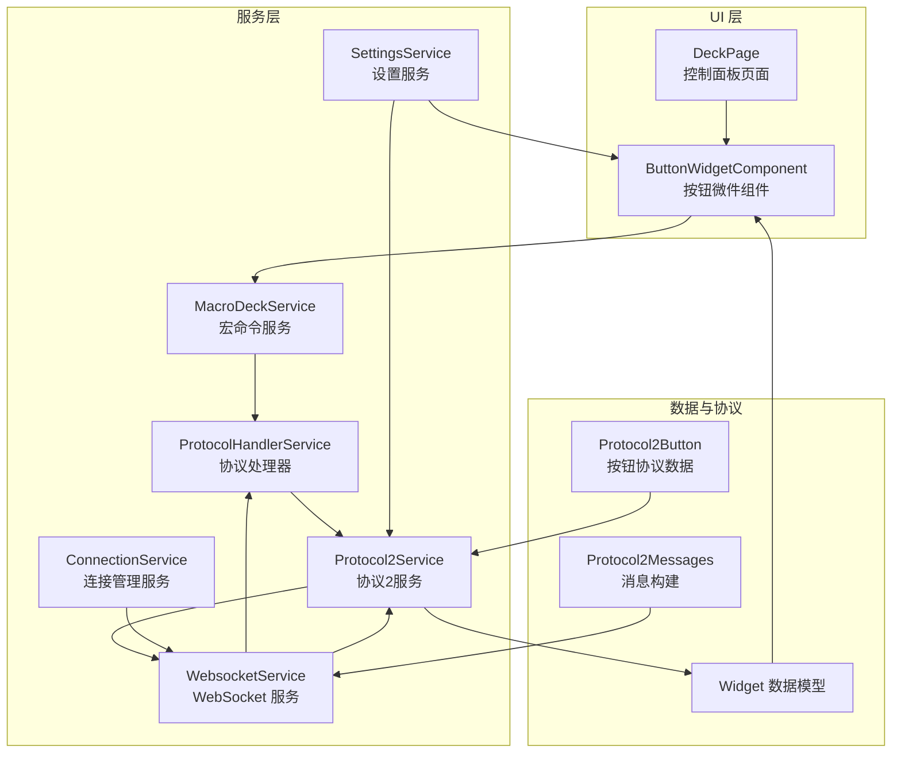
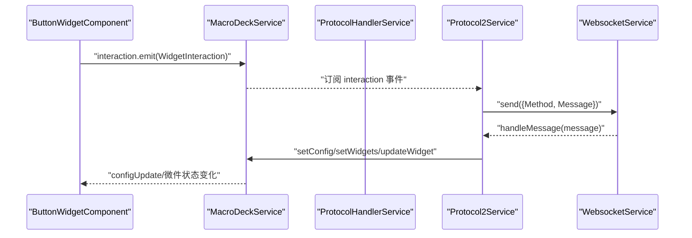
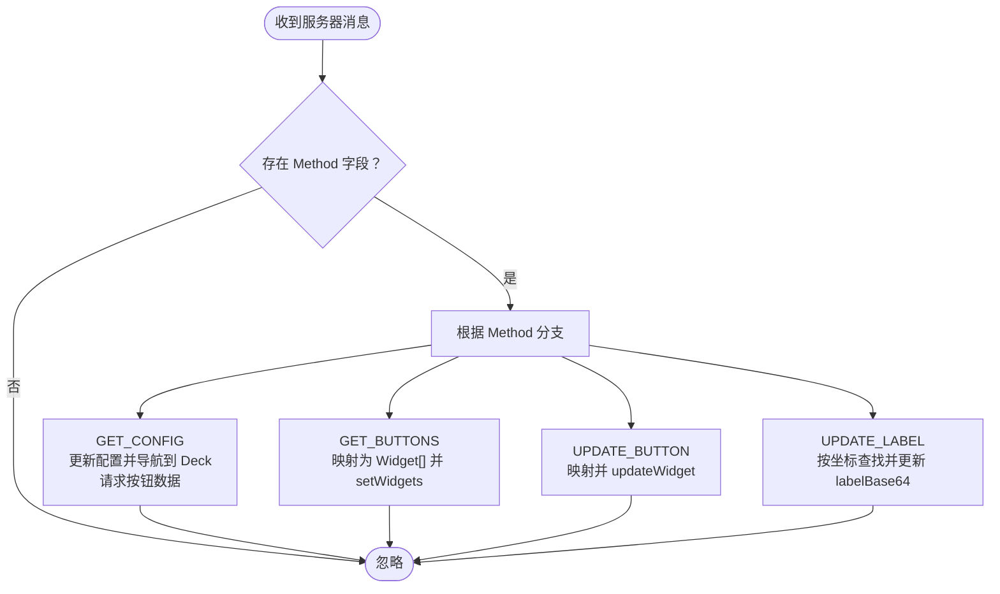
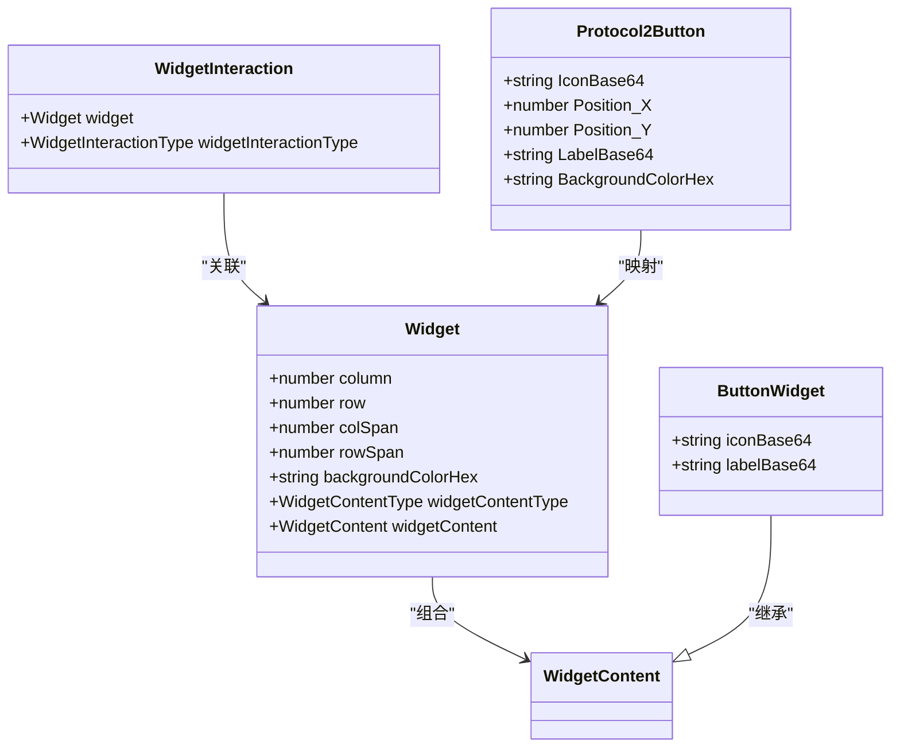
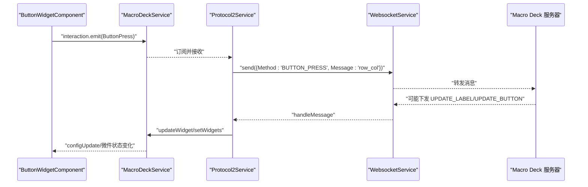
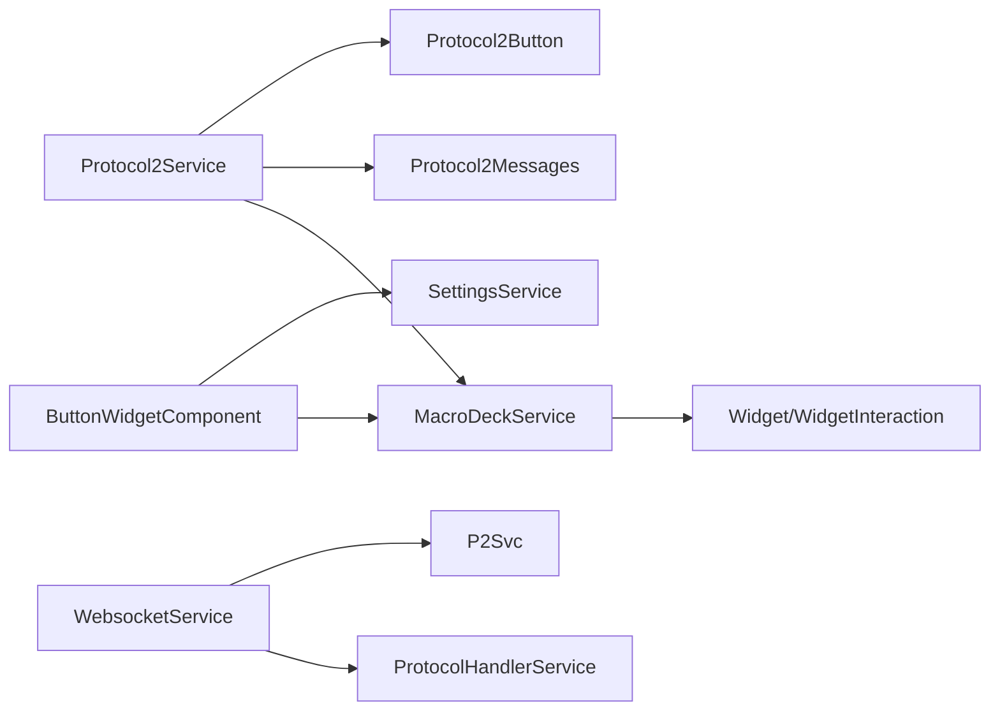

# 宏命令服务模块

<cite>
**本文档引用的文件**
- [macro-deck.service.ts](file://src/app/services/macro-deck/macro-deck.service.ts)
- [widget.ts](file://src/app/datatypes/widgets/widget.ts)
- [button-widget.ts](file://src/app/datatypes/widgets/button-widget.ts)
- [widget-content.ts](file://src/app/datatypes/widgets/widget-content.ts)
- [widget-interaction.ts](file://src/app/datatypes/widgets/widget-interaction.ts)
- [widget-content-type.ts](file://src/app/enums/widget-content-type.ts)
- [widget-interaction-type.ts](file://src/app/enums/widget-interaction-type.ts)
- [websocket.service.ts](file://src/app/services/websocket/websocket.service.ts)
- [protocol-handler.service.ts](file://src/app/services/protocol/protocol-handler.service.ts)
- [protocol2.service.ts](file://src/app/services/protocol/protocol2.service.ts)
- [protocol2-messages.ts](file://src/app/datatypes/protocol2/protocol2-messages.ts)
- [protocol2-button.ts](file://src/app/datatypes/protocol2/protocol2-button.ts)
- [button-widget.component.ts](file://src/app/widget-content-components/button-widget/button-widget.component.ts)
- [deck.page.ts](file://src/app/pages/deck/deck.page.ts)
- [settings.service.ts](file://src/app/services/settings/settings.service.ts)
- [connection.service.ts](file://src/app/services/connection/connection.service.ts)
</cite>

## 目录
1. [简介](#简介)
2. [项目结构](#项目结构)
3. [核心组件](#核心组件)
4. [架构总览](#架构总览)
5. [详细组件分析](#详细组件分析)
6. [依赖关系分析](#依赖关系分析)
7. [性能考虑](#性能考虑)
8. [故障排除指南](#故障排除指南)
9. [结论](#结论)
10. [附录](#附录)

## 简介
本文件系统性梳理宏命令服务模块（MacroDeckService）在整体架构中的核心作用与职责边界，解释其如何协调连接、WebSocket、协议处理等子模块的工作流程；阐述宏命令执行的完整生命周期（命令解析、参数验证、执行调度等）；描述Widget数据模型的处理机制（按钮渲染、交互事件、状态更新等）；说明错误处理策略、异常恢复机制与日志记录；并提供扩展开发指南与监控、性能分析、故障排除的最佳实践。

## 项目结构
宏命令服务模块位于 Angular 应用的服务层，围绕 MacroDeckService 为核心，向上承接 UI 渲染与交互，向下对接 WebSocket 通信与协议处理，形成“数据模型-渲染组件-通信协议-设备控制”的闭环。

图表来源
- [macro-deck.service.ts:1-111](file://src/app/services/macro-deck/macro-deck.service.ts#L1-L111)
- [websocket.service.ts:1-402](file://src/app/services/websocket/websocket.service.ts#L1-L402)
- [protocol-handler.service.ts:1-65](file://src/app/services/protocol/protocol-handler.service.ts#L1-L65)
- [protocol2.service.ts:1-296](file://src/app/services/protocol/protocol2.service.ts#L1-L296)
- [button-widget.component.ts:1-393](file://src/app/widget-content-components/button-widget/button-widget.component.ts#L1-L393)
- [deck.page.ts:1-158](file://src/app/pages/deck/deck.page.ts#L1-L158)
- [settings.service.ts:1-200](file://src/app/services/settings/settings.service.ts#L1-L200)
- [connection.service.ts:1-179](file://src/app/services/connection/connection.service.ts#L1-L179)
- [protocol2-messages.ts:1-57](file://src/app/datatypes/protocol2/protocol2-messages.ts#L1-L57)
- [protocol2-button.ts:1-21](file://src/app/datatypes/protocol2/protocol2-button.ts#L1-L21)

章节来源
- [macro-deck.service.ts:1-111](file://src/app/services/macro-deck/macro-deck.service.ts#L1-L111)
- [websocket.service.ts:1-402](file://src/app/services/websocket/websocket.service.ts#L1-L402)
- [protocol-handler.service.ts:1-65](file://src/app/services/protocol/protocol-handler.service.ts#L1-L65)
- [protocol2.service.ts:1-296](file://src/app/services/protocol/protocol2.service.ts#L1-L296)
- [button-widget.component.ts:1-393](file://src/app/widget-content-components/button-widget/button-widget.component.ts#L1-L393)
- [deck.page.ts:1-158](file://src/app/pages/deck/deck.page.ts#L1-L158)
- [settings.service.ts:1-200](file://src/app/services/settings/settings.service.ts#L1-L200)
- [connection.service.ts:1-179](file://src/app/services/connection/connection.service.ts#L1-L179)
- [protocol2-messages.ts:1-57](file://src/app/datatypes/protocol2/protocol2-messages.ts#L1-L57)
- [protocol2-button.ts:1-21](file://src/app/datatypes/protocol2/protocol2-button.ts#L1-L21)

## 核心组件
- MacroDeckService：管理面板配置与微件数据状态，发布配置更新与用户交互事件，提供微件列表的增删改能力。
- WebsocketService：封装 WebSocket 连接、消息收发、连接状态管理与错误处理。
- ProtocolHandlerService：根据协议版本分发消息到对应协议服务。
- Protocol2Service：解析协议消息、映射为内部微件模型、处理用户交互事件并转发至服务器。
- ButtonWidgetComponent：渲染按钮微件、处理交互事件、维护视觉状态。
- 数据模型：Widget、ButtonWidget、WidgetInteraction、Protocol2Button 等。

章节来源
- [macro-deck.service.ts:10-111](file://src/app/services/macro-deck/macro-deck.service.ts#L10-L111)
- [protocol2.service.ts:19-34](file://src/app/services/protocol/protocol2.service.ts#L19-L34)
- [button-widget.component.ts:23-53](file://src/app/widget-content-components/button-widget/button-widget.component.ts#L23-L53)

## 架构总览
宏命令服务模块采用“事件驱动 + 协议解耦”的设计：
- UI 侧通过 ButtonWidgetComponent 产生交互事件（按下/释放/长按），由 MacroDeckService.interaction 发布。
- Protocol2Service 订阅交互事件，将其映射为协议方法并发送至服务器。
- WebsocketService 接收服务器消息，交由 ProtocolHandlerService 分发，再由 Protocol2Service 解析并更新 MacroDeckService 的微件状态。
- DeckPage 作为入口页面，确保连接有效性并在需要时导航回首页。

图表来源
- [button-widget.component.ts:383-391](file://src/app/widget-content-components/button-widget/button-widget.component.ts#L383-L391)
- [macro-deck.service.ts:76-109](file://src/app/services/macro-deck/macro-deck.service.ts#L76-L109)
- [protocol2.service.ts:31-33](file://src/app/services/protocol/protocol2.service.ts#L31-L33)
- [protocol2.service.ts:139-160](file://src/app/services/protocol/protocol2.service.ts#L139-L160)
- [websocket.service.ts:115-133](file://src/app/services/websocket/websocket.service.ts#L115-L133)

## 详细组件分析

### MacroDeckService：宏命令服务核心
职责边界
- 管理面板配置（行/列、间距、圆角、背景开关）与事件发布。
- 维护微件列表，支持整包替换与单个更新。
- 作为 UI 与协议层之间的桥梁，发布配置更新与交互事件。

关键实现要点
- 配置更新：setConfig 接收服务器下发的面板配置，更新字段并发出 configUpdate 事件。
- 微件管理：setWidgets 整包替换；updateWidget 根据行列坐标查找并替换，不存在则追加。
- 事件机制：interaction 事件承载用户与微件的交互行为，供协议层消费。

复杂度与性能
- updateWidget 查找复杂度 O(n)，n 为微件数量；建议在批量更新时优先使用 setWidgets。

章节来源
- [macro-deck.service.ts:76-109](file://src/app/services/macro-deck/macro-deck.service.ts#L76-L109)

### WebsocketService：连接与消息传输
职责边界
- 建立/关闭 WebSocket 连接，处理连接打开/关闭事件。
- 订阅消息流，转交给协议处理器；处理安全错误与连接失败场景。
- 向协议层暴露发送接口，并在连接建立后发送握手消息。

关键实现要点
- 连接状态：connecting/closing/isConnected 状态机避免重复连接与竞态。
- 错误处理：区分安全错误（SSL）、正常关闭码 1000、以及非主动关闭的异常路径。
- 握手流程：连接成功后发送 CONNECTED 消息，携带客户端 ID 与可选 Token。

章节来源
- [websocket.service.ts:63-87](file://src/app/services/websocket/websocket.service.ts#L63-L87)
- [websocket.service.ts:101-134](file://src/app/services/websocket/websocket.service.ts#L101-L134)
- [websocket.service.ts:141-172](file://src/app/services/websocket/websocket.service.ts#L141-L172)
- [websocket.service.ts:197-219](file://src/app/services/websocket/websocket.service.ts#L197-L219)
- [websocket.service.ts:275-288](file://src/app/services/websocket/websocket.service.ts#L275-L288)
- [websocket.service.ts:300-330](file://src/app/services/websocket/websocket.service.ts#L300-L330)
- [websocket.service.ts:332-360](file://src/app/services/websocket/websocket.service.ts#L332-L360)
- [websocket.service.ts:374-393](file://src/app/services/websocket/websocket.service.ts#L374-L393)

### ProtocolHandlerService 与 Protocol2Service：协议编排与消息映射
职责边界
- ProtocolHandlerService：根据协议版本分发消息到对应协议服务。
- Protocol2Service：解析服务器消息（GET_CONFIG/GET_BUTTONS/UPDATE_BUTTON/UPDATE_LABEL），映射为内部微件模型；订阅 MacroDeckService.interaction 并转发交互到服务器。

关键实现要点
- 消息分发：handleMessage 根据 Method 分支处理。
- 初始配置：首次收到 GET_CONFIG 后导航到 Deck 页面并请求按钮数据。
- 微件映射：mapProtocol2ButtonToWidget 将 Protocol2Button 映射为 Widget。
- 交互转发：handleInteraction 将交互类型映射为协议方法并发送。

图表来源
- [protocol2.service.ts:41-95](file://src/app/services/protocol/protocol2.service.ts#L41-L95)
- [protocol2.service.ts:111-125](file://src/app/services/protocol/protocol2.service.ts#L111-L125)
- [protocol2.service.ts:193-247](file://src/app/services/protocol/protocol2.service.ts#L193-L247)
- [protocol2.service.ts:254-268](file://src/app/services/protocol/protocol2.service.ts#L254-L268)

章节来源
- [protocol-handler.service.ts:22-36](file://src/app/services/protocol/protocol-handler.service.ts#L22-L36)
- [protocol2.service.ts:41-95](file://src/app/services/protocol/protocol2.service.ts#L41-L95)
- [protocol2.service.ts:193-247](file://src/app/services/protocol/protocol2.service.ts#L193-L247)

### Widget 数据模型与按钮渲染
数据模型
- Widget：描述微件在网格中的位置、尺寸、背景色、内容类型与具体内容。
- ButtonWidget：按钮内容，包含图标与标签的 Base64 数据。
- WidgetInteraction：一次用户与微件的交互行为。
- Protocol2Button：服务器下发的按钮协议数据。

渲染与交互
- ButtonWidgetComponent：解码 Base64 图片为安全 URL，设置背景色与边框样式；处理按下/释放/长按事件；通过 MacroDeckService.interaction 发布交互事件。
- 设置联动：读取设置服务中的边框样式、长按延迟等影响渲染与交互行为的参数。

图表来源
- [widget.ts:5-20](file://src/app/datatypes/widgets/widget.ts#L5-L20)
- [button-widget.ts:4-9](file://src/app/datatypes/widgets/button-widget.ts#L4-L9)
- [widget-content.ts:2-3](file://src/app/datatypes/widgets/widget-content.ts#L2-L3)
- [widget-interaction.ts:5-10](file://src/app/datatypes/widgets/widget-interaction.ts#L5-L10)
- [protocol2-button.ts:2-13](file://src/app/datatypes/protocol2/protocol2-button.ts#L2-L13)

章节来源
- [widget.ts:5-20](file://src/app/datatypes/widgets/widget.ts#L5-L20)
- [button-widget.ts:4-9](file://src/app/datatypes/widgets/button-widget.ts#L4-L9)
- [widget-interaction.ts:5-10](file://src/app/datatypes/widgets/widget-interaction.ts#L5-L10)
- [protocol2-button.ts:2-13](file://src/app/datatypes/protocol2/protocol2-button.ts#L2-L13)
- [button-widget.component.ts:88-103](file://src/app/widget-content-components/button-widget/button-widget.component.ts#L88-L103)
- [button-widget.component.ts:350-365](file://src/app/widget-content-components/button-widget/button-widget.component.ts#L350-L365)

### 交互事件与执行生命周期
交互链路
- 用户在按钮上按下/释放/长按，ButtonWidgetComponent 发出 WidgetInteraction。
- Protocol2Service 订阅交互事件，将交互类型映射为协议方法（如 BUTTON_PRESS/BUTTON_LONG_PRESS），并发送消息到服务器。
- 服务器可能下发 UPDATE_LABEL/UPDATE_BUTTON 等增量更新，Protocol2Service 解析并调用 MacroDeckService.updateWidget，最终驱动 UI 重新渲染。

图表来源
- [button-widget.component.ts:383-391](file://src/app/widget-content-components/button-widget/button-widget.component.ts#L383-L391)
- [protocol2.service.ts:139-160](file://src/app/services/protocol/protocol2.service.ts#L139-L160)
- [protocol2.service.ts:69-93](file://src/app/services/protocol/protocol2.service.ts#L69-L93)
- [websocket.service.ts:115-133](file://src/app/services/websocket/websocket.service.ts#L115-L133)

章节来源
- [button-widget.component.ts:383-391](file://src/app/widget-content-components/button-widget/button-widget.component.ts#L383-L391)
- [protocol2.service.ts:139-160](file://src/app/services/protocol/protocol2.service.ts#L139-L160)
- [protocol2.service.ts:69-93](file://src/app/services/protocol/protocol2.service.ts#L69-L93)

### 错误处理策略与异常恢复
- 连接错误：WebsocketService 在 error 回调中处理安全错误（如 SSL 不受信），并通过 Modal 提示；在连接关闭事件中区分正常关闭与异常关闭，分别触发导航或失败事件。
- 异常恢复：当连接异常断开时，根据环境与连接状态决定导航到连接丢失页面或直接发出连接丢失事件；连接成功后重置状态并发送握手消息。
- 日志记录：连接状态与关闭码在控制台输出，便于调试定位。

章节来源
- [websocket.service.ts:120-133](file://src/app/services/websocket/websocket.service.ts#L120-L133)
- [websocket.service.ts:141-172](file://src/app/services/websocket/websocket.service.ts#L141-L172)
- [websocket.service.ts:197-219](file://src/app/services/websocket/websocket.service.ts#L197-L219)
- [websocket.service.ts:332-360](file://src/app/services/websocket/websocket.service.ts#L332-L360)
- [websocket.service.ts:374-393](file://src/app/services/websocket/websocket.service.ts#L374-L393)

### 扩展开发指南
- 自定义命令类型
  - 在 WidgetInteractionType 中新增交互类型枚举值。
  - 在 Protocol2Service.handleInteraction 中增加映射逻辑，将新类型转换为协议方法名。
  - 在按钮组件中补充相应事件处理逻辑（如新的长按阶段），并通过 MacroDeckService.interaction 发布。
- 自定义微件内容
  - 定义新的 WidgetContent 接口并实现 ButtonWidget 继承关系。
  - 在 Protocol2Service.mapProtocol2ButtonToWidget 中增加映射分支，将协议按钮数据映射为新的内容类型。
  - 在 UI 组件中实现渲染与交互逻辑，确保 Base64 解码与样式设置正确。
- 协议扩展
  - 在 ProtocolHandlerService 中增加协议版本判断与分发。
  - 在新的协议服务中实现消息解析与微件状态更新逻辑。

章节来源
- [widget-interaction-type.ts:2-11](file://src/app/enums/widget-interaction-type.ts#L2-L11)
- [protocol2.service.ts:139-160](file://src/app/services/protocol/protocol2.service.ts#L139-L160)
- [button-widget.component.ts:383-391](file://src/app/widget-content-components/button-widget/button-widget.component.ts#L383-L391)
- [protocol2.service.ts:111-125](file://src/app/services/protocol/protocol2.service.ts#L111-L125)
- [protocol-handler.service.ts:22-36](file://src/app/services/protocol/protocol-handler.service.ts#L22-L36)

## 依赖关系分析
- MacroDeckService 依赖 Widget、WidgetInteraction 类型，向外发布事件。
- Protocol2Service 依赖 MacroDeckService、SettingsService、NavigationService，内部依赖 Protocol2Messages、Protocol2Button。
- WebsocketService 依赖 ProtocolHandlerService、SettingsService、NavigationService，并通过 Protocol2Messages 发送握手消息。
- ButtonWidgetComponent 依赖 MacroDeckService、SettingsService、Renderer2、DomSanitizer。

图表来源
- [macro-deck.service.ts:16-17](file://src/app/services/macro-deck/macro-deck.service.ts#L16-L17)
- [protocol2.service.ts:27-29](file://src/app/services/protocol/protocol2.service.ts#L27-L29)
- [websocket.service.ts:51-55](file://src/app/services/websocket/websocket.service.ts#L51-L55)
- [button-widget.component.ts:49-52](file://src/app/widget-content-components/button-widget/button-widget.component.ts#L49-L52)

章节来源
- [macro-deck.service.ts:16-17](file://src/app/services/macro-deck/macro-deck.service.ts#L16-L17)
- [protocol2.service.ts:27-29](file://src/app/services/protocol/protocol2.service.ts#L27-L29)
- [websocket.service.ts:51-55](file://src/app/services/websocket/websocket.service.ts#L51-L55)
- [button-widget.component.ts:49-52](file://src/app/widget-content-components/button-widget/button-widget.component.ts#L49-L52)

## 性能考虑
- 微件更新策略：批量更新优先使用 setWidgets 替代多次 updateWidget，降低查找与渲染成本。
- 事件订阅管理：ButtonWidgetComponent 在构造函数中订阅网格更新与设置变更事件，需在销毁时统一取消订阅，避免内存泄漏。
- 渲染优化：Base64 解码与样式计算在 updateWidget 中进行，应避免频繁触发；可通过节流或差量更新减少重绘。
- 连接稳定性：WebsocketService 通过状态机避免重复连接，连接失败时及时释放订阅与加载状态，缩短恢复时间。

## 故障排除指南
- 连接失败
  - 现象：连接失败事件被触发，显示关闭详情。
  - 排查：检查主机地址、端口、SSL 配置；查看控制台输出的关闭码与原因。
  - 处理：根据环境选择重试或引导用户检查网络与证书。
- 交互无效
  - 现象：按钮按下无响应。
  - 排查：确认 MacroDeckService.interaction 是否被订阅；检查 Protocol2Service.handleInteraction 的映射是否覆盖该交互类型。
  - 处理：补充交互类型映射与协议方法名。
- 微件不刷新
  - 现象：服务器下发 UPDATE_BUTTON/UPDATE_LABEL 后 UI 未更新。
  - 排查：确认 Protocol2Service 是否正确解析消息并调用 updateWidget；检查 MacroDeckService.updateWidget 的坐标匹配逻辑。
  - 处理：修正坐标匹配条件或增加日志定位问题。

章节来源
- [websocket.service.ts:197-219](file://src/app/services/websocket/websocket.service.ts#L197-L219)
- [protocol2.service.ts:139-160](file://src/app/services/protocol/protocol2.service.ts#L139-L160)
- [protocol2.service.ts:79-93](file://src/app/services/protocol/protocol2.service.ts#L79-L93)

## 结论
MacroDeckService 作为宏命令服务的核心，承担着数据状态管理与事件编排的关键职责。通过与 WebSocket、协议处理、UI 组件的协同，实现了从服务器消息到按钮渲染与交互反馈的完整闭环。遵循本文档的扩展指南与最佳实践，可在保证稳定性的前提下快速扩展新的命令类型与微件内容。

## 附录
- 相关页面与组件
  - DeckPage：控制面板页面，负责连接状态校验与设置加载。
  - ButtonWidgetComponent：按钮渲染与交互处理。
- 设置与连接
  - SettingsService：提供按钮长按延迟、边框样式、USB 连接参数等配置项。
  - ConnectionService：管理连接配置的持久化与增删改查。

章节来源
- [deck.page.ts:44-52](file://src/app/pages/deck/deck.page.ts#L44-L52)
- [button-widget.component.ts:59-72](file://src/app/widget-content-components/button-widget/button-widget.component.ts#L59-L72)
- [settings.service.ts:176-190](file://src/app/services/settings/settings.service.ts#L176-L190)
- [connection.service.ts:40-50](file://src/app/services/connection/connection.service.ts#L40-L50)