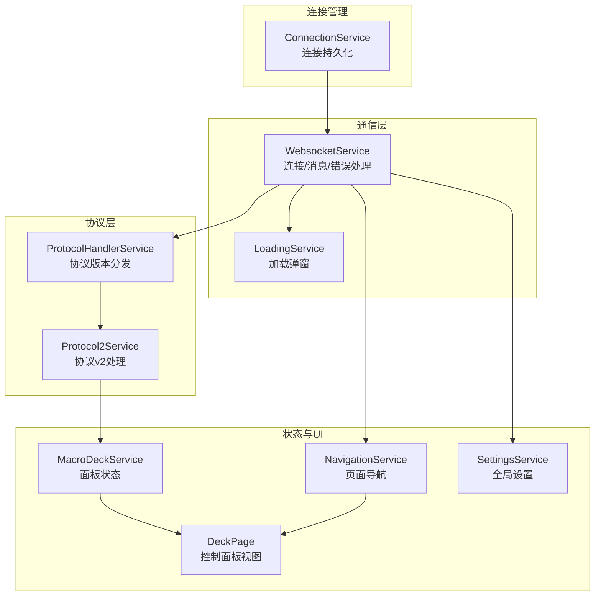
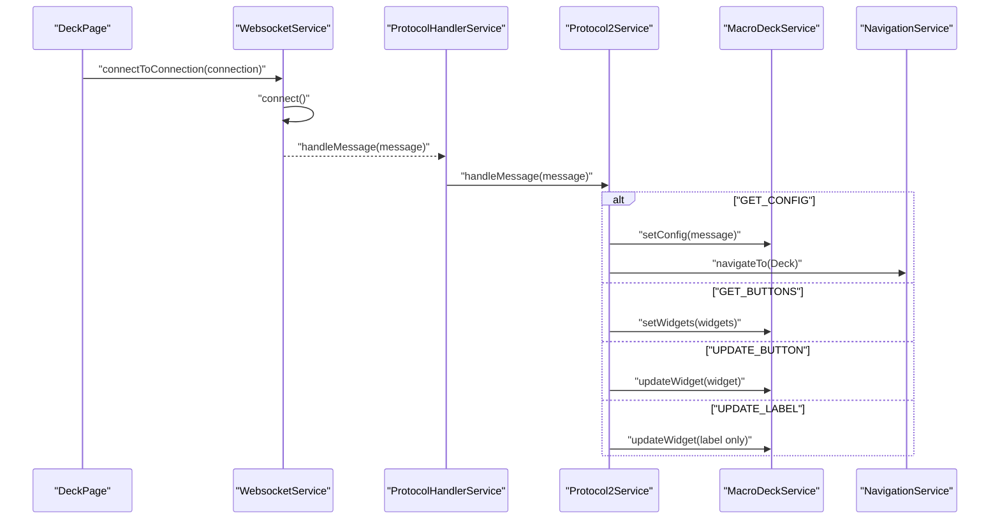
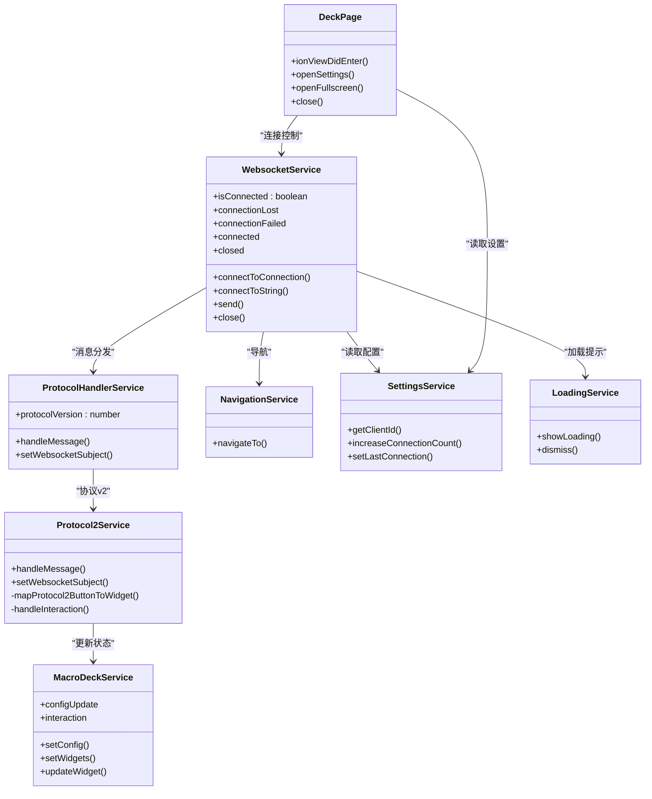

# 核心功能模块

<cite>
**本文档引用的文件**
- [connection.service.ts](file://src/app/services/connection/connection.service.ts)
- [websocket.service.ts](file://src/app/services/websocket/websocket.service.ts)
- [protocol-handler.service.ts](file://src/app/services/protocol/protocol-handler.service.ts)
- [protocol2.service.ts](file://src/app/services/protocol/protocol2.service.ts)
- [macro-deck.service.ts](file://src/app/services/macro-deck/macro-deck.service.ts)
- [settings.service.ts](file://src/app/services/settings/settings.service.ts)
- [navigation.service.ts](file://src/app/services/navigation/navigation.service.ts)
- [loading.service.ts](file://src/app/services/loading/loading.service.ts)
- [connection.ts](file://src/app/datatypes/connection.ts)
- [protocol2-button.ts](file://src/app/datatypes/protocol2/protocol2-button.ts)
- [widget.ts](file://src/app/datatypes/widgets/widget.ts)
- [deck.page.ts](file://src/app/pages/deck/deck.page.ts)
- [app.component.ts](file://src/app/app.component.ts)
- [navigation-destination.ts](file://src/app/enums/navigation-destination.ts)
</cite>

## 目录
1. [简介](#简介)
2. [项目结构](#项目结构)
3. [核心组件](#核心组件)
4. [架构总览](#架构总览)
5. [详细组件分析](#详细组件分析)
6. [依赖分析](#依赖分析)
7. [性能考虑](#性能考虑)
8. [故障排查指南](#故障排查指南)
9. [结论](#结论)
10. [附录](#附录)

## 简介
本文件面向Macro-Deck-Client-App的核心功能模块，系统梳理并解释四大核心模块：连接管理模块、WebSocket通信模块、协议处理模块、用户界面模块。文档覆盖各模块职责、内部结构、模块间协作机制（数据传递、事件处理、状态同步）、生命周期管理、错误处理策略、性能优化建议，并提供可定位到源码的示例路径与扩展点说明，帮助开发者理解与扩展这些关键能力。

## 项目结构
应用采用Angular + Ionic架构，核心逻辑集中在src/app/services目录下，配合页面组件与数据类型实现完整的连接、通信、协议处理与UI渲染闭环。四大核心模块分别对应以下服务与页面：
- 连接管理模块：ConnectionService（连接配置持久化）
- WebSocket通信模块：WebsocketService（连接、收发消息、错误处理）
- 协议处理模块：ProtocolHandlerService（协议版本分发）、Protocol2Service（协议v2具体实现）
- 用户界面模块：MacroDeckService（状态管理）、DeckPage（控制面板页面）、NavigationService（页面导航）、SettingsService（全局设置）

图表来源
- [connection.service.ts:10-179](file://src/app/services/connection/connection.service.ts#L10-179)
- [websocket.service.ts:20-402](file://src/app/services/websocket/websocket.service.ts#L20-402)
- [protocol-handler.service.ts:9-65](file://src/app/services/protocol/protocol-handler.service.ts#L9-65)
- [protocol2.service.ts:19-296](file://src/app/services/protocol/protocol2.service.ts#L19-296)
- [macro-deck.service.ts:10-111](file://src/app/services/macro-deck/macro-deck.service.ts#L10-111)
- [navigation.service.ts:13-86](file://src/app/services/navigation/navigation.service.ts#L13-86)
- [loading.service.ts:9-87](file://src/app/services/loading/loading.service.ts#L9-87)
- [deck.page.ts:14-158](file://src/app/pages/deck/deck.page.ts#L14-158)

章节来源
- [connection.service.ts:10-179](file://src/app/services/connection/connection.service.ts#L10-179)
- [websocket.service.ts:20-402](file://src/app/services/websocket/websocket.service.ts#L20-402)
- [protocol-handler.service.ts:9-65](file://src/app/services/protocol/protocol-handler.service.ts#L9-65)
- [protocol2.service.ts:19-296](file://src/app/services/protocol/protocol2.service.ts#L19-296)
- [macro-deck.service.ts:10-111](file://src/app/services/macro-deck/macro-deck.service.ts#L10-111)
- [navigation.service.ts:13-86](file://src/app/services/navigation/navigation.service.ts#L13-86)
- [loading.service.ts:9-87](file://src/app/services/loading/loading.service.ts#L9-87)
- [deck.page.ts:14-158](file://src/app/pages/deck/deck.page.ts#L14-158)

## 核心组件
- 连接管理模块（ConnectionService）
  - 职责：维护连接配置列表的增删改查、持久化存储；生成USB连接配置。
  - 关键接口：getConnections、addUpdateConnection、deleteConnection、getUsbConnection。
  - 数据结构：Connection接口定义了id、name、host、port、ssl、index、autoConnect、usbConnection、token等字段。
- WebSocket通信模块（WebsocketService）
  - 职责：建立/关闭WS连接、订阅消息、错误处理、连接状态事件广播、发送消息。
  - 关键接口：connectToConnection、connectToString、send、close、getConnection。
  - 事件：connected、closed、connectionFailed、connectionLost。
- 协议处理模块（ProtocolHandlerService + Protocol2Service）
  - 职责：根据协议版本分发消息至对应协议服务；协议v2负责解析GET_CONFIG/GET_BUTTONS/UPDATE_BUTTON/UPDATE_LABEL，映射为微件模型并驱动UI更新。
  - 关键接口：handleMessage、setWebsocketSubject。
- 用户界面模块（MacroDeckService + NavigationService + SettingsService + DeckPage）
  - 职责：管理面板配置与微件状态；页面导航；全局设置读写；控制面板页面展示与交互。
  - 关键接口：setConfig、setWidgets、updateWidget、navigateTo、getClientId、openSettings等。

章节来源
- [connection.service.ts:10-179](file://src/app/services/connection/connection.service.ts#L10-179)
- [connection.ts:1-33](file://src/app/datatypes/connection.ts#L1-33)
- [websocket.service.ts:20-402](file://src/app/services/websocket/websocket.service.ts#L20-402)
- [protocol-handler.service.ts:9-65](file://src/app/services/protocol/protocol-handler.service.ts#L9-65)
- [protocol2.service.ts:19-296](file://src/app/services/protocol/protocol2.service.ts#L19-296)
- [macro-deck.service.ts:10-111](file://src/app/services/macro-deck/macro-deck.service.ts#L10-111)
- [navigation.service.ts:13-86](file://src/app/services/navigation/navigation.service.ts#L13-86)
- [settings.service.ts:26-389](file://src/app/services/settings/settings.service.ts#L26-389)
- [deck.page.ts:14-158](file://src/app/pages/deck/deck.page.ts#L14-158)

## 架构总览
四大模块协同工作流程如下：
- 连接管理模块提供连接配置，WebSocket模块据此建立连接。
- WebSocket模块订阅消息并交由协议处理器分发。
- 协议v2服务解析消息，更新MacroDeckService中的面板配置与微件集合。
- NavigationService根据状态切换页面，DeckPage展示微件网格。
- SettingsService提供全局配置，LoadingService统一管理连接过程中的加载提示。

图表来源
- [websocket.service.ts:115-134](file://src/app/services/websocket/websocket.service.ts#L115-L134)
- [protocol-handler.service.ts:22-36](file://src/app/services/protocol/protocol-handler.service.ts#L22-L36)
- [protocol2.service.ts:41-95](file://src/app/services/protocol/protocol2.service.ts#L41-L95)
- [macro-deck.service.ts:36-65](file://src/app/services/macro-deck/macro-deck.service.ts#L36-L65)
- [navigation.service.ts:29-46](file://src/app/services/navigation/navigation.service.ts#L29-L46)

## 详细组件分析

### 连接管理模块（ConnectionService）
- 职责
  - 提供USB连接配置生成（基于SettingsService的USB相关设置）。
  - 对连接列表进行持久化存储（使用@ionic/storage），支持查询、新增/更新、删除。
  - 返回按index排序的连接列表，确保稳定顺序。
- 内部结构
  - 存储键名：connections。
  - 方法：getUsbConnection、getConnections、saveConnections、addUpdateConnection、deleteConnection。
- 生命周期与状态
  - 通过构造函数注入Storage与SettingsService，保证在应用启动时即可访问连接配置。
- 错误处理
  - 读取空数据时返回空数组；新增连接时自动生成id与index；更新连接时若未找到则追加。
- 性能与扩展
  - JSON序列化/反序列化成本低；可通过增加索引字段优化查找。
  - 可扩展：支持连接分组、标签、别名等元信息。

章节来源
- [connection.service.ts:10-179](file://src/app/services/connection/connection.service.ts#L10-179)
- [connection.ts:1-33](file://src/app/datatypes/connection.ts#L1-33)

### WebSocket通信模块（WebsocketService）
- 职责
  - 建立/关闭WebSocket连接，订阅消息与错误事件。
  - 在连接打开时发送“已连接”消息（包含clientId与token），在连接关闭时根据状态进行导航或事件广播。
  - 处理安全错误（如SSL证书问题）并弹出提示。
- 内部结构
  - 状态：isConnected、connecting、closing。
  - 事件：connected、closed、connectionFailed、connectionLost。
  - 订阅：connectionOpened、connectionClosed、loadingService.canceled。
  - 方法：connectToConnection、connectToString、connect、send、close、getConnection。
- 生命周期与状态
  - 连接中/已连接互斥；主动关闭与异常关闭区分处理。
  - 连接成功后设置WebSocketSubject给协议层，以便发送消息。
- 错误处理
  - 异常关闭码非1000时，区分Web版与原生版行为；已连接断开导航到连接丢失页；未连接断开触发connectionFailed事件。
  - 安全错误（DOMException.SecurityError）弹出不安全连接提示。
- 性能与扩展
  - 使用RxJS webSocket与Subject/Subscription管理消息流，避免内存泄漏。
  - 可扩展：支持重连策略、心跳、TLS校验开关。

章节来源
- [websocket.service.ts:20-402](file://src/app/services/websocket/websocket.service.ts#L20-402)

### 协议处理模块（ProtocolHandlerService + Protocol2Service）
- 职责
  - ProtocolHandlerService：根据协议版本分发消息到对应协议服务。
  - Protocol2Service：解析协议v2消息，映射按钮数据为内部Widget模型，处理用户交互并发送到服务器。
- 内部结构
  - ProtocolHandlerService：protocolVersion、handleMessage、setWebsocketSubject。
  - Protocol2Service：initialConfigReceived、socket、handleMessage、mapProtocol2ButtonToWidget、handleInteraction、send。
- 生命周期与状态
  - 首次收到GET_CONFIG后才开始处理后续消息；收到GET_BUTTONS后设置微件列表。
  - 用户交互事件通过MacroDeckService.interaction订阅，转换为协议方法名发送。
- 错误处理
  - 未收到初始配置时忽略部分消息；UPDATE_LABEL按坐标查找并更新标签。
- 性能与扩展
  - 按需更新：UPDATE_LABEL仅更新标签，UPDATE_BUTTON更新整块数据。
  - 可扩展：支持更多协议版本与消息类型。

章节来源
- [protocol-handler.service.ts:9-65](file://src/app/services/protocol/protocol-handler.service.ts#L9-65)
- [protocol2.service.ts:19-296](file://src/app/services/protocol/protocol2.service.ts#L19-296)
- [protocol2-button.ts:1-21](file://src/app/datatypes/protocol2/protocol2-button.ts#L1-21)
- [widget.ts:1-33](file://src/app/datatypes/widgets/widget.ts#L1-33)

### 用户界面模块（MacroDeckService + NavigationService + SettingsService + DeckPage）
- 职责
  - MacroDeckService：管理面板配置（行/列/间距/圆角/背景）与微件集合，发布配置更新与交互事件。
  - NavigationService：根据目标枚举导航到首页、控制面板或连接丢失页。
  - SettingsService：提供客户端ID生成、屏幕方向、外观主题、USB连接参数、唤醒锁等设置读写。
  - DeckPage：控制面板页面，负责检查连接状态、打开设置弹窗、全屏、关闭连接。
- 内部结构
  - MacroDeckService：configUpdate、interaction、widgets、rows、columns、buttonSpacing、buttonRadius、buttonBackground。
  - NavigationService：homePage/deckPage/connectionLostPage、navigateTo。
  - SettingsService：大量键值对常量与对应的getter/setter。
  - DeckPage：ionViewDidEnter、openSettings、openFullscreen、close。
- 生命周期与状态
  - DeckPage进入时检查连接状态，未连接则回到首页。
  - 设置变更后重新加载显示设置。
- 错误处理
  - 通过NavigationService在不同场景下导航，避免UI处于不确定状态。
- 性能与扩展
  - 事件驱动的状态更新，减少不必要的重绘。
  - 可扩展：更多UI主题、手势操作、快捷键绑定。

章节来源
- [macro-deck.service.ts:10-111](file://src/app/services/macro-deck/macro-deck.service.ts#L10-111)
- [navigation.service.ts:13-86](file://src/app/services/navigation/navigation.service.ts#L13-86)
- [settings.service.ts:26-389](file://src/app/services/settings/settings.service.ts#L26-389)
- [deck.page.ts:14-158](file://src/app/pages/deck/deck.page.ts#L14-158)
- [navigation-destination.ts:1-15](file://src/app/enums/navigation-destination.ts#L1-15)

## 依赖分析
- 模块耦合
  - WebsocketService依赖ProtocolHandlerService、SettingsService、NavigationService、LoadingService。
  - ProtocolHandlerService依赖Protocol2Service。
  - Protocol2Service依赖MacroDeckService、NavigationService、LoadingService。
  - MacroDeckService通过EventEmitter与UI组件解耦。
  - DeckPage依赖WebsocketService、SettingsService、NavigationService、ModalController。
- 外部依赖
  - @ionic/storage用于本地持久化。
  - RxJS webSocket用于WebSocket通信。
  - Capacitor插件用于Android平台SSL跳过配置。
- 潜在循环依赖
  - 未发现直接循环依赖；事件驱动的单向数据流降低耦合。

图表来源
- [websocket.service.ts:20-402](file://src/app/services/websocket/websocket.service.ts#L20-402)
- [protocol-handler.service.ts:9-65](file://src/app/services/protocol/protocol-handler.service.ts#L9-65)
- [protocol2.service.ts:19-296](file://src/app/services/protocol/protocol2.service.ts#L19-296)
- [macro-deck.service.ts:10-111](file://src/app/services/macro-deck/macro-deck.service.ts#L10-111)
- [navigation.service.ts:13-86](file://src/app/services/navigation/navigation.service.ts#L13-86)
- [settings.service.ts:26-389](file://src/app/services/settings/settings.service.ts#L26-389)
- [loading.service.ts:9-87](file://src/app/services/loading/loading.service.ts#L9-87)
- [deck.page.ts:14-158](file://src/app/pages/deck/deck.page.ts#L14-158)

## 性能考虑
- 事件驱动与懒更新
  - 使用EventEmitter与RxJS Subject/Subscription管理消息流，避免频繁DOM操作。
- 按需刷新
  - UPDATE_LABEL仅更新标签，UPDATE_BUTTON更新整块，减少UI重绘。
- 连接状态与加载提示
  - LoadingService统一管理加载弹窗，避免重复叠加与资源浪费。
- 存储与序列化
  - ConnectionService对连接列表进行JSON序列化/反序列化，建议在批量更新时合并写入以减少IO。
- 可扩展优化
  - WebSocket重连策略、心跳保活、消息批处理、UI虚拟滚动（按钮较多时）。

## 故障排查指南
- 连接失败
  - 触发connectionFailed事件，携带关闭码、原因与清理状态；检查服务器地址/端口/SSL配置。
  - 参考路径：[websocket.service.ts:374-393](file://src/app/services/websocket/websocket.service.ts#L374-L393)
- 连接丢失
  - 非主动关闭且非正常关闭码时触发connectionLost；原生端导航到连接丢失页。
  - 参考路径：[websocket.service.ts:332-359](file://src/app/services/websocket/websocket.service.ts#L332-L359)
- 不安全连接（SSL）
  - 捕获DOMException.SecurityError并弹出提示；可在设置中调整SSL校验策略。
  - 参考路径：[websocket.service.ts:321-328](file://src/app/services/websocket/websocket.service.ts#L321-L328)
  - 参考路径：[app.component.ts:112-115](file://src/app/app.component.ts#L112-L115)
- 控制面板不可用
  - DeckPage进入时检查isConnected，未连接则导航回首页。
  - 参考路径：[deck.page.ts:44-47](file://src/app/pages/deck/deck.page.ts#L44-L47)
- 设置项未生效
  - SettingsService提供各类getter/setter；确认存储键名与默认值。
  - 参考路径：[settings.service.ts:271-389](file://src/app/services/settings/settings.service.ts#L271-L389)

章节来源
- [websocket.service.ts:332-393](file://src/app/services/websocket/websocket.service.ts#L332-L393)
- [deck.page.ts:44-47](file://src/app/pages/deck/deck.page.ts#L44-L47)
- [app.component.ts:112-115](file://src/app/app.component.ts#L112-L115)
- [settings.service.ts:271-389](file://src/app/services/settings/settings.service.ts#L271-L389)

## 结论
四大核心模块围绕“连接—通信—协议—UI”的主线协同工作：ConnectionService提供稳定的连接配置，WebsocketService负责可靠通信与错误处理，ProtocolHandlerService与Protocol2Service完成消息解析与状态更新，MacroDeckService与DeckPage实现直观的可视化控制面板。该架构具备清晰的职责划分、良好的事件驱动设计与可扩展性，适合进一步增强协议支持、UI主题与交互体验。

## 附录
- 配置选项与扩展点
  - 连接配置：Connection接口字段可扩展（如分组、标签、别名）。
  - 协议版本：ProtocolHandlerService支持多版本扩展，新增协议服务并在switch中接入。
  - UI主题：SettingsService提供外观主题与按钮边框样式，可扩展更多主题变量。
  - 加载提示：LoadingService统一管理加载弹窗，便于定制样式与文案。
- 使用模式与示例路径
  - 建立连接：调用WebsocketService.connectToConnection(connection)。
    - 示例路径：[websocket.service.ts:275-288](file://src/app/services/websocket/websocket.service.ts#L275-L288)
  - 发送交互消息：通过MacroDeckService.interaction事件订阅，Protocol2Service内部自动转发。
    - 示例路径：[protocol2.service.ts:139-160](file://src/app/services/protocol/protocol2.service.ts#L139-L160)
  - 更新按钮标签：等待UPDATE_LABEL消息到达后，Protocol2Service自动更新。
    - 示例路径：[protocol2.service.ts:77-94](file://src/app/services/protocol/protocol2.service.ts#L77-L94)
  - 导航到控制面板：Protocol2Service在首次配置后导航。
    - 示例路径：[protocol2.service.ts:50-54](file://src/app/services/protocol/protocol2.service.ts#L50-L54)
  - 读取客户端ID：SettingsService.getClientId()。
    - 示例路径：[settings.service.ts:374-377](file://src/app/services/settings/settings.service.ts#L374-L377)