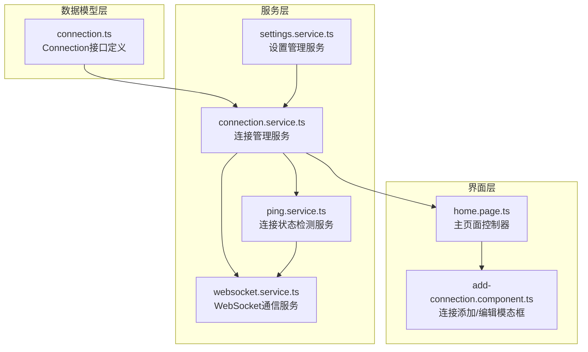
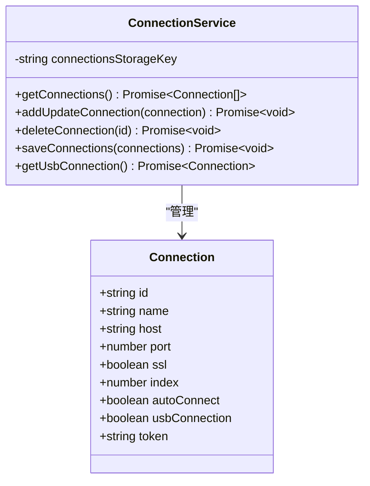
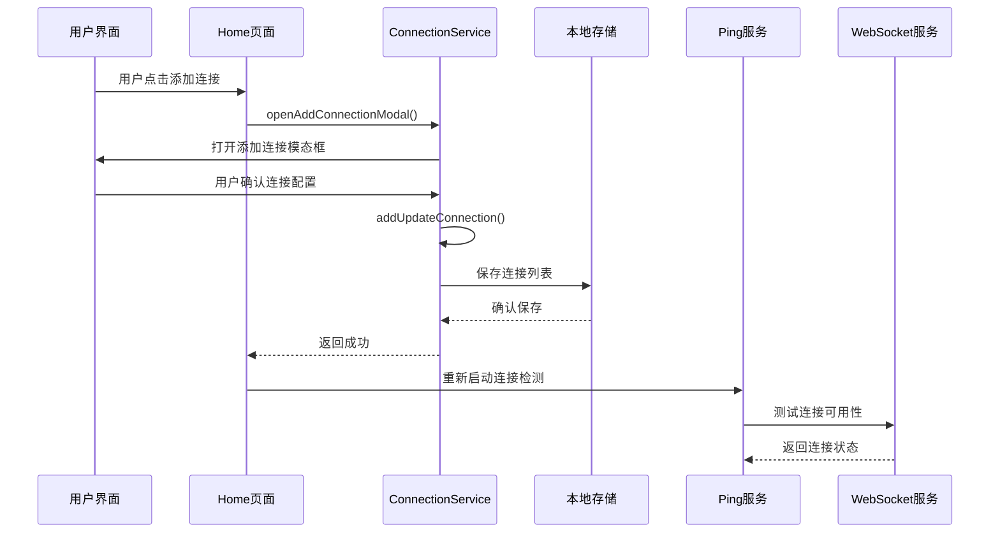
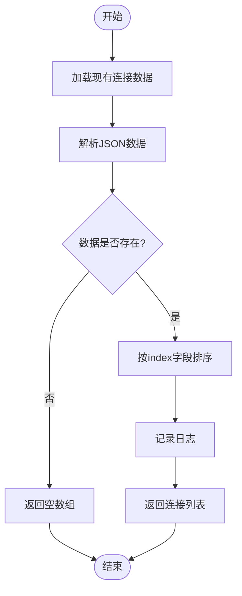
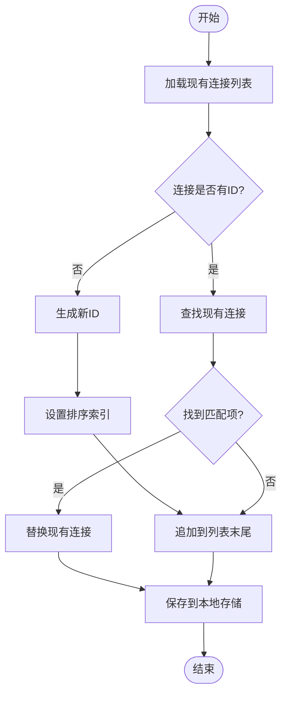
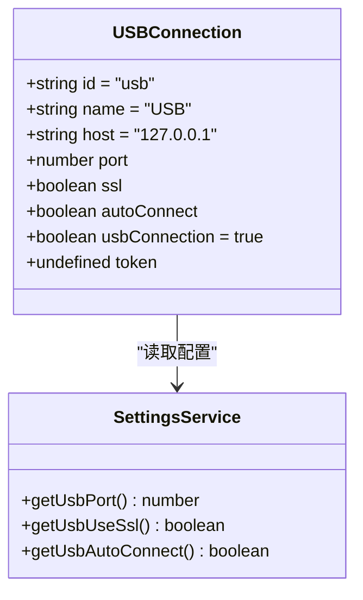
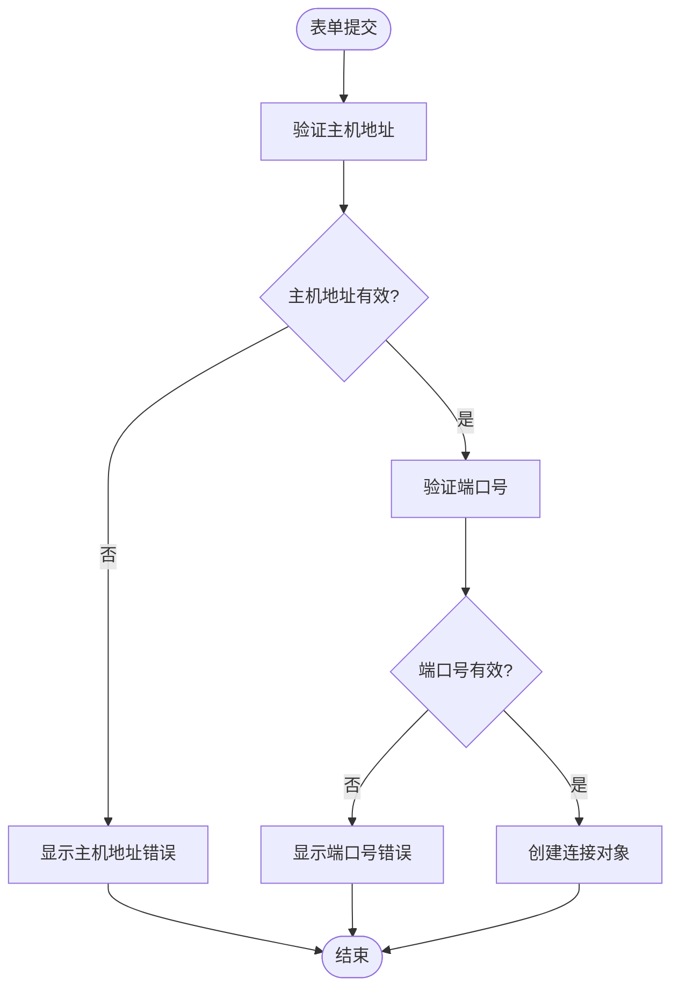
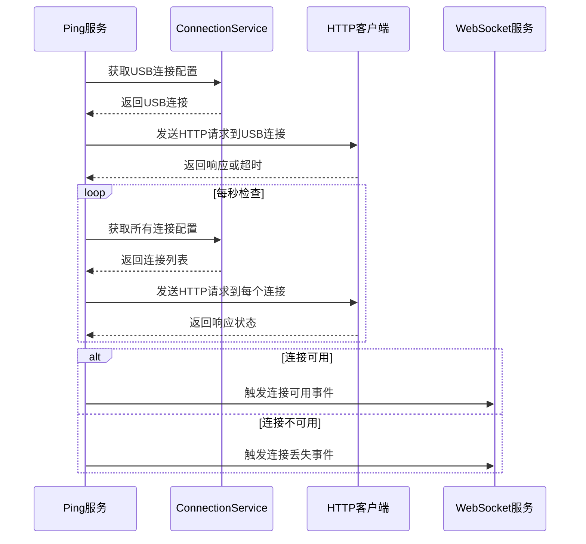
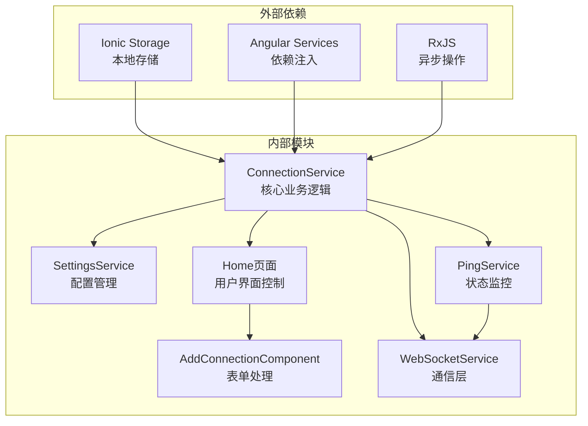

# 连接管理模块

<cite>
**本文档引用的文件**
- [connection.ts](file://src/app/datatypes/connection.ts)
- [connection.service.ts](file://src/app/services/connection/connection.service.ts)
- [settings.service.ts](file://src/app/services/settings/settings.service.ts)
- [home.page.ts](file://src/app/pages/home/home.page.ts)
- [add-connection.component.ts](file://src/app/pages/home/modals/add-connection/add-connection.component.ts)
- [ping.service.ts](file://src/app/services/ping/ping.service.ts)
- [websocket.service.ts](file://src/app/services/websocket/websocket.service.ts)
</cite>

## 目录
1. [简介](#简介)
2. [项目结构](#项目结构)
3. [核心组件](#核心组件)
4. [架构概览](#架构概览)
5. [详细组件分析](#详细组件分析)
6. [依赖关系分析](#依赖关系分析)
7. [性能考虑](#性能考虑)
8. [故障排除指南](#故障排除指南)
9. [结论](#结论)

## 简介

连接管理模块是Macro Deck客户端应用的核心功能之一，负责管理用户与Macro Deck服务器之间的连接配置。该模块提供了完整的连接生命周期管理，包括连接配置的创建、读取、更新、删除（CRUD）操作，以及本地存储机制、USB直连支持等功能。

该模块采用Angular服务架构设计，通过依赖注入的方式为整个应用提供统一的连接管理能力。系统支持多种连接方式，包括传统的网络连接和USB直连，并提供了直观的用户界面来管理这些连接配置。

## 项目结构

连接管理模块主要分布在以下目录结构中：

**图表来源**
- [connection.ts:1-33](file://src/app/datatypes/connection.ts#L1-L33)
- [connection.service.ts:1-179](file://src/app/services/connection/connection.service.ts#L1-L179)
- [settings.service.ts:1-389](file://src/app/services/settings/settings.service.ts#L1-L389)

**章节来源**
- [connection.ts:1-33](file://src/app/datatypes/connection.ts#L1-L33)
- [connection.service.ts:1-179](file://src/app/services/connection/connection.service.ts#L1-L179)

## 核心组件

### Connection数据模型

Connection接口定义了连接配置的所有必要字段，采用TypeScript接口确保类型安全：

**图表来源**
- [connection.ts:2-32](file://src/app/datatypes/connection.ts#L2-L32)
- [connection.service.ts:10-178](file://src/app/services/connection/connection.service.ts#L10-L178)

### 连接配置字段说明

| 字段名 | 类型 | 必填 | 默认值 | 描述 |
|--------|------|------|--------|------|
| id | string | 否 | 自动生成 | 连接唯一标识符 |
| name | string | 是 | - | 连接显示名称 |
| host | string | 是 | - | 服务器主机地址 |
| port | number | 是 | - | 服务器端口号 |
| ssl | boolean | 否 | false | 是否启用SSL加密连接 |
| index | number | 否 | undefined | 连接在列表中的排序索引 |
| autoConnect | boolean | 否 | undefined | 是否自动连接 |
| usbConnection | boolean | 否 | undefined | 是否使用USB连接 |
| token | string | 否 | undefined | 认证令牌 |

**章节来源**
- [connection.ts:2-32](file://src/app/datatypes/connection.ts#L2-L32)

## 架构概览

连接管理模块采用分层架构设计，各层职责明确，耦合度低：

**图表来源**
- [home.page.ts:431-466](file://src/app/pages/home/home.page.ts#L431-L466)
- [connection.service.ts:147-165](file://src/app/services/connection/connection.service.ts#L147-L165)
- [ping.service.ts:156-179](file://src/app/services/ping/ping.service.ts#L156-L179)

## 详细组件分析

### ConnectionService核心功能

ConnectionService是连接管理模块的核心服务，负责所有连接配置的CRUD操作和持久化存储。

#### 连接列表管理

连接列表采用JSON序列化存储在本地存储中，支持动态排序和索引管理：

**图表来源**
- [connection.service.ts:40-50](file://src/app/services/connection/connection.service.ts#L40-L50)
- [connection.service.ts:132-141](file://src/app/services/connection/connection.service.ts#L132-L141)

#### 新增/更新连接逻辑

新增和更新连接采用统一的方法，通过检查连接ID来判断操作类型：

**图表来源**
- [connection.service.ts:147-165](file://src/app/services/connection/connection.service.ts#L147-L165)

#### 删除连接操作

删除连接通过ID查找并移除指定的连接配置：

**章节来源**
- [connection.service.ts:40-101](file://src/app/services/connection/connection.service.ts#L40-L101)
- [connection.service.ts:132-177](file://src/app/services/connection/connection.service.ts#L132-L177)

### USB连接特殊处理

USB连接作为特殊的连接类型，具有独特的配置要求和行为特征：

**图表来源**
- [connection.service.ts:22-34](file://src/app/services/connection/connection.service.ts#L22-L34)
- [settings.service.ts:76-94](file://src/app/services/settings/settings.service.ts#L76-L94)

#### USB连接配置参数

| 参数 | 默认值 | 来源 | 用途 |
|------|--------|------|------|
| host | 127.0.0.1 | 固定值 | 本地回环地址 |
| port | 8191 | SettingsService | USB端口配置 |
| ssl | false | SettingsService | SSL启用状态 |
| autoConnect | false | SettingsService | 自动连接开关 |
| usbConnection | true | 固定值 | USB连接标识 |

**章节来源**
- [connection.service.ts:18-34](file://src/app/services/connection/connection.service.ts#L18-L34)
- [settings.service.ts:76-94](file://src/app/services/settings/settings.service.ts#L76-L94)

### 连接表单验证

连接添加/编辑表单提供了基本的输入验证机制：

**图表来源**
- [add-connection.component.ts:173-183](file://src/app/pages/home/modals/add-connection/add-connection.component.ts#L173-L183)

**章节来源**
- [add-connection.component.ts:145-183](file://src/app/pages/home/modals/add-connection/add-connection.component.ts#L145-L183)

### 连接状态检测

Ping服务负责监控连接的可用性和状态变化：

**图表来源**
- [ping.service.ts:156-179](file://src/app/services/ping/ping.service.ts#L156-L179)
- [ping.service.ts:190-225](file://src/app/services/ping/ping.service.ts#L190-L225)

**章节来源**
- [ping.service.ts:150-228](file://src/app/services/ping/ping.service.ts#L150-L228)

## 依赖关系分析

连接管理模块的依赖关系清晰，遵循单一职责原则：

**图表来源**
- [connection.service.ts:1-5](file://src/app/services/connection/connection.service.ts#L1-L5)
- [settings.service.ts:1-30](file://src/app/services/settings/settings.service.ts#L1-L30)

### 关键依赖关系

1. **ConnectionService依赖关系**：
   - 依赖Ionic Storage进行本地持久化
   - 依赖SettingsService获取USB连接配置
   - 为Home页面提供连接管理功能

2. **数据流依赖**：
   - Home页面 -> ConnectionService -> 本地存储
   - ConnectionService -> SettingsService -> USB配置
   - PingService -> ConnectionService -> 连接状态

**章节来源**
- [connection.service.ts:15-16](file://src/app/services/connection/connection.service.ts#L15-L16)
- [settings.service.ts:29](file://src/app/services/settings/settings.service.ts#L29)

## 性能考虑

### 存储优化策略

1. **JSON序列化优化**：
   - 使用批量操作减少存储访问次数
   - 避免频繁的读写操作
   - 通过索引排序避免重复计算

2. **内存管理**：
   - 连接列表在内存中缓存
   - 按需加载和更新
   - 及时释放不再使用的连接对象

### 异步操作优化

1. **并发处理**：
   - 连接状态检测使用RxJS Observable
   - 支持多连接同时检测
   - 避免阻塞主线程

2. **错误处理**：
   - 超时机制防止长时间等待
   - 重试机制提高成功率
   - 异常情况下的优雅降级

## 故障排除指南

### 常见问题及解决方案

#### 连接无法保存

**症状**：添加或修改连接后重启应用发现连接丢失

**可能原因**：
1. 本地存储权限问题
2. JSON序列化失败
3. 应用崩溃导致数据丢失

**解决步骤**：
1. 检查应用存储权限
2. 验证连接配置格式
3. 查看应用日志输出

#### USB连接失败

**症状**：USB连接配置正确但无法建立连接

**可能原因**：
1. USB端口配置错误
2. SSL设置不匹配
3. 设备未正确连接

**解决步骤**：
1. 检查USB端口设置（默认8191）
2. 验证SSL配置
3. 确认设备连接状态

#### 连接列表排序异常

**症状**：连接列表顺序混乱

**可能原因**：
1. index字段缺失或损坏
2. 数据库版本不兼容
3. 手动修改了存储数据

**解决步骤**：
1. 重新排列连接顺序
2. 清除并重建连接列表
3. 检查数据完整性

**章节来源**
- [connection.service.ts:40-50](file://src/app/services/connection/connection.service.ts#L40-L50)
- [ping.service.ts:190-225](file://src/app/services/ping/ping.service.ts#L190-L225)

## 结论

连接管理模块通过精心设计的架构实现了完整的连接生命周期管理。模块的主要优势包括：

1. **模块化设计**：清晰的职责分离和依赖关系
2. **类型安全**：完整的TypeScript类型定义
3. **扩展性**：易于添加新的连接类型和功能
4. **用户体验**：直观的界面和流畅的操作体验

该模块为Macro Deck客户端应用提供了稳定可靠的连接管理基础，支持多种连接方式和复杂的用户场景需求。通过合理的错误处理和性能优化，确保了应用的可靠性和响应速度。

未来可以考虑的功能增强包括：
- 更完善的连接配置验证
- 连接历史记录和统计功能
- 更灵活的连接模板系统
- 连接配置的导入导出功能