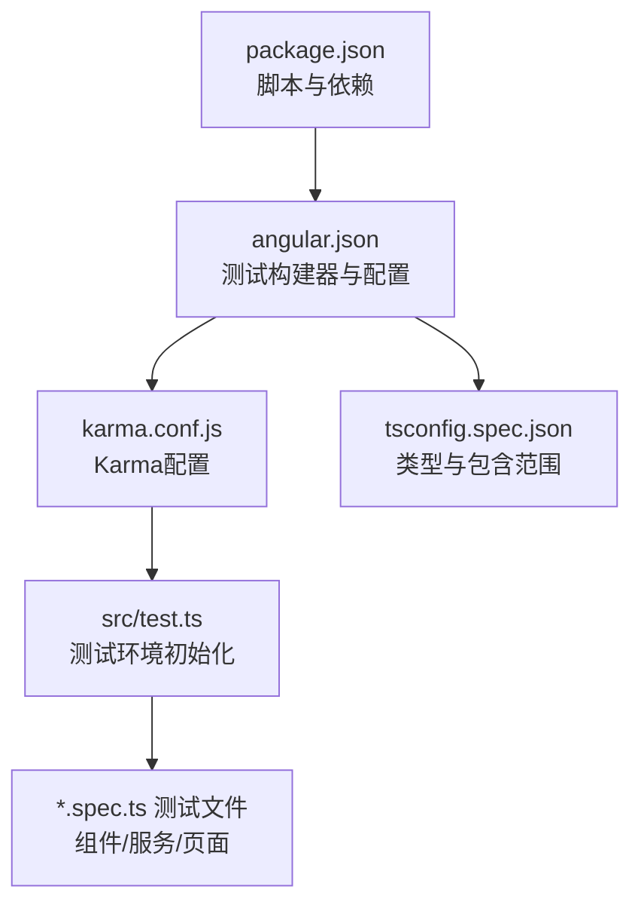
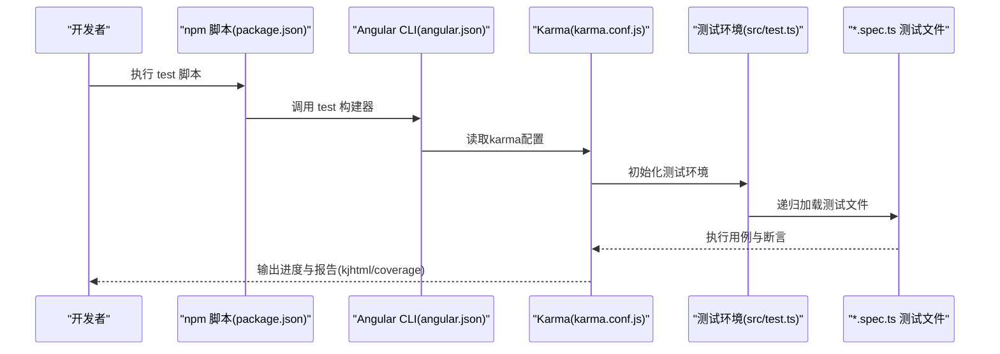
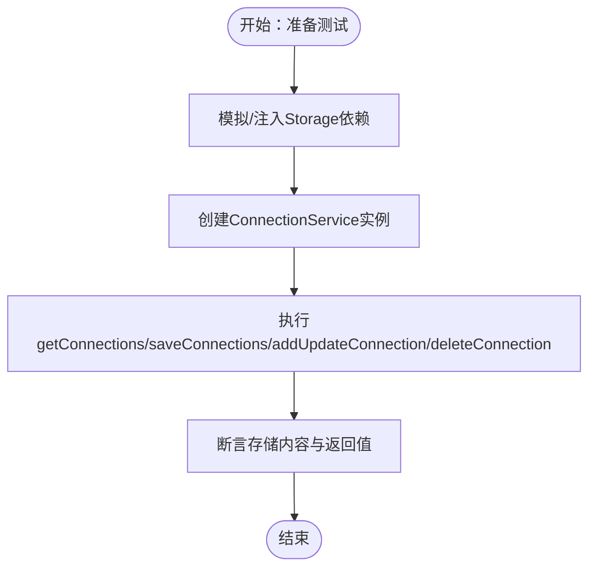
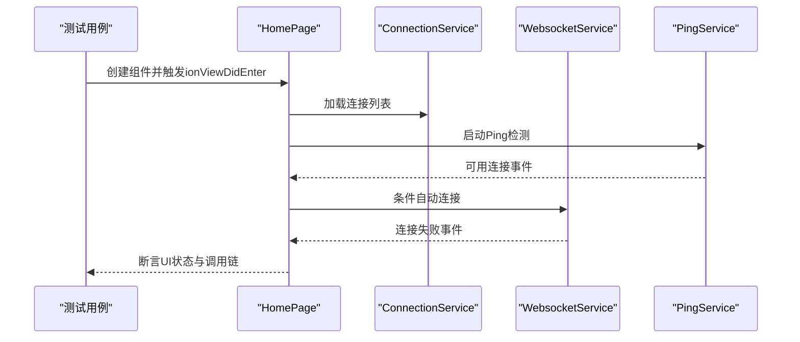
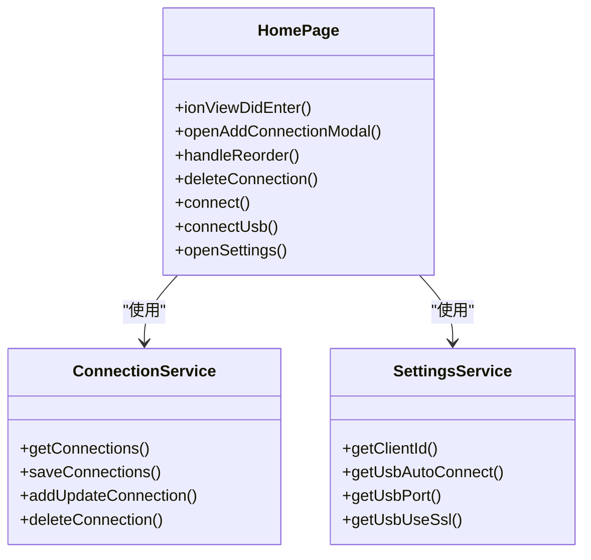

# 测试与调试

<cite>
**本文档引用的文件**
- [karma.conf.js](file://karma.conf.js)
- [package.json](file://package.json)
- [angular.json](file://angular.json)
- [src/test.ts](file://src/test.ts)
- [tsconfig.spec.json](file://tsconfig.spec.json)
- [src/app/app.component.spec.ts](file://src/app/app.component.spec.ts)
- [src/app/services/connection/connection.service.spec.ts](file://src/app/services/connection/connection.service.spec.ts)
- [src/app/pages/home/home.page.spec.ts](file://src/app/pages/home/home.page.spec.ts)
- [src/app/services/connection/connection.service.ts](file://src/app/services/connection/connection.service.ts)
- [src/app/pages/home/home.page.ts](file://src/app/pages/home/home.page.ts)
- [src/app/services/settings/settings.service.ts](file://src/app/services/settings/settings.service.ts)
- [src/app/datatypes/connection.ts](file://src/app/datatypes/connection.ts)
- [src/app/enums/widget-content-type.ts](file://src/app/enums/widget-content-type.ts)
- [src/app/datatypes/ws-message.ts](file://src/app/datatypes/ws-message.ts)
- [src/environments/environment.ts](file://src/environments/environment.ts)
</cite>

## 目录
1. [简介](#简介)
2. [项目结构](#项目结构)
3. [核心组件](#核心组件)
4. [架构总览](#架构总览)
5. [详细组件分析](#详细组件分析)
6. [依赖分析](#依赖分析)
7. [性能考虑](#性能考虑)
8. [故障排查指南](#故障排查指南)
9. [结论](#结论)
10. [附录](#附录)

## 简介
本指南面向Macro-Deck-Client-App的开发者，系统性介绍项目的测试与调试策略与实践，覆盖单元测试、集成测试与端到端测试的实施路径；详解Karma测试运行器与Jasmine断言库的配置与使用；提供针对组件、服务、数据类型的测试示例与调试技巧，包括浏览器开发者工具、Angular DevTools、远程调试等；并补充性能测试、内存泄漏检测与网络请求监控等高级调试技术，帮助团队建立稳定高效的测试体系。

## 项目结构
该项目采用Angular CLI工程，结合Ionic Angular构建跨平台客户端。测试相关的关键配置集中在以下位置：
- 测试运行器与报告：karma.conf.js
- 测试入口与环境初始化：src/test.ts
- TypeScript编译配置（spec）：tsconfig.spec.json
- Angular测试任务：angular.json 的 test builder
- 包脚本与依赖：package.json

图表来源
- [package.json:1-92](file://package.json#L1-L92)
- [angular.json:146-176](file://angular.json#L146-L176)
- [karma.conf.js:1-45](file://karma.conf.js#L1-L45)
- [src/test.ts:1-15](file://src/test.ts#L1-L15)
- [tsconfig.spec.json:1-19](file://tsconfig.spec.json#L1-L19)

章节来源
- [package.json:7-14](file://package.json#L7-L14)
- [angular.json:146-176](file://angular.json#L146-L176)
- [karma.conf.js:4-44](file://karma.conf.js#L4-L44)
- [src/test.ts:10-14](file://src/test.ts#L10-L14)
- [tsconfig.spec.json:4-17](file://tsconfig.spec.json#L4-L17)

## 核心组件
- 测试运行器与框架
  - Karma：用于启动浏览器执行测试、收集覆盖率与输出结果
  - Jasmine：用于编写断言与测试用例
- 测试入口与环境
  - src/test.ts 初始化Zone.js测试环境与BrowserDynamicTestingModule
- TypeScript配置
  - tsconfig.spec.json 指定jasmine类型、包含*.spec.ts与.d.ts
- Angular测试任务
  - angular.json 提供test builder，关联karma配置与测试资源

章节来源
- [karma.conf.js:7-14](file://karma.conf.js#L7-L14)
- [src/test.ts:3-14](file://src/test.ts#L3-L14)
- [tsconfig.spec.json:6-8](file://tsconfig.spec.json#L6-L8)
- [angular.json:146-176](file://angular.json#L146-L176)

## 架构总览
下图展示了测试生命周期：从npm脚本触发Angular测试构建器，到Karma加载测试入口与框架，再到浏览器执行测试与生成报告。

图表来源
- [package.json:12](file://package.json#L12)
- [angular.json:146-176](file://angular.json#L146-L176)
- [karma.conf.js:5-43](file://karma.conf.js#L5-L43)
- [src/test.ts:10-14](file://src/test.ts#L10-L14)

## 详细组件分析

### 单元测试：组件层
- 典型用例
  - 应用根组件创建校验
  - 页面组件实例化与变更检测
- 示例参考
  - [src/app/app.component.spec.ts:1-22](file://src/app/app.component.spec.ts#L1-L22)
  - [src/app/pages/home/home.page.spec.ts:1-18](file://src/app/pages/home/home.page.spec.ts#L1-L18)

建议测试点
- 组件实例化与模板渲染
- 输入输出属性与生命周期钩子行为
- 交互事件（点击、拖拽等）触发的内部逻辑

章节来源
- [src/app/app.component.spec.ts:15-19](file://src/app/app.component.spec.ts#L15-L19)
- [src/app/pages/home/home.page.spec.ts:14-16](file://src/app/pages/home/home.page.spec.ts#L14-L16)

### 单元测试：服务层
- 典型用例
  - 服务实例创建与注入
- 示例参考
  - [src/app/services/connection/connection.service.spec.ts:1-17](file://src/app/services/connection/connection.service.spec.ts#L1-L17)

建议测试点
- 依赖注入与构造函数参数
- 同步/异步方法返回值与副作用
- 与Storage等外部依赖的交互（见“集成测试”）

章节来源
- [src/app/services/connection/connection.service.spec.ts:13-15](file://src/app/services/connection/connection.service.spec.ts#L13-L15)

### 数据类型与枚举测试
- 目标
  - 确保数据契约稳定，避免类型不匹配导致的运行时错误
- 推荐策略
  - 为接口字段添加边界条件与默认值断言
  - 为枚举值添加存在性与取值范围断言
- 参考类型
  - [src/app/datatypes/connection.ts:1-33](file://src/app/datatypes/connection.ts#L1-L33)
  - [src/app/enums/widget-content-type.ts:1-12](file://src/app/enums/widget-content-type.ts#L1-L12)
  - [src/app/datatypes/ws-message.ts:1-12](file://src/app/datatypes/ws-message.ts#L1-L12)

章节来源
- [src/app/datatypes/connection.ts:2-21](file://src/app/datatypes/connection.ts#L2-L21)
- [src/app/enums/widget-content-type.ts:2-7](file://src/app/enums/widget-content-type.ts#L2-L7)
- [src/app/datatypes/ws-message.ts:2-7](file://src/app/datatypes/ws-message.ts#L2-L7)

### 集成测试：服务与存储交互
- 场景
  - 连接服务与本地存储的读写一致性
  - 设置服务对存储键的存取
- 关键实现
  - 连接服务：[src/app/services/connection/connection.service.ts:118-178](file://src/app/services/connection/connection.service.ts#L118-L178)
  - 设置服务：[src/app/services/settings/settings.service.ts:229-246](file://src/app/services/settings/settings.service.ts#L229-L246)
  - 连接数据类型：[src/app/datatypes/connection.ts:1-33](file://src/app/datatypes/connection.ts#L1-L33)

建议测试点
- 存储键名一致性与默认值回退
- JSON序列化/反序列化与排序逻辑
- 新增/更新/删除流程的原子性与幂等性

图表来源
- [src/app/services/connection/connection.service.ts:118-178](file://src/app/services/connection/connection.service.ts#L118-L178)
- [src/app/services/settings/settings.service.ts:229-246](file://src/app/services/settings/settings.service.ts#L229-L246)
- [src/app/datatypes/connection.ts:1-33](file://src/app/datatypes/connection.ts#L1-L33)

章节来源
- [src/app/services/connection/connection.service.ts:40-101](file://src/app/services/connection/connection.service.ts#L40-L101)
- [src/app/services/settings/settings.service.ts:229-246](file://src/app/services/settings/settings.service.ts#L229-L246)

### 端到端测试：页面与交互
- 目标
  - 验证页面生命周期、用户交互与服务协作
- 示例参考
  - [src/app/pages/home/home.page.ts:386-424](file://src/app/pages/home/home.page.ts#L386-L424)
  - [src/app/pages/home/home.page.spec.ts:1-18](file://src/app/pages/home/home.page.spec.ts#L1-L18)

建议测试点
- 生命周期钩子：ionViewDidEnter/WillEnter/DidLeave
- 订阅管理与清理（Subscription）
- 弹窗与模态交互、确认/取消流程
- 自动连接与USB连接分支

图表来源
- [src/app/pages/home/home.page.ts:386-424](file://src/app/pages/home/home.page.ts#L386-L424)
- [src/app/services/connection/connection.service.ts:132-141](file://src/app/services/connection/connection.service.ts#L132-L141)

章节来源
- [src/app/pages/home/home.page.ts:386-550](file://src/app/pages/home/home.page.ts#L386-L550)
- [src/app/pages/home/home.page.spec.ts:8-12](file://src/app/pages/home/home.page.spec.ts#L8-L12)

### 测试配置与运行
- Karma配置要点
  - 框架与插件：jasmine、@angular-devkit/build-angular
  - 报告器：kjhtml、coverage
  - 浏览器：Chrome
- TypeScript配置要点
  - 类型：jasmine
  - 包含：*.spec.ts与.d.ts
- Angular测试任务
  - main/polyfills/tsConfig/karmaConfig映射至karma.conf.js与tsconfig.spec.json

章节来源
- [karma.conf.js:7-35](file://karma.conf.js#L7-L35)
- [tsconfig.spec.json:6-17](file://tsconfig.spec.json#L6-L17)
- [angular.json:146-176](file://angular.json#L146-L176)

## 依赖分析
- 组件耦合
  - HomePage依赖多个服务：SettingsService、ConnectionService、WebsocketService、PingService、AlertController、ModalController、WakelockService
- 外部依赖
  - Storage（@ionic/storage）：用于持久化
  - RxJS（Subscription）：用于事件流管理
- 测试关注点
  - 通过依赖注入隔离外部依赖，便于Mock与断言

图表来源
- [src/app/pages/home/home.page.ts:386-550](file://src/app/pages/home/home.page.ts#L386-L550)
- [src/app/services/connection/connection.service.ts:118-178](file://src/app/services/connection/connection.service.ts#L118-L178)
- [src/app/services/settings/settings.service.ts:229-246](file://src/app/services/settings/settings.service.ts#L229-L246)

章节来源
- [src/app/pages/home/home.page.ts:56-64](file://src/app/pages/home/home.page.ts#L56-L64)
- [src/app/services/connection/connection.service.ts:15-16](file://src/app/services/connection/connection.service.ts#L15-L16)
- [src/app/services/settings/settings.service.ts:29](file://src/app/services/settings/settings.service.ts#L29)

## 性能考虑
- 测试性能
  - 使用单次运行与自动监听：karma.conf.js启用autoWatch与restartOnFileChange，提升迭代效率
  - CI模式禁用进度与监听：angular.json提供ci配置，减少输出与等待
- 覆盖率
  - 启用HTML与文本摘要报告，定位薄弱模块
- 内存与资源
  - 在测试中及时取消订阅（如HomePage中的Subscription），避免内存泄漏
  - 对弹窗与模态进行onWillDismiss断言，确保资源释放

章节来源
- [karma.conf.js:39-42](file://karma.conf.js#L39-L42)
- [angular.json:170-175](file://angular.json#L170-L175)
- [karma.conf.js:27-34](file://karma.conf.js#L27-L34)
- [src/app/pages/home/home.page.ts:80-83](file://src/app/pages/home/home.page.ts#L80-L83)

## 故障排查指南
- 常见问题
  - 测试无法启动：检查karma.conf.js插件与framework配置、Chrome可用性
  - 环境初始化失败：确认src/test.ts正确初始化BrowserDynamicTestingModule
  - 类型报错：核对tsconfig.spec.json的types与包含范围
  - CI失败：切换到ci配置，禁用watch与进度输出
- 调试技巧
  - 浏览器开发者工具：断点、控制台日志、网络面板观察WebSocket与HTTP请求
  - Angular DevTools：检查组件树、输入输出、变更检测状态
  - 远程调试：在移动端或WebView中启用调试，结合浏览器开发者工具
- 高级调试
  - 性能：使用Performance面板记录渲染与事件处理耗时
  - 内存：Heap Snapshot对比泄漏，关注未释放的订阅与定时器
  - 网络：Network面板过滤与拦截请求，验证认证与重连逻辑

章节来源
- [karma.conf.js:8-14](file://karma.conf.js#L8-L14)
- [src/test.ts:10-14](file://src/test.ts#L10-L14)
- [tsconfig.spec.json:6-8](file://tsconfig.spec.json#L6-L8)
- [angular.json:170-175](file://angular.json#L170-L175)

## 结论
本指南提供了从配置到实践的完整测试与调试方案。通过规范的单元、集成与端到端测试，配合Karma与Jasmine，结合浏览器与Angular DevTools，可有效保障代码质量与稳定性。建议在CI中启用覆盖率与静默模式，在开发中保持高反馈速度，并持续完善测试矩阵与调试流程。

## 附录
- 测试最佳实践
  - 优先测试业务逻辑而非实现细节
  - 使用Mock隔离外部依赖，集中断言行为
  - 为异步流程添加超时与重试策略
  - 为关键分支与边界条件编写用例
- 常用断言与辅助
  - Jasmine Expect：相等、真值、异常
  - Angular Testing：TestBed、ComponentFixture、async/await
  - 环境变量：environment.ts区分开发与生产行为

章节来源
- [src/environments/environment.ts:4-11](file://src/environments/environment.ts#L4-L11)
- [src/environments/environment.ts:22-26](file://src/environments/environment.ts#L22-L26)