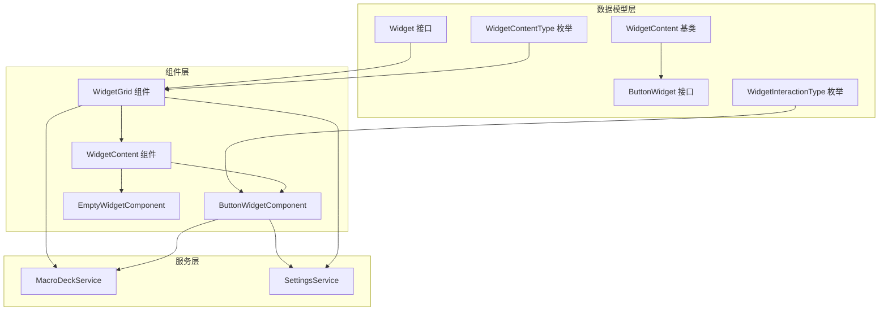
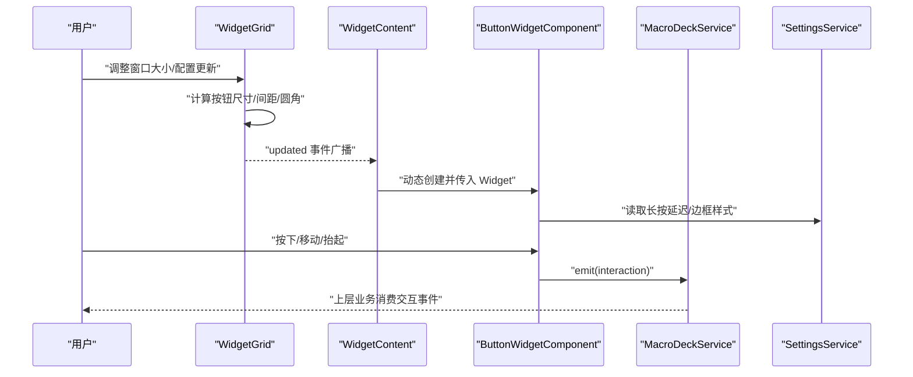
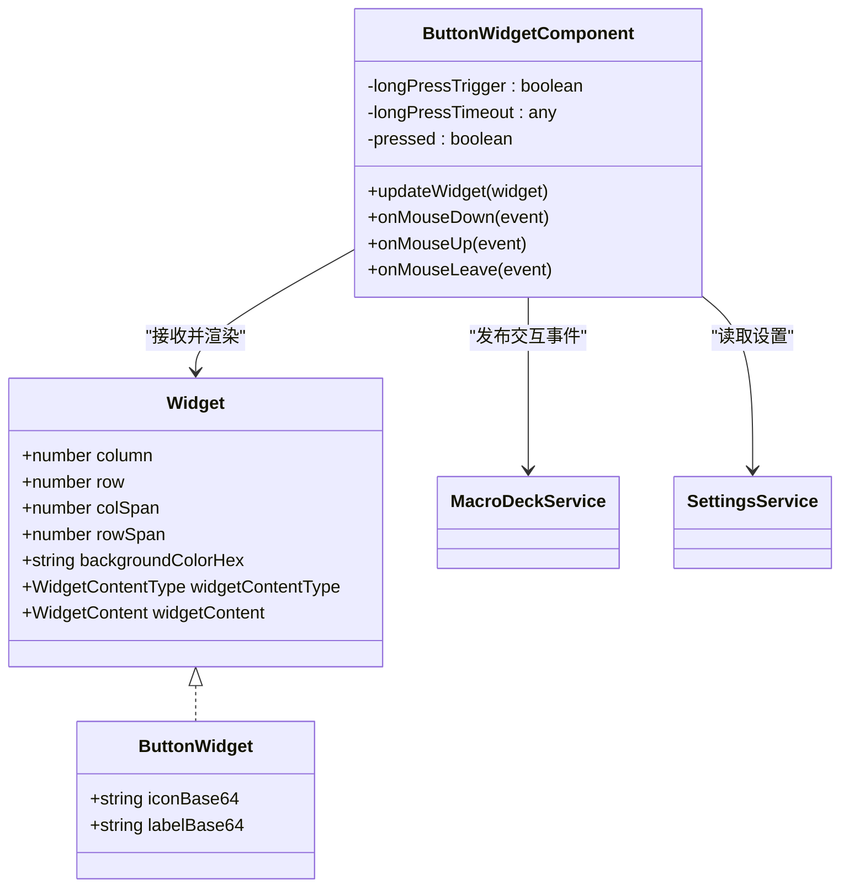
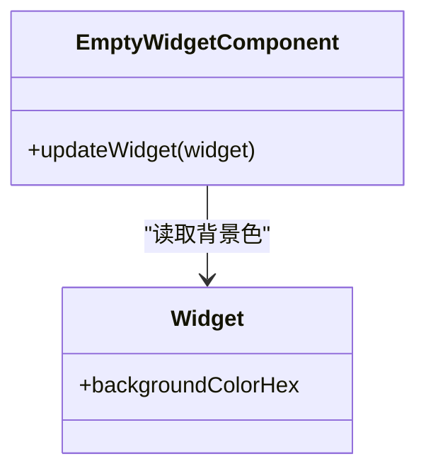
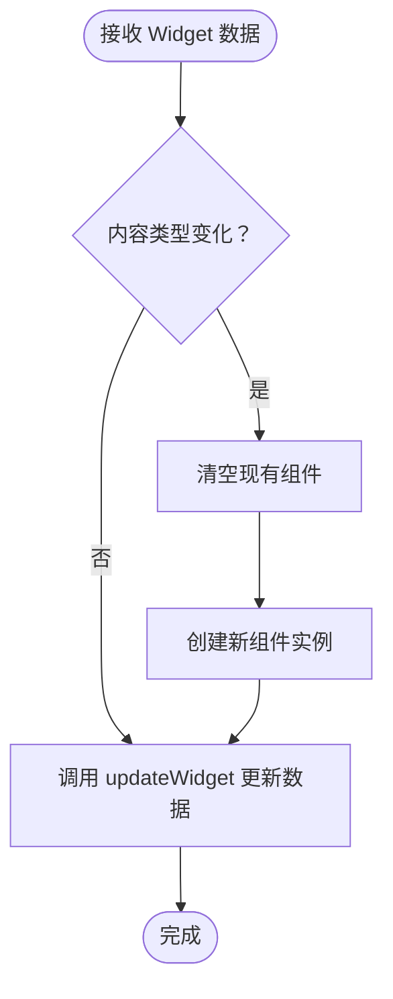
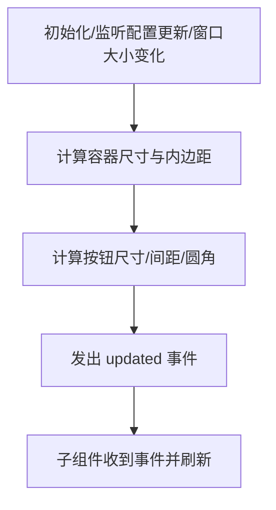
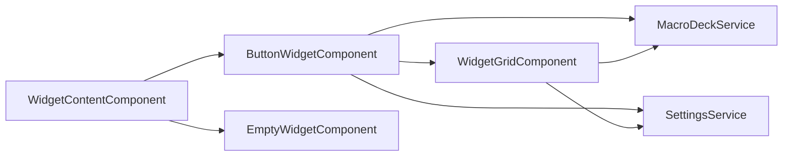
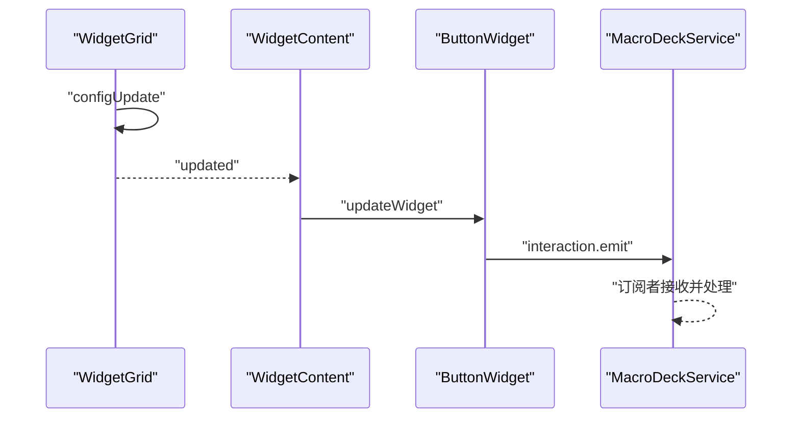

# 微件组件

<cite>
**本文档引用的文件**
- [src/app/datatypes/widgets/widget.ts](file://src/app/datatypes/widgets/widget.ts)
- [src/app/datatypes/widgets/button-widget.ts](file://src/app/datatypes/widgets/button-widget.ts)
- [src/app/datatypes/widgets/widget-content.ts](file://src/app/datatypes/widgets/widget-content.ts)
- [src/app/datatypes/widgets/widget-interaction.ts](file://src/app/datatypes/widgets/widget-interaction.ts)
- [src/app/enums/widget-content-type.ts](file://src/app/enums/widget-content-type.ts)
- [src/app/enums/widget-interaction-type.ts](file://src/app/enums/widget-interaction-type.ts)
- [src/app/widget-content-components/button-widget/button-widget.component.ts](file://src/app/widget-content-components/button-widget/button-widget.component.ts)
- [src/app/widget-content-components/button-widget/button-widget.component.html](file://src/app/widget-content-components/button-widget/button-widget.component.html)
- [src/app/widget-content-components/button-widget/button-widget.component.scss](file://src/app/widget-content-components/button-widget/button-widget.component.scss)
- [src/app/widget-content-components/button-widget/button-widget-border-style.ts](file://src/app/widget-content-components/button-widget/button-widget-border-style.ts)
- [src/app/widget-content-components/empty-widget/empty-widget.component.ts](file://src/app/widget-content-components/empty-widget/empty-widget.component.ts)
- [src/app/widget-content-components/empty-widget/empty-widget.component.html](file://src/app/widget-content-components/empty-widget/empty-widget.component.html)
- [src/app/widget-content-components/empty-widget/empty-widget.component.scss](file://src/app/widget-content-components/empty-widget/empty-widget.component.scss)
- [src/app/pages/deck/widget-grid/widget-grid.component.ts](file://src/app/pages/deck/widget-grid/widget-grid.component.ts)
- [src/app/pages/deck/widget-grid/widget-content/widget-content.component.ts](file://src/app/pages/deck/widget-grid/widget-content/widget-content.component.ts)
- [src/app/services/macro-deck/macro-deck.service.ts](file://src/app/services/macro-deck/macro-deck.service.ts)
- [src/app/services/settings/settings.service.ts](file://src/app/services/settings/settings.service.ts)
</cite>

## 目录
1. [简介](#简介)
2. [项目结构](#项目结构)
3. [核心组件](#核心组件)
4. [架构总览](#架构总览)
5. [详细组件分析](#详细组件分析)
6. [依赖关系分析](#依赖关系分析)
7. [性能考虑](#性能考虑)
8. [故障排查指南](#故障排查指南)
9. [结论](#结论)
10. [附录：使用示例与最佳实践](#附录使用示例与最佳实践)

## 简介
本文件聚焦于 Macro-Deck-Client-App 的微件组件系统，系统性阐述按钮微件 ButtonWidget 与空白微件 EmptyWidget 的实现与使用方法。内容涵盖：
- 设计模式与数据绑定
- 事件处理与交互类型
- 样式定制与外观配置
- 与宏命令服务的集成
- 扩展新微件类型的步骤
- 响应式设计、触摸交互与动画效果

## 项目结构
微件系统由“数据模型层”“组件层”“网格布局层”“服务层”四部分组成，采用 Angular 动态组件与事件总线驱动的解耦架构。

图表来源
- [src/app/datatypes/widgets/widget.ts:1-33](file://src/app/datatypes/widgets/widget.ts#L1-L33)
- [src/app/datatypes/widgets/button-widget.ts:1-16](file://src/app/datatypes/widgets/button-widget.ts#L1-L16)
- [src/app/datatypes/widgets/widget-content.ts:1-6](file://src/app/datatypes/widgets/widget-content.ts#L1-L6)
- [src/app/enums/widget-content-type.ts:1-12](file://src/app/enums/widget-content-type.ts#L1-L12)
- [src/app/enums/widget-interaction-type.ts:1-18](file://src/app/enums/widget-interaction-type.ts#L1-L18)
- [src/app/pages/deck/widget-grid/widget-grid.component.ts:1-335](file://src/app/pages/deck/widget-grid/widget-grid.component.ts#L1-L335)
- [src/app/pages/deck/widget-grid/widget-content/widget-content.component.ts:1-152](file://src/app/pages/deck/widget-grid/widget-content/widget-content.component.ts#L1-L152)
- [src/app/widget-content-components/button-widget/button-widget.component.ts:1-393](file://src/app/widget-content-components/button-widget/button-widget.component.ts#L1-L393)
- [src/app/widget-content-components/empty-widget/empty-widget.component.ts:1-57](file://src/app/widget-content-components/empty-widget/empty-widget.component.ts#L1-L57)
- [src/app/services/macro-deck/macro-deck.service.ts:1-111](file://src/app/services/macro-deck/macro-deck.service.ts#L1-L111)
- [src/app/services/settings/settings.service.ts:1-389](file://src/app/services/settings/settings.service.ts#L1-L389)

章节来源
- [src/app/pages/deck/widget-grid/widget-grid.component.ts:1-335](file://src/app/pages/deck/widget-grid/widget-grid.component.ts#L1-L335)
- [src/app/pages/deck/widget-grid/widget-content/widget-content.component.ts:1-152](file://src/app/pages/deck/widget-grid/widget-content/widget-content.component.ts#L1-L152)
- [src/app/services/macro-deck/macro-deck.service.ts:1-111](file://src/app/services/macro-deck/macro-deck.service.ts#L1-L111)
- [src/app/services/settings/settings.service.ts:1-389](file://src/app/services/settings/settings.service.ts#L1-L389)

## 核心组件
- Widget：描述微件在网格中的位置、尺寸、背景色、内容类型与具体数据。
- ButtonWidget：按钮微件的具体内容，包含图标与前景标签的 Base64 数据。
- EmptyWidget：空白微件，用于占位与背景填充。
- WidgetContentComponent：根据 WidgetContentType 动态创建并渲染对应微件内容组件。
- WidgetGridComponent：负责网格布局计算、尺寸适配与事件广播。
- MacroDeckService：提供配置更新与交互事件的发布订阅。
- SettingsService：提供按钮长按延迟、边框样式等设置项的读写。

章节来源
- [src/app/datatypes/widgets/widget.ts:1-33](file://src/app/datatypes/widgets/widget.ts#L1-L33)
- [src/app/datatypes/widgets/button-widget.ts:1-16](file://src/app/datatypes/widgets/button-widget.ts#L1-L16)
- [src/app/widget-content-components/button-widget/button-widget.component.ts:1-393](file://src/app/widget-content-components/button-widget/button-widget.component.ts#L1-L393)
- [src/app/widget-content-components/empty-widget/empty-widget.component.ts:1-57](file://src/app/widget-content-components/empty-widget/empty-widget.component.ts#L1-L57)
- [src/app/pages/deck/widget-grid/widget-content/widget-content.component.ts:1-152](file://src/app/pages/deck/widget-grid/widget-content/widget-content.component.ts#L1-L152)
- [src/app/pages/deck/widget-grid/widget-grid.component.ts:1-335](file://src/app/pages/deck/widget-grid/widget-grid.component.ts#L1-L335)
- [src/app/services/macro-deck/macro-deck.service.ts:1-111](file://src/app/services/macro-deck/macro-deck.service.ts#L1-L111)
- [src/app/services/settings/settings.service.ts:1-389](file://src/app/services/settings/settings.service.ts#L1-L389)

## 架构总览
微件系统采用“数据驱动 + 动态组件 + 事件总线”的架构：
- WidgetGridComponent 计算按钮尺寸、间距与圆角，并通过静态事件通知子组件刷新。
- WidgetContentComponent 根据 WidgetContentType 动态创建 ButtonWidgetComponent 或 EmptyWidgetComponent。
- ButtonWidgetComponent 负责渲染图标/标签、背景与边框，处理按下/长按/释放事件并通过 MacroDeckService.interaction 发布交互事件。
- SettingsService 提供按钮长按延迟与边框样式等可配置项。

图表来源
- [src/app/pages/deck/widget-grid/widget-grid.component.ts:68-116](file://src/app/pages/deck/widget-grid/widget-grid.component.ts#L68-L116)
- [src/app/pages/deck/widget-grid/widget-content/widget-content.component.ts:45-79](file://src/app/pages/deck/widget-grid/widget-content/widget-content.component.ts#L45-L79)
- [src/app/widget-content-components/button-widget/button-widget.component.ts:59-81](file://src/app/widget-content-components/button-widget/button-widget.component.ts#L59-L81)
- [src/app/services/macro-deck/macro-deck.service.ts:11-14](file://src/app/services/macro-deck/macro-deck.service.ts#L11-L14)
- [src/app/services/settings/settings.service.ts:353-355](file://src/app/services/settings/settings.service.ts#L353-L355)

## 详细组件分析

### ButtonWidget 按钮微件
- 数据模型
  - 继承自 WidgetContent，包含 iconBase64 与 labelBase64（均为 Base64 图片数据）。
- 渲染逻辑
  - 在 updateWidget 中将 Base64 解码为浏览器可加载的安全 URL，设置背景色与边框样式。
  - 根据 SettingsService 的按钮边框样式策略设置 borderStyle；根据背景色明暗调整边框色。
- 交互处理
  - 鼠标/触摸按下：添加 pressed 类，发射 ButtonPress；启动长按计时器。
  - 鼠标/触摸抬起：根据是否触发长按分别发射 ButtonShortPressRelease 或 ButtonLongPressRelease；重置状态与计时器。
  - 鼠标/触摸离开：视为抬起处理。
- 动画与样式
  - 按下缩放（scale 0.9），释放过渡（transform 过渡）。
  - 背景与前景图层使用 z-index 控制层级，保证视觉一致性。

图表来源
- [src/app/datatypes/widgets/widget.ts:4-20](file://src/app/datatypes/widgets/widget.ts#L4-L20)
- [src/app/datatypes/widgets/button-widget.ts:3-9](file://src/app/datatypes/widgets/button-widget.ts#L3-L9)
- [src/app/widget-content-components/button-widget/button-widget.component.ts:88-103](file://src/app/widget-content-components/button-widget/button-widget.component.ts#L88-L103)
- [src/app/services/macro-deck/macro-deck.service.ts:13-14](file://src/app/services/macro-deck/macro-deck.service.ts#L13-L14)
- [src/app/services/settings/settings.service.ts:353-355](file://src/app/services/settings/settings.service.ts#L353-L355)

章节来源
- [src/app/datatypes/widgets/button-widget.ts:1-16](file://src/app/datatypes/widgets/button-widget.ts#L1-L16)
- [src/app/widget-content-components/button-widget/button-widget.component.ts:1-393](file://src/app/widget-content-components/button-widget/button-widget.component.ts#L1-L393)
- [src/app/widget-content-components/button-widget/button-widget.component.html:1-14](file://src/app/widget-content-components/button-widget/button-widget.component.html#L1-L14)
- [src/app/widget-content-components/button-widget/button-widget.component.scss:1-52](file://src/app/widget-content-components/button-widget/button-widget.component.scss#L1-L52)
- [src/app/services/settings/settings.service.ts:353-355](file://src/app/services/settings/settings.service.ts#L353-L355)

### EmptyWidget 空白微件
- 用途：作为网格中无内容时的占位微件，统一背景色与圆角。
- 渲染逻辑：updateWidget 仅设置背景色，边框圆角继承自 WidgetGridComponent 的 borderRadiusPoints。
- 适用场景：未配置的网格区域、占位与视觉留白。

图表来源
- [src/app/widget-content-components/empty-widget/empty-widget.component.ts:26-28](file://src/app/widget-content-components/empty-widget/empty-widget.component.ts#L26-L28)
- [src/app/pages/deck/widget-grid/widget-grid.component.ts:48-48](file://src/app/pages/deck/widget-grid/widget-grid.component.ts#L48-L48)

章节来源
- [src/app/widget-content-components/empty-widget/empty-widget.component.ts:1-57](file://src/app/widget-content-components/empty-widget/empty-widget.component.ts#L1-L57)
- [src/app/widget-content-components/empty-widget/empty-widget.component.html:1-4](file://src/app/widget-content-components/empty-widget/empty-widget.component.html#L1-L4)
- [src/app/widget-content-components/empty-widget/empty-widget.component.scss:1-24](file://src/app/widget-content-components/empty-widget/empty-widget.component.scss#L1-L24)

### WidgetContentComponent 动态内容组件
- 根据 Widget.widgetContentType 动态创建并注入对应微件组件实例。
- 当内容类型变化时清理旧组件并重建，避免状态污染。
- 将 Widget 数据直接传递给子组件的 updateWidget 方法进行渲染。

图表来源
- [src/app/pages/deck/widget-grid/widget-content/widget-content.component.ts:45-79](file://src/app/pages/deck/widget-grid/widget-content/widget-content.component.ts#L45-L79)

章节来源
- [src/app/pages/deck/widget-grid/widget-content/widget-content.component.ts:1-152](file://src/app/pages/deck/widget-grid/widget-content/widget-content.component.ts#L1-L152)

### WidgetGridComponent 网格布局与尺寸计算
- 计算按钮最佳尺寸（取宽高方向最小值）、间距与圆角半径（pt 单位）。
- 提供 getWidgetStyle 与 getWidgetContentStyle 以支持绝对定位与内容边距。
- 提供 getWidgetFromIndex 生成默认空白微件，确保网格完整覆盖。
- 广播 updated 事件，驱动子组件刷新。

图表来源
- [src/app/pages/deck/widget-grid/widget-grid.component.ts:68-116](file://src/app/pages/deck/widget-grid/widget-grid.component.ts#L68-L116)

章节来源
- [src/app/pages/deck/widget-grid/widget-grid.component.ts:1-335](file://src/app/pages/deck/widget-grid/widget-grid.component.ts#L1-L335)

## 依赖关系分析
- ButtonWidgetComponent 依赖：
  - MacroDeckService：发布交互事件
  - SettingsService：读取长按延迟与边框样式
  - WidgetGridComponent：读取 borderRadiusPoints 与 updated 事件
- WidgetContentComponent 依赖：
  - 动态组件工厂：根据 WidgetContentType 创建 ButtonWidgetComponent 或 EmptyWidgetComponent
- WidgetGridComponent 依赖：
  - MacroDeckService：读取 rows/columns/buttons 配置
  - SettingsService：读取按钮间距/圆角配置

图表来源
- [src/app/widget-content-components/button-widget/button-widget.component.ts:49-53](file://src/app/widget-content-components/button-widget/button-widget.component.ts#L49-L53)
- [src/app/pages/deck/widget-grid/widget-content/widget-content.component.ts:58-71](file://src/app/pages/deck/widget-grid/widget-content/widget-content.component.ts#L58-L71)
- [src/app/pages/deck/widget-grid/widget-grid.component.ts:33-34](file://src/app/pages/deck/widget-grid/widget-grid.component.ts#L33-L34)

章节来源
- [src/app/widget-content-components/button-widget/button-widget.component.ts:1-393](file://src/app/widget-content-components/button-widget/button-widget.component.ts#L1-L393)
- [src/app/pages/deck/widget-grid/widget-content/widget-content.component.ts:1-152](file://src/app/pages/deck/widget-grid/widget-content/widget-content.component.ts#L1-L152)
- [src/app/pages/deck/widget-grid/widget-grid.component.ts:1-335](file://src/app/pages/deck/widget-grid/widget-grid.component.ts#L1-L335)

## 性能考虑
- 动态组件复用：WidgetContentComponent 在内容类型不变时仅更新数据，避免频繁创建销毁。
- 事件节流：窗口 resize 事件通过延时与 tick 机制减少重排频率。
- 最小化样式计算：边框圆角与间距统一在网格层计算，子组件只消费结果。
- 图片解码：Base64 解码在 updateWidget 中执行，避免重复解码与 DOM 抖动。
- 动画优化：CSS transition 与 transform: translateZ(0)/translate3d(0,0,0) 提升硬件加速表现。

## 故障排查指南
- 按钮不响应交互
  - 检查 MacroDeckService.interaction 是否被上层订阅。
  - 确认 ButtonWidgetComponent 事件绑定与 emit 调用路径。
- 长按无效
  - 检查 SettingsService.getButtonLongPressDelay 返回值是否合理。
  - 确认 onMouseDown 中计时器创建与 onMouseUp 中清除逻辑。
- 边框样式未生效
  - 检查 SettingsService.getButtonWidgetBorderStyle 返回值与 setBorderStyle 分支。
  - 确认 WidgetGridComponent.borderRadiusPoints 已正确计算。
- 网格尺寸异常
  - 检查 WidgetGridComponent.calculateWidgetSize 的容器尺寸与内边距读取。
  - 确认 MacroDeckService.rows/columns/buttonSpacing/buttonRadius 是否更新并触发 configUpdate。

章节来源
- [src/app/services/macro-deck/macro-deck.service.ts:11-14](file://src/app/services/macro-deck/macro-deck.service.ts#L11-L14)
- [src/app/services/settings/settings.service.ts:353-355](file://src/app/services/settings/settings.service.ts#L353-L355)
- [src/app/widget-content-components/button-widget/button-widget.component.ts:174-183](file://src/app/widget-content-components/button-widget/button-widget.component.ts#L174-L183)
- [src/app/pages/deck/widget-grid/widget-grid.component.ts:92-116](file://src/app/pages/deck/widget-grid/widget-grid.component.ts#L92-L116)

## 结论
本微件系统通过清晰的数据模型、动态组件与事件总线实现了高内聚低耦合的可扩展架构。ButtonWidget 与 EmptyWidget 分别承担“有内容”与“占位”的职责，配合 WidgetGrid 的响应式布局与 SettingsService 的可配置项，满足多平台、多尺寸的使用需求。扩展新微件类型只需新增数据模型、组件与类型映射即可无缝接入。

## 附录：使用示例与最佳实践

### 按钮微件配置要点
- 内容类型与数据
  - 将 Widget.widgetContentType 设为按钮类型，设置 Widget.widgetContent 为 ButtonWidget。
  - 在 ButtonWidget 中提供 iconBase64 与 labelBase64（Base64 图片数据）。
- 外观配置
  - backgroundColorHex：设置按钮背景色。
  - 边框样式：通过 SettingsService.setButtonWidgetBorderStyle 配置。
  - 圆角与间距：由 WidgetGridComponent 基于按钮尺寸自动计算。
- 交互响应
  - 上层订阅 MacroDeckService.interaction，区分 ButtonPress、ButtonShortPressRelease、ButtonLongPress、ButtonLongPressRelease。
  - 长按延迟：通过 SettingsService.setButtonLongPressDelay 自定义。

章节来源
- [src/app/datatypes/widgets/button-widget.ts:1-16](file://src/app/datatypes/widgets/button-widget.ts#L1-L16)
- [src/app/enums/widget-content-type.ts:1-12](file://src/app/enums/widget-content-type.ts#L1-L12)
- [src/app/services/settings/settings.service.ts:353-355](file://src/app/services/settings/settings.service.ts#L353-L355)
- [src/app/enums/widget-interaction-type.ts:1-18](file://src/app/enums/widget-interaction-type.ts#L1-L18)
- [src/app/services/macro-deck/macro-deck.service.ts:13-14](file://src/app/services/macro-deck/macro-deck.service.ts#L13-L14)

### 样式设置与动画
- 按下缩放与释放过渡：通过 CSS 类 pressed 与 release-transition 实现。
- 背景与前景图层：z-index 控制层级，object-fit: fill 确保铺满。
- 硬件加速：transform: translateZ(0)/translate3d(0,0,0) 与 backface-visibility 隐藏提升性能。

章节来源
- [src/app/widget-content-components/button-widget/button-widget.component.scss:45-51](file://src/app/widget-content-components/button-widget/button-widget.component.scss#L45-L51)
- [src/app/widget-content-components/button-widget/button-widget.component.html:1-14](file://src/app/widget-content-components/button-widget/button-widget.component.html#L1-L14)

### 与宏命令服务的集成
- 配置更新：WidgetGridComponent 监听 MacroDeckService.configUpdate，计算尺寸并广播 updated。
- 交互上报：ButtonWidgetComponent 在交互发生时通过 MacroDeckService.interaction 发布 WidgetInteraction。
- 上层消费：业务侧订阅 interaction，解析 widget 与 widgetInteractionType，触发相应动作。

图表来源
- [src/app/pages/deck/widget-grid/widget-grid.component.ts:68-86](file://src/app/pages/deck/widget-grid/widget-grid.component.ts#L68-L86)
- [src/app/pages/deck/widget-grid/widget-content/widget-content.component.ts:45-79](file://src/app/pages/deck/widget-grid/widget-content/widget-content.component.ts#L45-L79)
- [src/app/services/macro-deck/macro-deck.service.ts:11-14](file://src/app/services/macro-deck/macro-deck.service.ts#L11-L14)

### 扩展新微件类型步骤
- 定义数据模型
  - 新建接口继承 WidgetContent，如 NewWidgetContent。
- 实现组件
  - 创建组件类与模板、样式，实现 updateWidget 接收 Widget 并渲染。
- 注册类型
  - 在 WidgetContentType 中新增枚举值。
  - 在 WidgetContentComponent 的 switch 分支中添加新类型分支。
- 可选设置
  - 如需可配置项，在 SettingsService 中新增读写方法。
- 集成测试
  - 通过 MacroDeckService.setWidgets 或 updateWidget 注入新类型微件，验证渲染与交互。

章节来源
- [src/app/datatypes/widgets/widget-content.ts:1-6](file://src/app/datatypes/widgets/widget-content.ts#L1-L6)
- [src/app/enums/widget-content-type.ts:1-12](file://src/app/enums/widget-content-type.ts#L1-L12)
- [src/app/pages/deck/widget-grid/widget-content/widget-content.component.ts:115-146](file://src/app/pages/deck/widget-grid/widget-content/widget-content.component.ts#L115-L146)