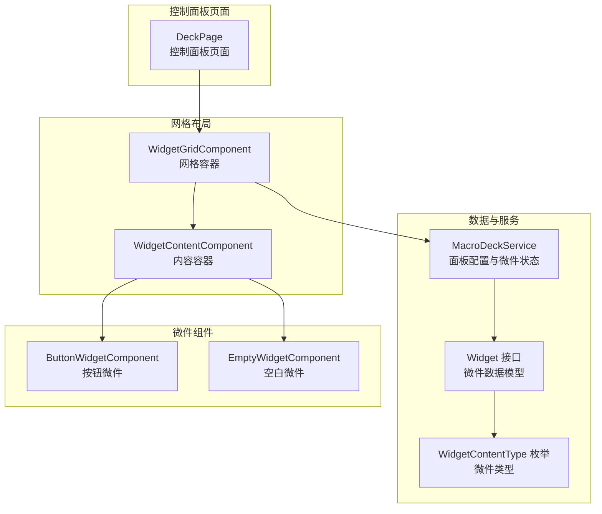
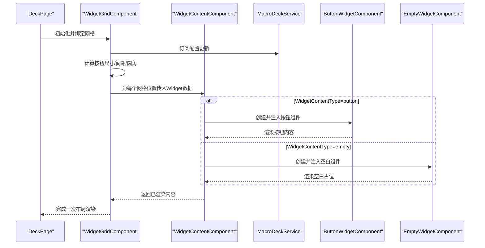
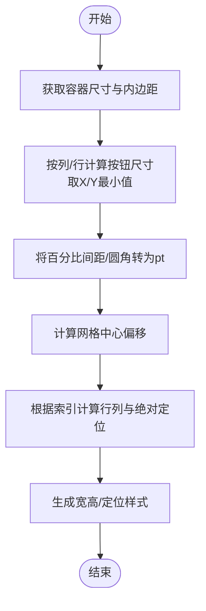
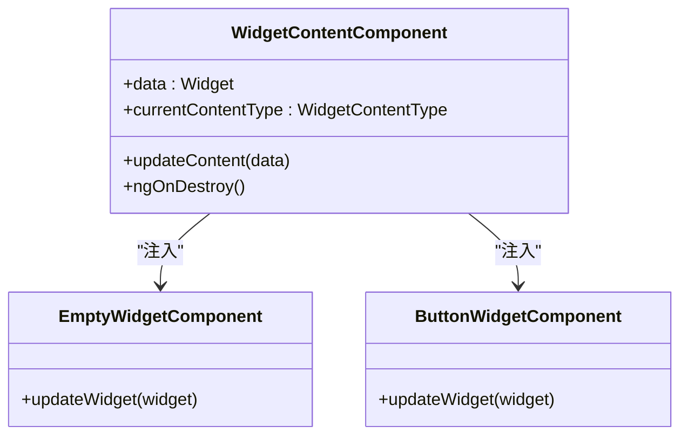
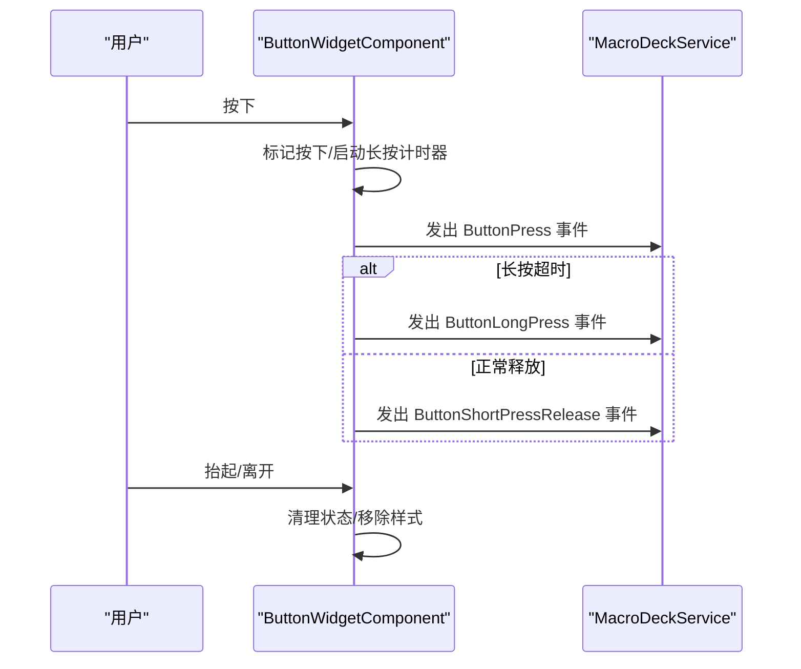
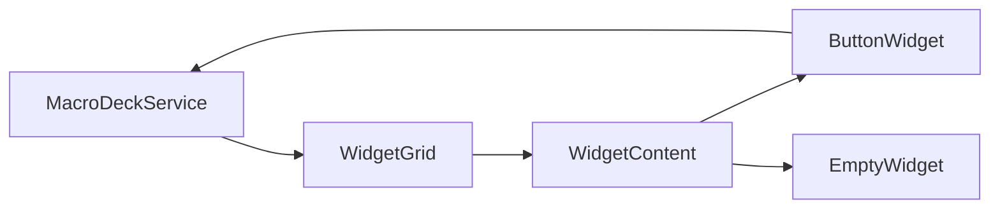

# 网格布局系统

<cite>
**本文档引用的文件**
- [widget-grid.component.ts](file://src/app/pages/deck/widget-grid/widget-grid.component.ts)
- [widget-grid.component.html](file://src/app/pages/deck/widget-grid/widget-grid.component.html)
- [widget-grid.component.scss](file://src/app/pages/deck/widget-grid/widget-grid.component.scss)
- [widget-content.component.ts](file://src/app/pages/deck/widget-grid/widget-content/widget-content.component.ts)
- [widget-content.component.html](file://src/app/pages/deck/widget-grid/widget-content/widget-content.component.html)
- [widget.ts](file://src/app/datatypes/widgets/widget.ts)
- [widget-content-type.ts](file://src/app/enums/widget-content-type.ts)
- [macro-deck.service.ts](file://src/app/services/macro-deck/macro-deck.service.ts)
- [button-widget.component.ts](file://src/app/widget-content-components/button-widget/button-widget.component.ts)
- [button-widget.component.html](file://src/app/widget-content-components/button-widget/button-widget.component.html)
- [button-widget.component.scss](file://src/app/widget-content-components/button-widget/button-widget.component.scss)
- [empty-widget.component.ts](file://src/app/widget-content-components/empty-widget/empty-widget.component.ts)
- [deck.page.html](file://src/app/pages/deck/deck.page.html)
- [deck.page.ts](file://src/app/pages/deck/deck.page.ts)
</cite>

## 目录
1. [简介](#简介)
2. [项目结构](#项目结构)
3. [核心组件](#核心组件)
4. [架构总览](#架构总览)
5. [详细组件分析](#详细组件分析)
6. [依赖关系分析](#依赖关系分析)
7. [性能考虑](#性能考虑)
8. [故障排除指南](#故障排除指南)
9. [结论](#结论)
10. [附录](#附录)

## 简介
本文件面向Macro-Deck-Client-App的网格布局系统，聚焦于WidgetGrid网格组件与WidgetContent内容组件的实现与使用。文档从设计原理、响应式适配、尺寸计算、拖拽排序能力现状、配置参数、布局算法、性能优化、使用示例、组件集成与扩展等方面进行深入解析，帮助开发者快速理解并高效使用网格布局系统。

## 项目结构
网格布局系统位于控制面板页面中，由以下关键文件组成：
- 网格容器：WidgetGrid组件负责布局计算与渲染
- 内容容器：WidgetContent组件负责根据微件类型动态渲染具体组件
- 数据模型：Widget接口与WidgetContentType枚举定义微件的数据结构与类型
- 服务层：MacroDeckService提供面板配置、微件列表与交互事件
- 微件组件：ButtonWidgetComponent与EmptyWidgetComponent分别渲染按钮与空白占位
- 页面容器：DeckPage承载网格布局并提供入口

图表来源
- [deck.page.ts:14-23](file://src/app/pages/deck/deck.page.ts#L14-L23)
- [widget-grid.component.ts:19-28](file://src/app/pages/deck/widget-grid/widget-grid.component.ts#L19-L28)
- [widget-content.component.ts:10-15](file://src/app/pages/deck/widget-grid/widget-content/widget-content.component.ts#L10-L15)
- [macro-deck.service.ts:6-10](file://src/app/services/macro-deck/macro-deck.service.ts#L6-L10)
- [widget.ts:4-20](file://src/app/datatypes/widgets/widget.ts#L4-L20)
- [widget-content-type.ts:1-7](file://src/app/enums/widget-content-type.ts#L1-L7)
- [button-widget.component.ts:14-22](file://src/app/widget-content-components/button-widget/button-widget.component.ts#L14-L22)
- [empty-widget.component.ts:6-14](file://src/app/widget-content-components/empty-widget/empty-widget.component.ts#L6-L14)

章节来源
- [deck.page.html:34-47](file://src/app/pages/deck/deck.page.html#L34-L47)
- [deck.page.ts:14-23](file://src/app/pages/deck/deck.page.ts#L14-L23)

## 核心组件
- WidgetGridComponent：负责根据容器尺寸与面板行列数计算按钮尺寸、间距与圆角；为每个网格位置生成绝对定位样式；提供空白占位微件填充逻辑。
- WidgetContentComponent：根据微件类型动态创建并注入对应内容组件（按钮或空白），并在数据变化时更新组件实例。
- MacroDeckService：提供面板配置（行/列、间距、圆角）、微件列表与交互事件，是网格布局的数据源。
- ButtonWidgetComponent/EmptyWidgetComponent：具体微件渲染组件，前者处理按钮图像、背景与交互，后者处理空白占位背景。

章节来源
- [widget-grid.component.ts:19-335](file://src/app/pages/deck/widget-grid/widget-grid.component.ts#L19-L335)
- [widget-content.component.ts:10-152](file://src/app/pages/deck/widget-grid/widget-content/widget-content.component.ts#L10-L152)
- [macro-deck.service.ts:6-111](file://src/app/services/macro-deck/macro-deck.service.ts#L6-L111)
- [button-widget.component.ts:14-393](file://src/app/widget-content-components/button-widget/button-widget.component.ts#L14-L393)
- [empty-widget.component.ts:6-57](file://src/app/widget-content-components/empty-widget/empty-widget.component.ts#L6-L57)

## 架构总览
网格布局系统采用“容器-内容”分层设计：
- WidgetGrid作为网格容器，承担布局计算与渲染职责
- WidgetContent作为内容容器，承担动态组件注入与更新
- MacroDeckService集中管理配置与状态，向网格与微件组件提供数据
- ButtonWidgetComponent/EmptyWidgetComponent分别渲染不同类型的微件内容

图表来源
- [deck.page.html:36](file://src/app/pages/deck/deck.page.html#L36)
- [widget-grid.component.ts:68-86](file://src/app/pages/deck/widget-grid/widget-grid.component.ts#L68-L86)
- [widget-content.component.ts:45-79](file://src/app/pages/deck/widget-grid/widget-content/widget-content.component.ts#L45-L79)
- [button-widget.component.ts:293-306](file://src/app/widget-content-components/button-widget/button-widget.component.ts#L293-L306)
- [empty-widget.component.ts:26-28](file://src/app/widget-content-components/empty-widget/empty-widget.component.ts#L26-L28)

## 详细组件分析

### WidgetGrid网格组件
- 响应式适配与尺寸计算
  - 通过容器内边距与外宽高计算可用区域，按列数与行数计算按钮最佳尺寸，取X/Y方向最小值保证正方形按钮
  - 将百分比间距与圆角转换为pt单位，用于微件内容容器的内外边距与圆角
  - 监听窗口resize与配置更新事件，延迟重算并触发应用刷新
- 绝对定位布局
  - 根据线性索引计算行列位置，结合colSpan/rowSpan计算宽高
  - 计算网格中心偏移，使整个网格面板在容器中居中显示
- 空白占位策略
  - 若指定位置无微件数据，则构造空微件（WidgetContentType.empty）作为占位，保持网格完整性

图表来源
- [widget-grid.component.ts:92-116](file://src/app/pages/deck/widget-grid/widget-grid.component.ts#L92-L116)
- [widget-grid.component.ts:262-281](file://src/app/pages/deck/widget-grid/widget-grid.component.ts#L262-L281)
- [widget-grid.component.ts:287-308](file://src/app/pages/deck/widget-grid/widget-grid.component.ts#L287-L308)
- [widget-grid.component.ts:316-333](file://src/app/pages/deck/widget-grid/widget-grid.component.ts#L316-L333)

章节来源
- [widget-grid.component.ts:68-86](file://src/app/pages/deck/widget-grid/widget-grid.component.ts#L68-L86)
- [widget-grid.component.ts:92-116](file://src/app/pages/deck/widget-grid/widget-grid.component.ts#L92-L116)
- [widget-grid.component.ts:243-259](file://src/app/pages/deck/widget-grid/widget-grid.component.ts#L243-L259)
- [widget-grid.component.ts:262-281](file://src/app/pages/deck/widget-grid/widget-grid.component.ts#L262-L281)
- [widget-grid.component.ts:287-308](file://src/app/pages/deck/widget-grid/widget-grid.component.ts#L287-L308)
- [widget-grid.component.ts:316-333](file://src/app/pages/deck/widget-grid/widget-grid.component.ts#L316-L333)

### WidgetContent内容组件
- 动态组件注入
  - 根据WidgetContentType选择注入EmptyWidget或ButtonWidget
  - 当内容类型变化时清理旧组件并重建，避免状态污染
- 数据更新与样式
  - 通过updateWidget方法将Widget数据传递给注入的子组件
  - 设置动态组件根元素样式类，确保占位与拉伸效果一致

图表来源
- [widget-content.component.ts:45-79](file://src/app/pages/deck/widget-grid/widget-content/widget-content.component.ts#L45-L79)
- [empty-widget.component.ts:26-28](file://src/app/widget-content-components/empty-widget/empty-widget.component.ts#L26-L28)
- [button-widget.component.ts:293-306](file://src/app/widget-content-components/button-widget/button-widget.component.ts#L293-L306)

章节来源
- [widget-content.component.ts:45-79](file://src/app/pages/deck/widget-grid/widget-content/widget-content.component.ts#L45-L79)
- [widget-content.component.ts:115-146](file://src/app/pages/deck/widget-grid/widget-content/widget-content.component.ts#L115-L146)

### ButtonWidget组件（按钮微件）
- 图像与背景
  - 支持前景标签与图标Base64解码为安全URL，设置背景色与边框样式
  - 边框颜色基于背景色调暗40单位，提升对比度
- 交互事件
  - 处理按下/抬起/离开事件，支持短按与长按识别
  - 通过MacroDeckService发出交互事件，供上层处理
- 响应式更新
  - 订阅WidgetGrid.updated事件与设置变更事件，自动更新渲染

图表来源
- [button-widget.component.ts:350-365](file://src/app/widget-content-components/button-widget/button-widget.component.ts#L350-L365)
- [button-widget.component.ts:325-344](file://src/app/widget-content-components/button-widget/button-widget.component.ts#L325-L344)
- [button-widget.component.ts:383-391](file://src/app/widget-content-components/button-widget/button-widget.component.ts#L383-L391)

章节来源
- [button-widget.component.ts:88-103](file://src/app/widget-content-components/button-widget/button-widget.component.ts#L88-L103)
- [button-widget.component.ts:325-365](file://src/app/widget-content-components/button-widget/button-widget.component.ts#L325-L365)
- [button-widget.component.ts:383-391](file://src/app/widget-content-components/button-widget/button-widget.component.ts#L383-L391)

### EmptyWidget组件（空白微件）
- 简单背景渲染
  - 仅根据Widget.backgroundColorHex设置背景色
  - 与ButtonWidget共享相同的网格尺寸与圆角策略

章节来源
- [empty-widget.component.ts:26-28](file://src/app/widget-content-components/empty-widget/empty-widget.component.ts#L26-L28)

### 数据模型与配置参数
- Widget接口
  - 描述微件的行列位置、跨行跨列、背景色、内容类型与具体内容
- WidgetContentType枚举
  - empty：空白占位
  - button：按钮微件
- MacroDeckService配置
  - rows/columns：面板行列数
  - buttonSpacing/buttonRadius：按钮间距与圆角百分比
  - buttonBackground：是否显示按钮背景
  - widgets：当前面板微件列表

章节来源
- [widget.ts:4-20](file://src/app/datatypes/widgets/widget.ts#L4-L20)
- [widget-content-type.ts:1-7](file://src/app/enums/widget-content-type.ts#L1-L7)
- [macro-deck.service.ts:16-27](file://src/app/services/macro-deck/macro-deck.service.ts#L16-L27)
- [macro-deck.service.ts:36-43](file://src/app/services/macro-deck/macro-deck.service.ts#L36-L43)

## 依赖关系分析
- 组件耦合
  - WidgetGrid直接依赖MacroDeckService提供的rows/columns与widgets
  - WidgetContent依赖Widget数据与WidgetContentType枚举
  - ButtonWidget/EmptyWidget依赖WidgetGrid的圆角与间距计算结果
- 事件流
  - MacroDeckService通过configUpdate驱动WidgetGrid重新计算
  - ButtonWidget通过MacroDeckService.interaction上报用户交互
- 可能的循环依赖
  - ButtonWidget通过静态引用访问WidgetGrid.updated，属于跨组件事件通信，不构成编译期循环依赖

图表来源
- [macro-deck.service.ts:11-14](file://src/app/services/macro-deck/macro-deck.service.ts#L11-L14)
- [widget-grid.component.ts:69-72](file://src/app/pages/deck/widget-grid/widget-grid.component.ts#L69-L72)
- [button-widget.component.ts:59-67](file://src/app/widget-content-components/button-widget/button-widget.component.ts#L59-L67)

章节来源
- [macro-deck.service.ts:11-14](file://src/app/services/macro-deck/macro-deck.service.ts#L11-L14)
- [widget-grid.component.ts:69-72](file://src/app/pages/deck/widget-grid/widget-grid.component.ts#L69-L72)
- [button-widget.component.ts:59-67](file://src/app/widget-content-components/button-widget/button-widget.component.ts#L59-L67)

## 性能考虑
- 布局计算优化
  - 使用setTimeout延迟处理resize事件，避免频繁重排
  - 仅在容器存在且配置更新时执行计算，减少无效渲染
- 渲染优化
  - 使用绝对定位与固定尺寸，降低布局树复杂度
  - 动态组件按需创建与复用，避免重复实例化
- 事件与订阅
  - 在组件销毁时统一取消订阅，防止内存泄漏
- 样式与动画
  - 使用transform与translateZ加速渲染，减少重绘
  - 按键按下/释放过渡时间极短，保证交互流畅

章节来源
- [widget-grid.component.ts:74-80](file://src/app/pages/deck/widget-grid/widget-grid.component.ts#L74-L80)
- [widget-grid.component.ts:249-254](file://src/app/pages/deck/widget-grid/widget-grid.component.ts#L249-L254)
- [widget-content.component.ts:47-50](file://src/app/pages/deck/widget-grid/widget-content/widget-content.component.ts#L47-L50)
- [button-widget.component.ts:46-53](file://src/app/widget-content-components/button-widget/button-widget.component.ts#L46-L53)
- [button-widget.component.scss:7-10](file://src/app/widget-content-components/button-widget/button-widget.component.scss#L7-L10)

## 故障排除指南
- 网格不显示或尺寸异常
  - 检查容器是否正确渲染，确认wrapperElement非空
  - 确认MacroDeckService的rows/columns与widgets已正确设置
- 按钮点击无响应
  - 检查ButtonWidget的交互事件是否正常发出
  - 确认MacroDeckService.interaction订阅链路有效
- 样式错乱或圆角不生效
  - 确认WidgetGrid计算的borderRadiusPoints与WidgetContent的margin正确传递
  - 检查SCSS中圆角与过渡样式是否被覆盖

章节来源
- [widget-grid.component.ts:94-96](file://src/app/pages/deck/widget-grid/widget-grid.component.ts#L94-L96)
- [macro-deck.service.ts:11-14](file://src/app/services/macro-deck/macro-deck.service.ts#L11-L14)
- [button-widget.component.ts:218-226](file://src/app/widget-content-components/button-widget/button-widget.component.ts#L218-L226)

## 结论
网格布局系统通过WidgetGrid与WidgetContent的清晰分工，实现了高性能、可扩展的按钮面板布局。WidgetGrid专注于布局计算与定位，WidgetContent专注于动态内容渲染，二者配合MacroDeckService完成从配置到渲染的完整流程。系统具备良好的响应式适配能力与交互扩展空间，适合进一步引入拖拽排序、自定义布局与主题化等高级功能。

## 附录

### 使用示例与最佳实践
- 按钮排列
  - 通过设置MacroDeckService的rows与columns即可改变面板规模
  - 使用Widget的row/col与colSpan/rowSpan实现按钮合并与分割
- 动态调整
  - 修改MacroDeckService的buttonSpacing与buttonRadius即时影响间距与圆角
  - 通过configUpdate事件驱动网格重算，无需刷新页面
- 自适应布局
  - 利用容器尺寸与百分比参数，系统自动适配不同屏幕尺寸
  - 在移动端与桌面端均可获得一致的视觉体验

章节来源
- [macro-deck.service.ts:36-43](file://src/app/services/macro-deck/macro-deck.service.ts#L36-L43)
- [widget-grid.component.ts:108-110](file://src/app/pages/deck/widget-grid/widget-grid.component.ts#L108-L110)
- [widget-grid.component.ts:274-276](file://src/app/pages/deck/widget-grid/widget-grid.component.ts#L274-L276)

### 可扩展性与自定义布局
- 新增微件类型
  - 在WidgetContentType中新增枚举值
  - 在WidgetContent中增加对应组件的创建分支
  - 在ButtonWidget/EmptyWidget基础上扩展新的渲染组件
- 自定义布局方案
  - 可在WidgetGrid中扩展布局算法（如按权重/优先级排列）
  - 通过MacroDeckService暴露更多配置项，驱动更灵活的布局策略
- 拖拽排序
  - 当前代码未实现拖拽排序，可在WidgetGrid中引入拖拽事件与位置交换逻辑，并同步更新MacroDeckService的widgets

章节来源
- [widget-content-type.ts:1-7](file://src/app/enums/widget-content-type.ts#L1-L7)
- [widget-content.component.ts:59-74](file://src/app/pages/deck/widget-grid/widget-content/widget-content.component.ts#L59-L74)
- [button-widget.component.ts:14-22](file://src/app/widget-content-components/button-widget/button-widget.component.ts#L14-L22)
- [empty-widget.component.ts:6-14](file://src/app/widget-content-components/empty-widget/empty-widget.component.ts#L6-L14)