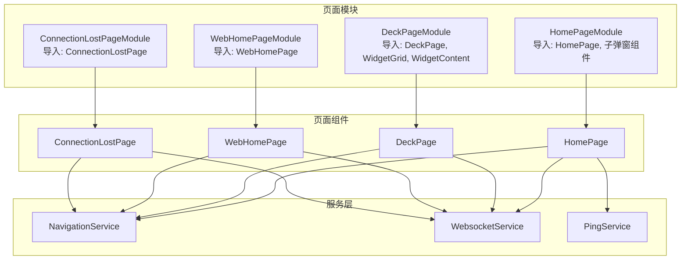
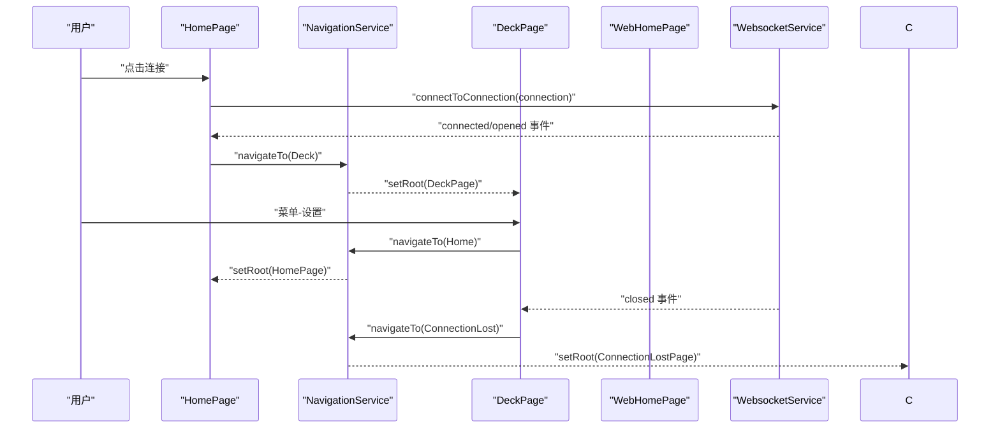
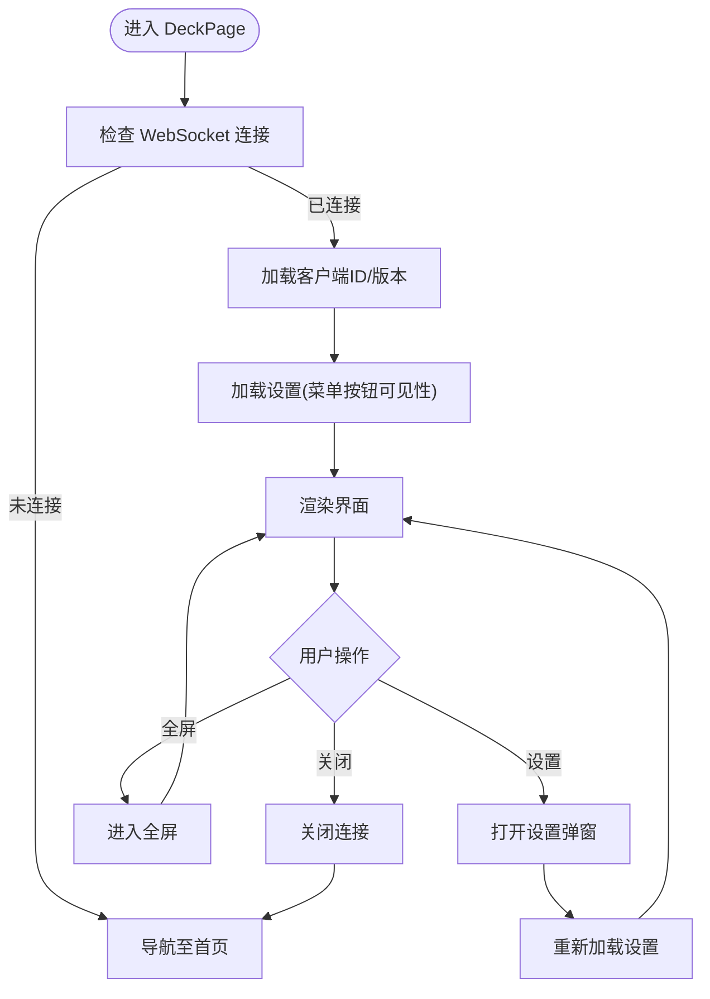
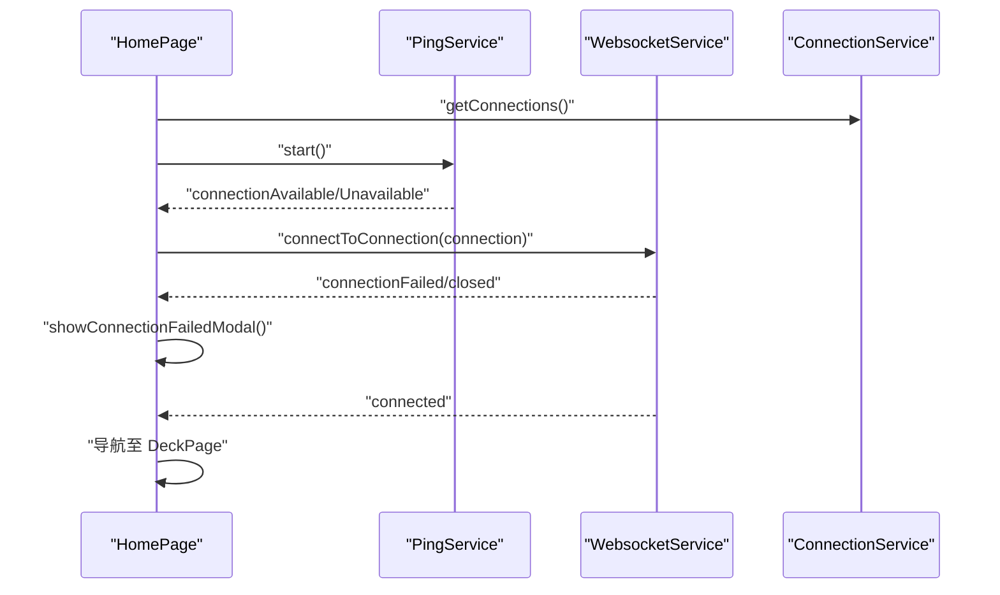
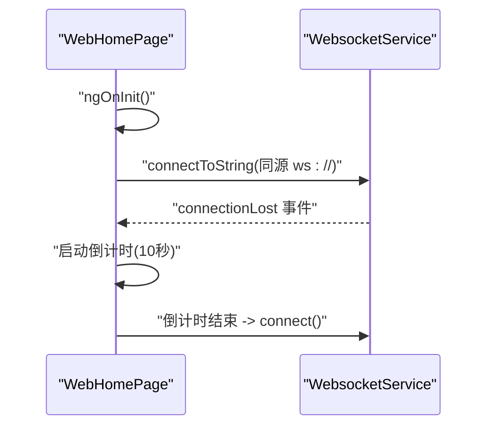
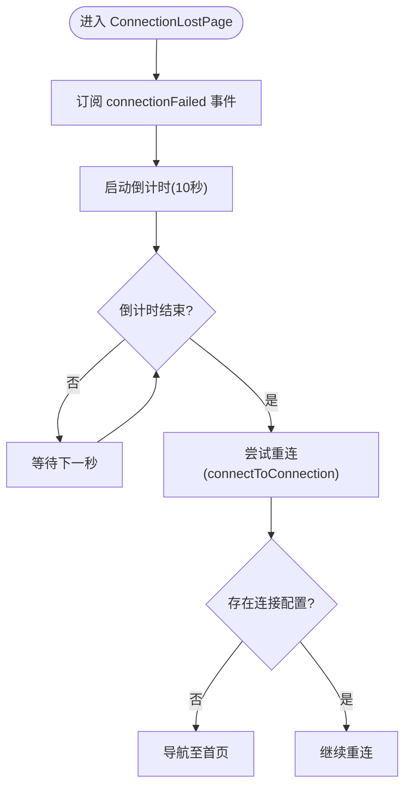
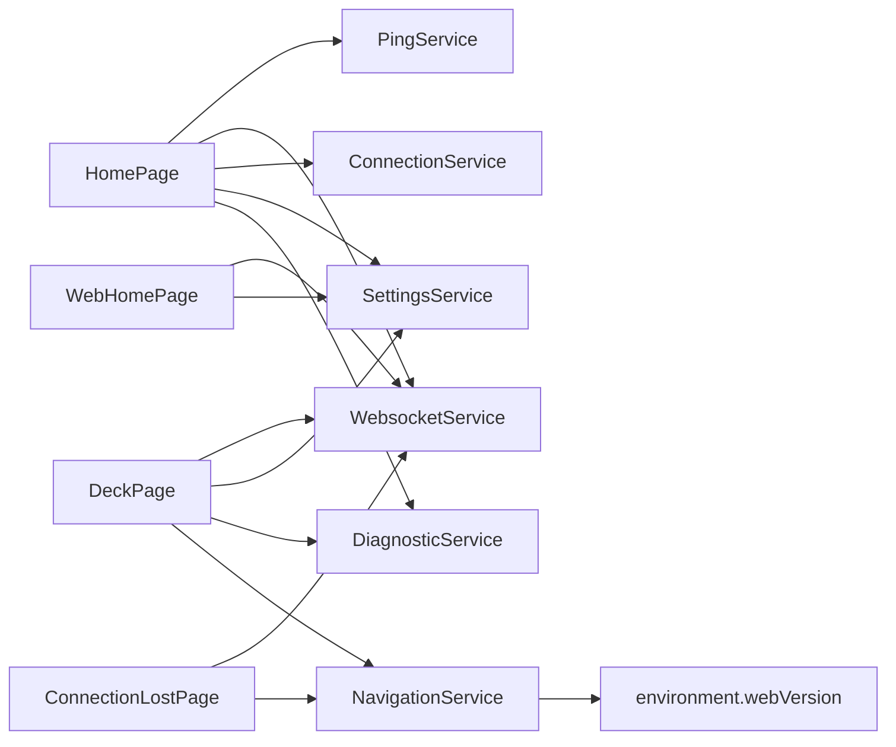

# 页面组件

<cite>
**本文档引用的文件**
- [deck.page.ts](file://src/app/pages/deck/deck.page.ts)
- [deck.page.html](file://src/app/pages/deck/deck.page.html)
- [deck.module.ts](file://src/app/pages/deck/deck.module.ts)
- [home.page.ts](file://src/app/pages/home/home.page.ts)
- [home.page.html](file://src/app/pages/home/home.page.html)
- [home.module.ts](file://src/app/pages/home/home.module.ts)
- [web-home.page.ts](file://src/app/pages/web-home/web-home.page.ts)
- [web-home.page.html](file://src/app/pages/web-home/web-home.page.html)
- [web-home.module.ts](file://src/app/pages/web-home/web-home.module.ts)
- [connection-lost.page.ts](file://src/app/pages/connection-lost/connection-lost.page.ts)
- [connection-lost.page.html](file://src/app/pages/connection-lost/connection-lost.page.html)
- [connection-lost.module.ts](file://src/app/pages/connection-lost/connection-lost.module.ts)
- [navigation.service.ts](file://src/app/services/navigation/navigation.service.ts)
- [navigation-destination.ts](file://src/app/enums/navigation-destination.ts)
- [websocket.service.ts](file://src/app/services/websocket/websocket.service.ts)
- [ping.service.ts](file://src/app/services/ping/ping.service.ts)
</cite>

## 目录
1. [简介](#简介)
2. [项目结构](#项目结构)
3. [核心组件](#核心组件)
4. [架构总览](#架构总览)
5. [详细组件分析](#详细组件分析)
6. [依赖关系分析](#依赖关系分析)
7. [性能考虑](#性能考虑)
8. [故障排查指南](#故障排查指南)
9. [结论](#结论)
10. [附录](#附录)

## 简介
本文件聚焦于 Macro-Deck-Client-App 的页面组件，系统性梳理以下核心页面的职责、生命周期、路由导航、状态管理、页面间导航逻辑与数据传递机制，并给出在移动端与 Web 平台上的适配要点与使用示例路径。涉及页面包括：
- DeckPage 控制面板页面
- HomePage 主页面
- WebHomePage 网页版主页
- ConnectionLostPage 连接丢失页面

## 项目结构
页面组件位于 src/app/pages 下，采用按功能分层的模块化组织方式，每个页面均配套独立的模块文件，便于按需导入与懒加载。

图示来源
- [home.module.ts:1-76](file://src/app/pages/home/home.module.ts#L1-L76)
- [deck.module.ts:1-44](file://src/app/pages/deck/deck.module.ts#L1-L44)
- [web-home.module.ts:1-42](file://src/app/pages/web-home/web-home.module.ts#L1-L42)
- [connection-lost.module.ts:1-36](file://src/app/pages/connection-lost/connection-lost.module.ts#L1-L36)
- [navigation.service.ts:1-86](file://src/app/services/navigation/navigation.service.ts#L1-L86)
- [websocket.service.ts:1-200](file://src/app/services/websocket/websocket.service.ts#L1-L200)
- [ping.service.ts:1-200](file://src/app/services/ping/ping.service.ts#L1-L200)

章节来源
- [home.module.ts:1-76](file://src/app/pages/home/home.module.ts#L1-L76)
- [deck.module.ts:1-44](file://src/app/pages/deck/deck.module.ts#L1-L44)
- [web-home.module.ts:1-42](file://src/app/pages/web-home/web-home.module.ts#L1-L42)
- [connection-lost.module.ts:1-36](file://src/app/pages/connection-lost/connection-lost.module.ts#L1-L36)

## 核心组件
- DeckPage 控制面板页面：展示按钮面板，支持菜单、全屏、设置弹窗、关闭连接等；进入时检查连接状态并加载客户端信息与设置。
- HomePage 主页面：管理连接列表、Ping 检测、连接操作、USB 自动连接、QR 快速设置、设置弹窗等；负责页面生命周期内的订阅管理与资源释放。
- WebHomePage 网页版主页：浏览器直连同源服务器，自动检测连接丢失并倒计时重连。
- ConnectionLostPage 连接丢失页面：显示倒计时重试与手动重试/取消，基于 WebSocket 事件驱动。

章节来源
- [deck.page.ts:14-86](file://src/app/pages/deck/deck.page.ts#L14-L86)
- [home.page.ts:29-551](file://src/app/pages/home/home.page.ts#L29-L551)
- [web-home.page.ts:8-82](file://src/app/pages/web-home/web-home.page.ts#L8-L82)
- [connection-lost.page.ts:9-85](file://src/app/pages/connection-lost/connection-lost.page.ts#L9-L85)

## 架构总览
页面组件通过 NavigationService 实现统一的页面跳转，WebSocket 服务负责与服务器的实时通信，Ping 服务负责连接可用性检测。页面间的数据传递主要通过服务层事件与状态共享实现。

图示来源
- [home.page.ts:251-254](file://src/app/pages/home/home.page.ts#L251-L254)
- [websocket.service.ts:136-172](file://src/app/services/websocket/websocket.service.ts#L136-L172)
- [navigation.service.ts:24-46](file://src/app/services/navigation/navigation.service.ts#L24-L46)
- [deck.page.ts:44-47](file://src/app/pages/deck/deck.page.ts#L44-L47)
- [connection-lost.page.ts:71-78](file://src/app/pages/connection-lost/connection-lost.page.ts#L71-L78)

## 详细组件分析

### DeckPage 控制面板页面
- 职责
  - 展示按钮面板与菜单，支持全屏、设置弹窗、关闭连接。
  - 进入时校验连接状态，若未连接则导航回首页。
  - 加载客户端 ID、版本号与“菜单按钮”显示设置。
- 生命周期
  - ionViewDidEnter：检查连接、加载信息与设置。
  - 提供 close、openSettings、openFullscreen 方法。
- 状态管理
  - showMenuButton、clientId、version 等本地状态。
  - 依赖 SettingsService、DiagnosticService、NavigationService、WebsocketService。
- 页面结构
  - 使用 Ion Menu 与 FAB 菜单，内容区嵌入 WidgetGrid。

图示来源
- [deck.page.ts:44-83](file://src/app/pages/deck/deck.page.ts#L44-L83)
- [deck.page.html:1-49](file://src/app/pages/deck/deck.page.html#L1-L49)

章节来源
- [deck.page.ts:14-86](file://src/app/pages/deck/deck.page.ts#L14-L86)
- [deck.page.html:1-49](file://src/app/pages/deck/deck.page.html#L1-L49)
- [deck.module.ts:11-22](file://src/app/pages/deck/deck.module.ts#L11-L22)

### HomePage 主页面
- 职责
  - 管理已保存连接列表、Ping 检测、连接/编辑/删除、USB 连接、QR 快速设置、设置弹窗、捐赠入口等。
- 生命周期
  - ionViewWillEnter：同步可用连接列表与 USB 状态。
  - ionViewDidEnter：加载连接、订阅 Ping 与 WebSocket 事件、启动 Ping。
  - ionViewDidLeave：停止 Ping、取消订阅。
- 状态管理
  - savedConnections、availableConnections、usbConnectionAvailable、savedConnectionsInitialized 等。
  - 通过 ConnectionService、PingService、WebsocketService、SettingsService、DiagnosticService、AlertController、ModalController 等协作。
- 数据传递
  - 打开 AddConnection 弹窗时，通过 componentProps 传递连接或 QR 数据；onWillDismiss 后持久化更新。

图示来源
- [home.page.ts:89-139](file://src/app/pages/home/home.page.ts#L89-L139)
- [home.page.ts:426-429](file://src/app/pages/home/home.page.ts#L426-L429)
- [ping.service.ts:36-72](file://src/app/services/ping/ping.service.ts#L36-L72)
- [websocket.service.ts:136-172](file://src/app/services/websocket/websocket.service.ts#L136-L172)

章节来源
- [home.page.ts:29-551](file://src/app/pages/home/home.page.ts#L29-L551)
- [home.page.html:1-123](file://src/app/pages/home/home.page.html#L1-L123)
- [home.module.ts:21-37](file://src/app/pages/home/home.module.ts#L21-L37)

### WebHomePage 网页版主页
- 职责
  - 浏览器端直接连接同源服务器，自动检测连接丢失并倒计时重连。
- 生命周期
  - ngOnInit：获取客户端信息、自动连接、订阅连接丢失事件。
- 状态管理
  - connectionLost、retryCountdown、interval 定时器。
- 数据传递
  - 通过 WebsocketService.connectToString(wsUrl) 连接；连接丢失时触发重试逻辑。

图示来源
- [web-home.page.ts:40-79](file://src/app/pages/web-home/web-home.page.ts#L40-L79)
- [web-home.page.html:1-19](file://src/app/pages/web-home/web-home.page.html#L1-L19)

章节来源
- [web-home.page.ts:8-82](file://src/app/pages/web-home/web-home.page.ts#L8-L82)
- [web-home.page.html:1-19](file://src/app/pages/web-home/web-home.page.html#L1-L19)
- [web-home.module.ts:9-21](file://src/app/pages/web-home/web-home.module.ts#L9-L21)

### ConnectionLostPage 连接丢失页面
- 职责
  - 显示连接丢失提示与倒计时重试，支持立即重试与取消返回首页。
- 生命周期
  - ionViewDidEnter：订阅连接失败事件并启动倒计时。
  - ionViewDidLeave：取消订阅。
- 状态管理
  - retryCountdown、interval、connection（来自 WebsocketService）。
- 数据传递
  - 通过 NavigationService.navigateTo 返回首页或重新连接。

图示来源
- [connection-lost.page.ts:46-84](file://src/app/pages/connection-lost/connection-lost.page.ts#L46-L84)

章节来源
- [connection-lost.page.ts:9-85](file://src/app/pages/connection-lost/connection-lost.page.ts#L9-L85)
- [connection-lost.page.html:1-15](file://src/app/pages/connection-lost/connection-lost.page.html#L1-L15)
- [connection-lost.module.ts:9-18](file://src/app/pages/connection-lost/connection-lost.module.ts#L9-L18)

## 依赖关系分析
- 页面到服务
  - HomePage 依赖 PingService、WebsocketService、ConnectionService、SettingsService、DiagnosticService、AlertController、ModalController。
  - DeckPage 依赖 WebsocketService、SettingsService、DiagnosticService、NavigationService。
  - WebHomePage 依赖 WebsocketService、SettingsService。
  - ConnectionLostPage 依赖 WebsocketService、NavigationService。
- 页面到导航
  - NavigationService 根据环境变量选择首页组件类型（WebHomePage 或 HomePage），并统一 setRoot 切换页面。
- 事件与状态
  - WebsocketService 暴露 opened/closed/failed/lost 等事件，驱动页面跳转与状态更新。
  - PingService 暴露 connectionAvailable/Unavailable，驱动 HomePage 的连接列表与自动连接逻辑。

图示来源
- [home.page.ts:56-63](file://src/app/pages/home/home.page.ts#L56-L63)
- [deck.page.ts:33-37](file://src/app/pages/deck/deck.page.ts#L33-L37)
- [web-home.page.ts:32-34](file://src/app/pages/web-home/web-home.page.ts#L32-L34)
- [connection-lost.page.ts:32-35](file://src/app/pages/connection-lost/connection-lost.page.ts#L32-L35)
- [navigation.service.ts:15-21](file://src/app/services/navigation/navigation.service.ts#L15-L21)

章节来源
- [navigation.service.ts:1-86](file://src/app/services/navigation/navigation.service.ts#L1-L86)
- [websocket.service.ts:16-57](file://src/app/services/websocket/websocket.service.ts#L16-L57)
- [ping.service.ts:13-31](file://src/app/services/ping/ping.service.ts#L13-L31)

## 性能考虑
- Ping 检测频率与超时
  - USB 连接每 1 秒检测，网络连接每 1.5 秒检测，HTTP 请求超时 800ms，避免阻塞主线程。
- 订阅管理
  - 页面离开时务必取消订阅，防止内存泄漏与后台任务持续运行。
- 连接建立与加载提示
  - 连接过程显示加载提示，取消加载时及时关闭连接，减少资源占用。
- 全屏与菜单按钮
  - 条件渲染与平台差异（webVersion）减少不必要的 DOM 渲染。

## 故障排查指南
- 连接失败
  - 观察 WebsocketService 的 connectionFailed 事件，HomePage 会弹出失败弹窗；必要时查看诊断信息与日志。
- 连接丢失
  - ConnectionLostPage 会自动倒计时重连；若无连接配置，将返回首页。
- Ping 不可用
  - 确认 PingService.start() 已调用，且 availableConnections 与 usbConnectionAvailable 状态正确更新。
- 页面无法跳转
  - 检查 NavigationService 的 homePage/deckPage/connectionLostPage 类型选择与 ion-nav 根节点是否存在。

章节来源
- [websocket.service.ts:115-134](file://src/app/services/websocket/websocket.service.ts#L115-L134)
- [home.page.ts:129-131](file://src/app/pages/home/home.page.ts#L129-L131)
- [connection-lost.page.ts:47-50](file://src/app/pages/connection-lost/connection-lost.page.ts#L47-L50)
- [ping.service.ts:36-72](file://src/app/services/ping/ping.service.ts#L36-L72)

## 结论
上述页面组件围绕服务层事件与状态展开，形成清晰的职责边界与解耦设计。通过 NavigationService 统一导航、WebsocketService 管理实时通信、PingService 提供连接可用性检测，页面间导航逻辑与数据传递机制明确可靠。在移动端与 Web 平台上，通过环境变量与条件渲染实现差异化适配，满足多端一致体验。

## 附录
- 页面初始化与事件处理示例路径
  - DeckPage 初始化与连接检查：[deck.page.ts:44-52](file://src/app/pages/deck/deck.page.ts#L44-L52)
  - HomePage 生命周期与订阅管理：[home.page.ts:89-139](file://src/app/pages/home/home.page.ts#L89-L139)
  - WebHomePage 连接丢失与倒计时：[web-home.page.ts:44-79](file://src/app/pages/web-home/web-home.page.ts#L44-L79)
  - ConnectionLostPage 重试与取消：[connection-lost.page.ts:46-84](file://src/app/pages/connection-lost/connection-lost.page.ts#L46-L84)
- 用户交互与数据传递示例路径
  - 添加/编辑连接弹窗与持久化：[home.page.ts:154-192](file://src/app/pages/home/home.page.ts#L154-L192)
  - 设置弹窗与 Ping 重启：[home.page.ts:279-286](file://src/app/pages/home/home.page.ts#L279-L286)
  - 控制面板设置弹窗与设置刷新：[deck.page.ts:63-70](file://src/app/pages/deck/deck.page.ts#L63-L70)
- 页面间导航与路由
  - 导航目标枚举：[navigation-destination.ts:2-9](file://src/app/enums/navigation-destination.ts#L2-L9)
  - 统一导航实现：[navigation.service.ts:29-46](file://src/app/services/navigation/navigation.service.ts#L29-L46)
  - Web 环境首页选择：[navigation.service.ts:15-16](file://src/app/services/navigation/navigation.service.ts#L15-L16)