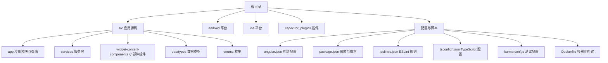
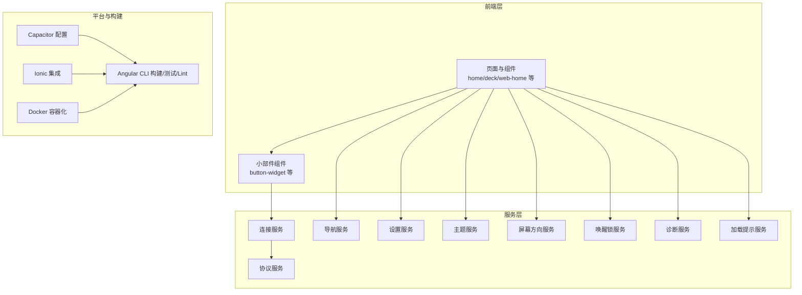
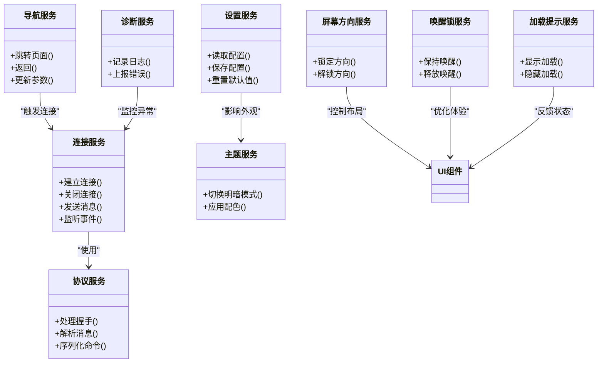
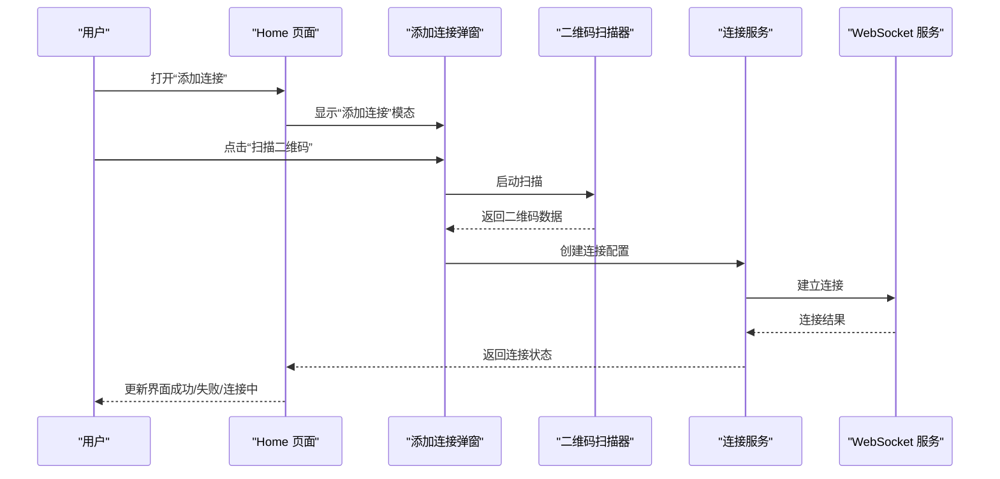
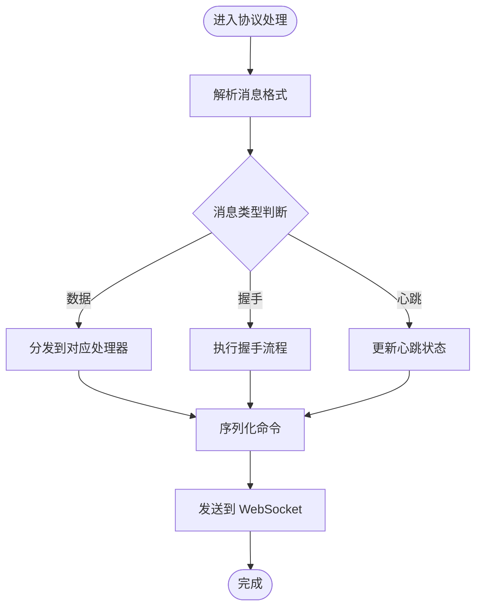

# 贡献指南

<cite>
**本文引用的文件**
- [README.md](file://README.md)
- [package.json](file://package.json)
- [angular.json](file://angular.json)
- [.eslintrc.json](file://.eslintrc.json)
- [.editorconfig](file://.editorconfig)
- [tsconfig.json](file://tsconfig.json)
- [tsconfig.app.json](file://tsconfig.app.json)
- [karma.conf.js](file://karma.conf.js)
- [.gitignore](file://.gitignore)
- [capacitor.config.ts](file://capacitor.config.ts)
- [ionic.config.json](file://ionic.config.json)
- [Dockerfile](file://Dockerfile)
</cite>

## 目录
1. 引言
2. 项目结构
3. 核心组件
4. 架构总览
5. 详细组件分析
6. 依赖分析
7. 性能考虑
8. 故障排查指南
9. 结论
10. 附录

## 引言
本指南面向希望参与 Macro Deck Client（Macro-Deck-Client-App）项目的开发者与贡献者，系统阐述从开发环境搭建、代码贡献流程、代码审查标准、版本与分支管理到发布流程与持续集成的完整实践路径。项目采用 Angular + Ionic 框架构建，通过 Capacitor 实现跨平台能力，并支持 Web、Android 与 iOS 平台。

## 项目结构
项目采用“特性/页面”与“层”混合组织方式：核心应用位于 src 目录，包含页面、服务、数据类型、小部件组件与主题样式；平台相关配置位于 android、ios、capacitor_plugins 等目录；构建与质量保障由 Angular CLI、Capacitor、Ionic 配置以及 ESLint、Karma、Docker 等工具共同支撑。

图表来源
- [angular.json:1-203](file://angular.json#L1-L203)
- [package.json:1-92](file://package.json#L1-L92)
- [tsconfig.json:1-34](file://tsconfig.json#L1-L34)
- [tsconfig.app.json:1-16](file://tsconfig.app.json#L1-L16)
- [karma.conf.js:1-45](file://karma.conf.js#L1-L45)
- [Dockerfile:1-16](file://Dockerfile#L1-L16)

章节来源
- [README.md:1-25](file://README.md#L1-L25)
- [angular.json:1-203](file://angular.json#L1-L203)
- [package.json:1-92](file://package.json#L1-L92)

## 核心组件
- 应用入口与模块
  - 入口文件与模块定义位于 src 目录，应用通过 app.module.ts 初始化，页面按功能划分为 home、deck、web-home 等模块。
- 服务层
  - 服务覆盖连接管理、协议处理、导航、设置、主题、屏幕方向、唤醒锁、诊断、加载提示等，形成横切关注点的可复用能力。
- 小部件与内容组件
  - 小部件体系以 button-widget、empty-widget 等为核心，配合交互与内容类型枚举实现可扩展的界面组合。
- 数据类型与协议
  - 包含 WebSocket 消息、连接状态、快速设置二维码数据、协议 v2 的消息与按钮定义等，确保前后端通信一致性。
- 平台与构建
  - Capacitor 配置统一 App ID、应用名与 Web 输出目录；Ionic 与 Angular CLI 提供构建、测试、服务与 Lint 能力；Dockerfile 支持容器化构建产物。

章节来源
- [capacitor.config.ts:1-16](file://capacitor.config.ts#L1-L16)
- [ionic.config.json:1-10](file://ionic.config.json#L1-L10)
- [src/app/app.module.ts](file://src/app/app.module.ts)
- [src/app/services/](file://src/app/services/)
- [src/app/widget-content-components/](file://src/app/widget-content-components/)
- [src/app/datatypes/](file://src/app/datatypes/)
- [src/app/enums/](file://src/app/enums/)

## 架构总览
应用采用分层架构：UI 页面与组件负责展示与交互；服务层封装业务逻辑与平台能力；数据类型与协议定义确保通信契约；构建与工具链贯穿开发、测试与部署阶段。

图表来源
- [capacitor.config.ts:1-16](file://capacitor.config.ts#L1-L16)
- [angular.json:1-203](file://angular.json#L1-L203)
- [ionic.config.json:1-10](file://ionic.config.json#L1-L10)
- [Dockerfile:1-16](file://Dockerfile#L1-L16)

## 详细组件分析

### 组件一：服务层设计与职责
服务层遵循单一职责原则，每个服务聚焦特定领域，如连接、协议、导航、设置等。服务之间通过依赖注入与事件/回调进行协作，避免紧耦合。

图表来源
- [src/app/services/connection/](file://src/app/services/connection/)
- [src/app/services/protocol/](file://src/app/services/protocol/)
- [src/app/services/navigation/](file://src/app/services/navigation/)
- [src/app/services/settings/](file://src/app/services/settings/)
- [src/app/services/theme/](file://src/app/services/theme/)
- [src/app/services/screen-orientation/](file://src/app/services/screen-orientation/)
- [src/app/services/wakelock/](file://src/app/services/wakelock/)
- [src/app/services/diagnostic/](file://src/app/services/diagnostic/)
- [src/app/services/loading/](file://src/app/services/loading/)

章节来源
- [src/app/services/](file://src/app/services/)

### 组件二：页面与路由交互流程
页面负责用户交互与状态管理，典型流程包括添加连接、扫描二维码、连接建立与失败处理、网络接口扫描等。

图表来源
- [src/app/pages/home/](file://src/app/pages/home/)
- [src/app/services/connection/](file://src/app/services/connection/)
- [src/app/services/websocket/](file://src/app/services/websocket/)

章节来源
- [src/app/pages/home/](file://src/app/pages/home/)

### 组件三：协议处理与消息流转
协议服务负责握手、消息解析与命令序列化，确保与后端通信的一致性与可靠性。

图表来源
- [src/app/services/protocol/](file://src/app/services/protocol/)
- [src/app/datatypes/protocol2/](file://src/app/datatypes/protocol2/)

章节来源
- [src/app/services/protocol/](file://src/app/services/protocol/)
- [src/app/datatypes/protocol2/](file://src/app/datatypes/protocol2/)

## 依赖分析
- 运行时依赖
  - Angular 生态与 Ionic：@angular/*、@ionic/angular、@ionic/storage-angular 等，提供框架与 UI 能力。
  - Capacitor：@capacitor/* 与 @awesome-cordova-plugins/*，提供原生能力桥接与插件生态。
  - 第三方库：@mdi/font、bootstrap、ionicons、rxjs、zone.js 等。
- 开发时依赖
  - @angular-devkit/build-angular、@angular/cli、@ionic/angular-toolkit、@capacitor/cli 等，支撑构建与开发工具链。
  - ESLint 及 Angular ESLint 插件、TypeScript ESLint、Jasmine/Karma、ts-node、typescript 等，保障代码质量与测试覆盖率。

章节来源
- [package.json:16-90](file://package.json#L16-L90)

## 性能考虑
- 构建优化
  - 生产构建启用输出哈希与预算限制，Web 与移动端分别提供独立配置，平衡包体大小与运行性能。
  - 使用 Service Worker 与缓存策略提升 Web 端离线与二次加载体验。
- 运行时优化
  - 合理使用懒加载与按需加载，减少初始包体。
  - 控制组件渲染与变更检测范围，避免不必要的重绘与回流。
  - 在移动端启用屏幕方向与唤醒锁服务，改善交互体验。
- 测试与覆盖率
  - Karma + Jasmine 提供单元测试与覆盖率统计，建议在 PR 中保持覆盖率稳定或提升。

章节来源
- [angular.json:47-119](file://angular.json#L47-L119)
- [karma.conf.js:1-45](file://karma.conf.js#L1-L45)

## 故障排查指南
- 构建失败
  - 检查 Node 版本与依赖安装是否正确；确认 angular.json 与 tsconfig.json 配置无误；清理 node_modules 与缓存后重试。
- 平台集成问题
  - 确认 Capacitor 配置与 App ID、应用名一致；检查 android/ios 平台目录同步状态；验证证书与签名配置。
- 测试异常
  - 使用 Karma 配置中的浏览器与单测选项定位问题；查看覆盖率报告与控制台输出。
- 代码风格与 Lint 报错
  - 根据 .eslintrc.json 与 .editorconfig 的规则修正命名、选择器、缩进与引号等；优先使用编辑器自动修复。

章节来源
- [capacitor.config.ts:1-16](file://capacitor.config.ts#L1-L16)
- [.eslintrc.json:1-47](file://.eslintrc.json#L1-L47)
- [.editorconfig:1-17](file://.editorconfig#L1-L17)
- [karma.conf.js:1-45](file://karma.conf.js#L1-L45)

## 结论
本指南提供了从开发环境到贡献流程、从代码规范到发布与运维的全栈实践参考。建议贡献者在提交前完成本地构建、测试与 Lint，并遵循 Pull Request 规范与审查标准，确保代码质量与项目稳定性。

## 附录

### A. 开发环境配置
- 必备工具
  - Node.js、Yarn、Angular CLI、Ionic CLI、Capacitor CLI。
- 克隆与安装
  - 安装依赖后，可通过 npm scripts 启动开发服务器、构建与测试。
- 平台准备
  - Android：Android Studio 与 SDK；iOS：Xcode；根据平台要求配置签名与模拟器/真机。
- 编辑器配置
  - 使用 .editorconfig 与 ESLint 规则统一风格；推荐启用保存时自动修复。

章节来源
- [package.json:7-14](file://package.json#L7-L14)
- [.editorconfig:1-17](file://.editorconfig#L1-L17)
- [Dockerfile:1-16](file://Dockerfile#L1-L16)

### B. 代码贡献流程
- 分支策略
  - 建议采用功能分支（feature/*）、修复分支（fix/*）与热修复分支（hotfix/*），主分支仅合并已审查的 PR。
- 提交规范
  - 提交信息应简洁明确，描述变更目的与影响；必要时关联 Issue 编号。
- Pull Request 规范
  - PR 描述需包含变更动机、改动范围、测试方法与风险评估；至少一名维护者审查通过后方可合并。
- 代码审查标准
  - 代码可读性、可维护性、性能与安全性；遵循 ESLint 规则与 Angular 最佳实践；确保测试覆盖与构建通过。

章节来源
- [.eslintrc.json:1-47](file://.eslintrc.json#L1-L47)
- [angular.json:177-185](file://angular.json#L177-L185)

### C. 版本管理与发布
- 版本号
  - 采用语义化版本（MAJOR.MINOR.PATCH），大版本变更需谨慎评估兼容性。
- 发布流程
  - 在 CI 环境中执行构建、测试与打包；生成 Web 与原生平台产物；上传至分发渠道（App Store、Google Play、Web CDN）。
- 容器化发布
  - 使用 Dockerfile 构建静态站点产物，便于在容器环境中部署与分发。

章节来源
- [package.json:4](file://package.json#L4)
- [Dockerfile:1-16](file://Dockerfile#L1-L16)

### D. 文档贡献与问题报告
- 文档贡献
  - 通过 Fork 与 PR 方式提交文档修改；确保语言准确、结构清晰、示例可运行。
- 问题报告
  - 提供环境信息、复现步骤、预期与实际行为、日志与截图；优先处理高优先级问题。
- 功能请求
  - 说明使用场景、收益与可能的影响；讨论可行性与替代方案。

章节来源
- [README.md:1-25](file://README.md#L1-L25)

### E. 测试要求与持续集成
- 测试要求
  - 新增功能需配套单元测试；修改涉及回归风险时需补充或调整测试；保持覆盖率稳定。
- 持续集成
  - 建议在 CI 中执行 Lint、测试与构建任务；针对不同平台与配置分别运行，确保多端一致性。

章节来源
- [karma.conf.js:1-45](file://karma.conf.js#L1-L45)
- [angular.json:146-176](file://angular.json#L146-L176)