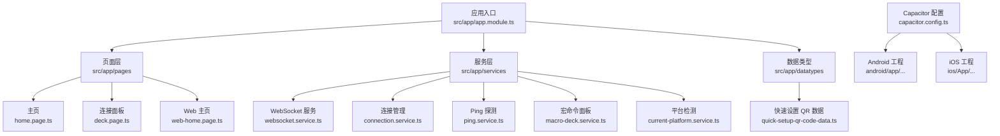
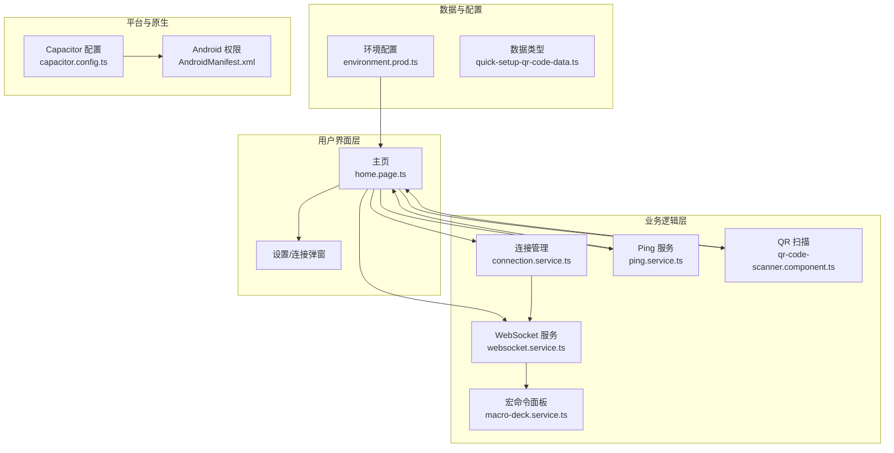
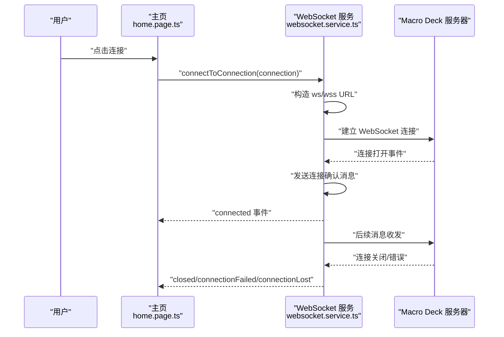
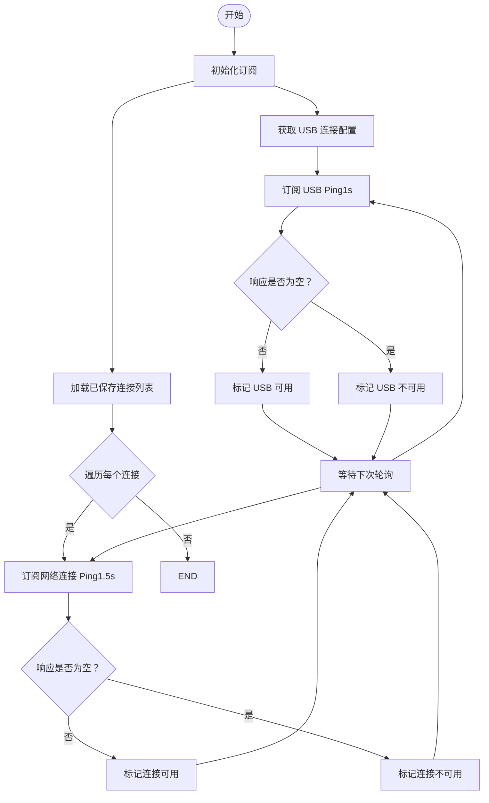
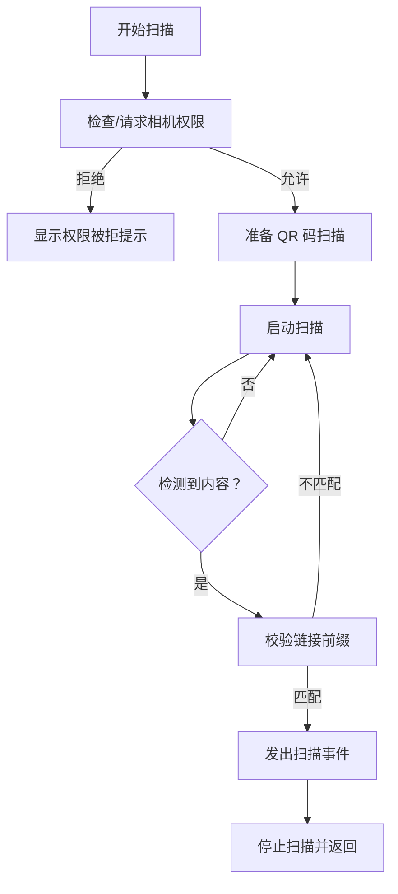
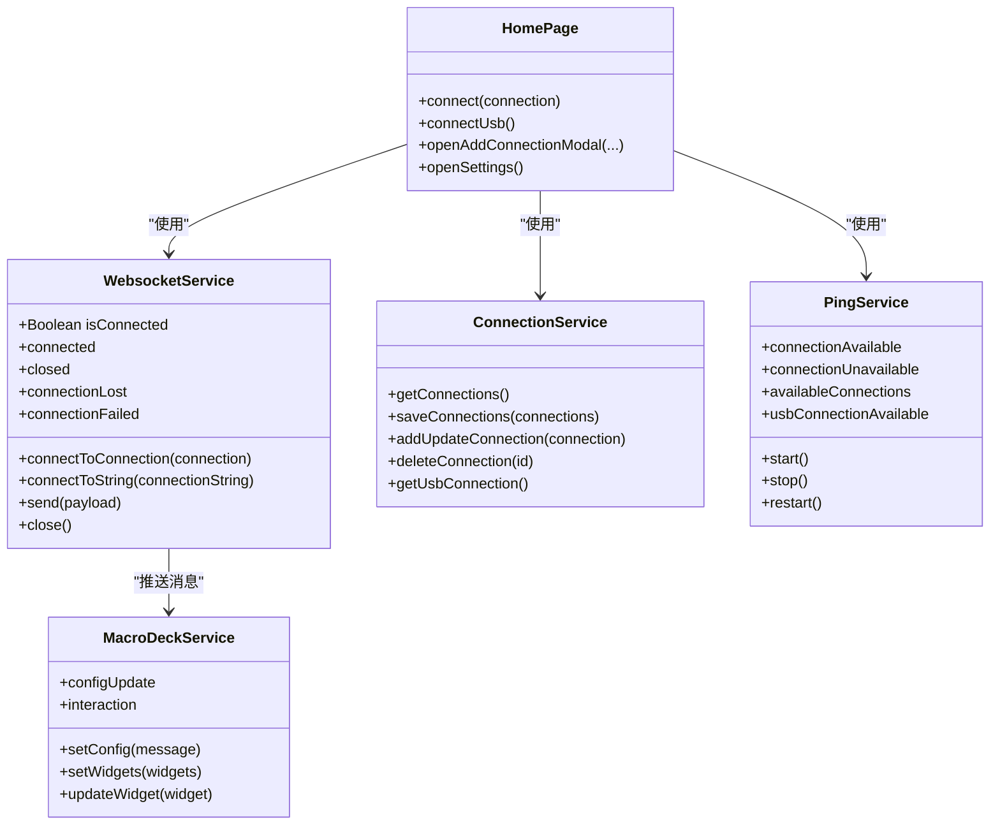
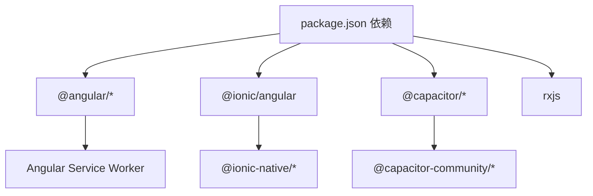

# 项目概述

<cite>
**本文档引用的文件**
- [README.md](file://README.md)
- [package.json](file://package.json)
- [angular.json](file://angular.json)
- [capacitor.config.ts](file://capacitor.config.ts)
- [src/app/app.module.ts](file://src/app/app.module.ts)
- [src/app/services/websocket/websocket.service.ts](file://src/app/services/websocket/websocket.service.ts)
- [src/app/services/macro-deck/macro-deck.service.ts](file://src/app/services/macro-deck/macro-deck.service.ts)
- [src/app/pages/home/home.page.ts](file://src/app/pages/home/home.page.ts)
- [src/app/datatypes/quick-setup-qr-code-data.ts](file://src/app/datatypes/quick-setup-qr-code-data.ts)
- [src/app/services/connection/connection.service.ts](file://src/app/services/connection/connection.service.ts)
- [src/app/services/ping/ping.service.ts](file://src/app/services/ping/ping.service.ts)
- [src/app/services/current-platform/current-platform.service.ts](file://src/app/services/current-platform/current-platform.service.ts)
- [src/app/pages/home/modals/add-connection/qr-code-scanner/qr-code-scanner.component.ts](file://src/app/pages/home/modals/add-connection/qr-code-scanner/qr-code-scanner.component.ts)
- [src/environments/environment.prod.ts](file://src/environments/environment.prod.ts)
- [android/app/src/main/AndroidManifest.xml](file://android/app/src/main/AndroidManifest.xml)
</cite>

## 目录
1. [简介](#简介)
2. [项目结构](#项目结构)
3. [核心组件](#核心组件)
4. [架构总览](#架构总览)
5. [详细组件分析](#详细组件分析)
6. [依赖关系分析](#依赖关系分析)
7. [性能考虑](#性能考虑)
8. [故障排除指南](#故障排除指南)
9. [结论](#结论)

## 简介
Macro-Deck-Client-App 是一款基于 Angular 与 Ionic 框架构建的跨平台客户端应用，支持 Android、iOS 与 Web 浏览器。项目采用统一代码库策略，通过 Capacitor 将 Web 技术打包为原生应用，实现一次开发、多端部署。该应用的核心目标是为用户提供便捷的 Macro Deck 服务器控制体验，具备以下关键能力：
- 服务器控制：通过 WebSocket 与 Macro Deck 服务器建立实时通信，实现按钮交互、面板配置下发与状态同步。
- 实时通信：基于 RxJS 的 WebSocket 主题，提供可靠的消息收发与连接生命周期管理。
- 快速设置：支持通过 QR 码扫描快速添加服务器连接，简化首次配置流程。
- USB 直连：内置 USB 连接支持，结合 Ping 服务实现自动发现与连接。

项目技术栈概览（关键版本）：
- Angular 19.2.6
- Ionic Angular 8.5.4
- Capacitor 7.2.0
- RxJS 7.8.2
- Service Worker（PWA）

**章节来源**
- [README.md:1-25](file://README.md#L1-L25)
- [package.json:16-57](file://package.json#L16-L57)

## 项目结构
项目采用 Angular 单页应用（SPA）架构，结合 Ionic 提供的移动端 UI 组件与 Capacitor 的原生桥接能力。核心目录组织如下：
- src/app：应用主体，包含页面、服务、数据类型与组件模块。
- src/environments：环境配置，区分 Web 与原生环境。
- android/ios：原生平台工程，由 Capacitor 管理。
- resources：图标、启动图与网络安全配置等资源。
- capacitor.config.ts：Capacitor 配置，定义应用 ID、名称与 Web 目录。

**图表来源**
- [src/app/app.module.ts:19-42](file://src/app/app.module.ts#L19-L42)
- [capacitor.config.ts:3-13](file://capacitor.config.ts#L3-L13)

**章节来源**
- [angular.json:6-120](file://angular.json#L6-L120)
- [capacitor.config.ts:1-16](file://capacitor.config.ts#L1-L16)

## 核心组件
本节对项目的关键组件进行深入分析，涵盖职责、数据流与交互方式。

- WebSocket 服务（WebsocketService）
  - 职责：管理与 Macro Deck 服务器的 WebSocket 连接，处理连接生命周期、消息分发与错误处理。
  - 关键特性：支持 wss/ws 自动选择、SSL 安全提示弹窗、连接成功后发送认证消息、断线重连与导航策略。
  - 事件机制：connected、closed、connectionLost、connectionFailed 等事件驱动 UI 更新。

- 宏命令面板服务（MacroDeckService）
  - 职责：维护面板配置（行/列、间距、圆角、背景）与微件列表，提供配置变更与交互事件通知。
  - 数据模型：Widget、WidgetInteraction 等数据类型支撑面板渲染与交互。

- 连接管理服务（ConnectionService）
  - 职责：提供连接的增删改查与持久化存储，支持 USB 连接配置生成与索引排序。
  - 存储键：connections（JSON 数组）。

- Ping 服务（PingService）
  - 职责：周期性探测服务器可用性，分别针对 USB 与网络连接设定不同轮询间隔，提供可用性事件。
  - 超时与容错：HTTP 请求超时 800ms，异常返回视为不可用。

- 平台检测服务（CurrentPlatformService）
  - 职责：基于 Ionic Platform 判断当前运行环境（移动端或浏览器），用于差异化行为控制。

- 快速设置 QR 数据（QuickSetupQrCodeData）
  - 职责：描述通过 QR 码分享的服务器连接信息，包括实例名、网络接口、端口、SSL 与令牌。

- 主页（HomePage）
  - 职责：展示连接列表、Ping 可用性、USB 连接状态；提供新增/编辑/删除连接、QR 扫描、设置弹窗与捐赠入口。

**章节来源**
- [src/app/services/websocket/websocket.service.ts:16-230](file://src/app/services/websocket/websocket.service.ts#L16-L230)
- [src/app/services/macro-deck/macro-deck.service.ts:6-66](file://src/app/services/macro-deck/macro-deck.service.ts#L6-L66)
- [src/app/services/connection/connection.service.ts:6-102](file://src/app/services/connection/connection.service.ts#L6-L102)
- [src/app/services/ping/ping.service.ts:9-130](file://src/app/services/ping/ping.service.ts#L9-L130)
- [src/app/services/current-platform/current-platform.service.ts:4-45](file://src/app/services/current-platform/current-platform.service.ts#L4-L45)
- [src/app/datatypes/quick-setup-qr-code-data.ts:1-21](file://src/app/datatypes/quick-setup-qr-code-data.ts#L1-L21)
- [src/app/pages/home/home.page.ts:29-317](file://src/app/pages/home/home.page.ts#L29-L317)

## 架构总览
下图展示了应用的整体架构与组件交互关系，突出 WebSocket 实时通信、QR 码快速设置、USB 直连与 Ping 探测等核心流程。

**图表来源**
- [src/app/pages/home/home.page.ts:29-317](file://src/app/pages/home/home.page.ts#L29-L317)
- [src/app/services/websocket/websocket.service.ts:16-230](file://src/app/services/websocket/websocket.service.ts#L16-L230)
- [src/app/services/connection/connection.service.ts:6-102](file://src/app/services/connection/connection.service.ts#L6-L102)
- [src/app/services/ping/ping.service.ts:9-130](file://src/app/services/ping/ping.service.ts#L9-L130)
- [src/app/pages/home/modals/add-connection/qr-code-scanner/qr-code-scanner.component.ts:7-97](file://src/app/pages/home/modals/add-connection/qr-code-scanner/qr-code-scanner.component.ts#L7-L97)
- [src/environments/environment.prod.ts:1-15](file://src/environments/environment.prod.ts#L1-L15)
- [capacitor.config.ts:3-13](file://capacitor.config.ts#L3-L13)
- [android/app/src/main/AndroidManifest.xml:1-61](file://android/app/src/main/AndroidManifest.xml#L1-L61)

## 详细组件分析

### WebSocket 连接流程（序列图）
该序列图展示了从用户发起连接到服务器接受确认的完整过程，包括认证消息发送与错误处理分支。

**图表来源**
- [src/app/pages/home/home.page.ts:247-254](file://src/app/pages/home/home.page.ts#L247-L254)
- [src/app/services/websocket/websocket.service.ts:63-171](file://src/app/services/websocket/websocket.service.ts#L63-L171)

**章节来源**
- [src/app/pages/home/home.page.ts:247-254](file://src/app/pages/home/home.page.ts#L247-L254)
- [src/app/services/websocket/websocket.service.ts:63-171](file://src/app/services/websocket/websocket.service.ts#L63-L171)

### Ping 服务算法（流程图）
Ping 服务通过定时 HTTP 请求探测服务器可用性，区分 USB 与网络连接的不同轮询策略。

**图表来源**
- [src/app/services/ping/ping.service.ts:36-128](file://src/app/services/ping/ping.service.ts#L36-L128)

**章节来源**
- [src/app/services/ping/ping.service.ts:36-128](file://src/app/services/ping/ping.service.ts#L36-L128)

### QR 码快速设置流程（流程图）
通过设备摄像头扫描 Macro Deck 快速设置链接，解析并触发连接弹窗。

**图表来源**
- [src/app/pages/home/modals/add-connection/qr-code-scanner/qr-code-scanner.component.ts:56-96](file://src/app/pages/home/modals/add-connection/qr-code-scanner/qr-code-scanner.component.ts#L56-L96)

**章节来源**
- [src/app/pages/home/modals/add-connection/qr-code-scanner/qr-code-scanner.component.ts:56-96](file://src/app/pages/home/modals/add-connection/qr-code-scanner/qr-code-scanner.component.ts#L56-L96)

### 类关系图（代码级）
展示核心服务与数据类型的类关系与依赖。

**图表来源**
- [src/app/services/websocket/websocket.service.ts:16-230](file://src/app/services/websocket/websocket.service.ts#L16-L230)
- [src/app/services/macro-deck/macro-deck.service.ts:6-66](file://src/app/services/macro-deck/macro-deck.service.ts#L6-L66)
- [src/app/services/connection/connection.service.ts:6-102](file://src/app/services/connection/connection.service.ts#L6-L102)
- [src/app/services/ping/ping.service.ts:9-130](file://src/app/services/ping/ping.service.ts#L9-L130)
- [src/app/pages/home/home.page.ts:247-286](file://src/app/pages/home/home.page.ts#L247-L286)

## 依赖关系分析
- Angular 生态：@angular/* 核心库、@angular/service-worker（PWA）、RxJS。
- Ionic：@ionic/angular、@ionic-native/*、@ionic/storage-angular。
- Capacitor：@capacitor/* 与第三方插件（如 @capacitor-community/barcode-scanner）。
- 构建与工具：@angular-devkit/build-angular、@angular/cli、@capacitor/cli。
- 环境配置：environment.prod.ts 与 Web 环境变体（environment.web.prod.ts）。

**图表来源**
- [package.json:16-57](file://package.json#L16-L57)

**章节来源**
- [package.json:16-57](file://package.json#L16-L57)
- [angular.json:13-46](file://angular.json#L13-L46)

## 性能考虑
- 连接轮询策略：USB Ping 1s、网络连接 1.5s，兼顾实时性与资源消耗。
- 超时控制：HTTP Ping 超时 800ms，避免阻塞 UI。
- PWA 优化：启用 Service Worker 与构建哈希，提升 Web 端缓存与加载性能。
- 资源体积：生产构建开启输出哈希与预算告警，建议持续监控与优化。

[本节为通用指导，无需特定文件引用]

## 故障排除指南
- 连接失败排查
  - 检查服务器地址、端口与 SSL 配置，确认 ws/wss 协议匹配。
  - 观察 WebSocket 服务的 connectionFailed 事件参数，提取关闭码与原因。
  - 若出现 SecurityError，系统会弹出“不安全连接”提示，需在服务器侧配置有效证书。
- Ping 不可用
  - 确认服务器端 /ping 接口可达，检查防火墙与网络策略。
  - 查看 Ping 服务的 availableConnections 与 usbConnectionAvailable 状态。
- QR 扫描无响应
  - 确认相机权限已授予，检查设备摄像头可用性。
  - 确保扫描链接以 https://macro-deck.app/quick-setup 开头。
- 平台差异
  - Web 环境与原生环境在连接丢失处理上存在差异，需根据 environment.webVersion 分支处理。

**章节来源**
- [src/app/services/websocket/websocket.service.ts:197-229](file://src/app/services/websocket/websocket.service.ts#L197-L229)
- [src/app/services/ping/ping.service.ts:87-111](file://src/app/services/ping/ping.service.ts#L87-L111)
- [src/app/pages/home/modals/add-connection/qr-code-scanner/qr-code-scanner.component.ts:81-96](file://src/app/pages/home/modals/add-connection/qr-code-scanner/qr-code-scanner.component.ts#L81-L96)
- [src/environments/environment.prod.ts:1-15](file://src/environments/environment.prod.ts#L1-L15)

## 结论
Macro-Deck-Client-App 通过 Angular 与 Ionic 的组合，配合 Capacitor 的跨平台能力，实现了统一代码库下的多端一致体验。其核心优势在于：
- 统一架构：共享 UI 与业务逻辑，降低维护成本。
- 实时通信：基于 WebSocket 的可靠消息通道与事件驱动 UI 更新。
- 快速配置：QR 码扫描与 USB 直连显著降低首次接入门槛。
- 平台适配：通过 CurrentPlatformService 与环境配置实现差异化行为。

对于初学者，建议从 HomePage 与 WebSocket 服务入手理解主流程；对于有经验的开发者，可重点关注 Ping 服务的轮询策略、QR 扫描的权限与错误处理，以及 Capacitor 插件的集成方式。